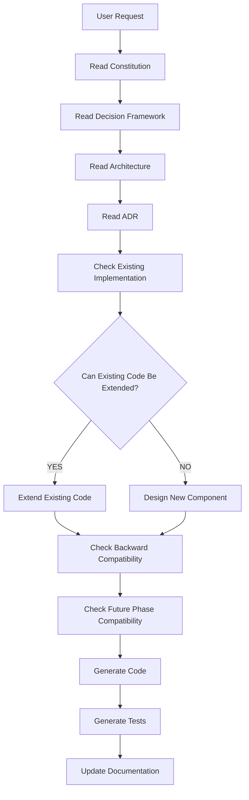

# 13 — AI Decision Framework

**Status:** Permanent decision framework.  
**Audience:** AI assistants operating on this repository.  
**Authority:** Subordinate to [00-CONSTITUTION.md](../constitution/00-CONSTITUTION.md). Supersedes conversational inference and tool defaults for engineering decisions.  
**Position:** Below constitution; above implementation and operational documents.

---

# Purpose

## Rules

- Every AI assistant contributing to this repository MUST apply this framework before making engineering decisions or modifying code.
- Decisions MUST be derivable from documented authority — not from model-specific training bias or session heuristics.
- Inconsistent decisions across assistants (Claude, Cursor, Codex, Gemini, OpenHands, and successors) MUST be treated as a defect; this document is the normalization layer.

## Rationale

Multiple AI tools modify the same codebase across sessions. Without a shared decision framework, architecture drifts, contracts break, and duplicate abstractions accumulate. A single decision hierarchy preserves enterprise-grade maintainability over years.

---

# Decision Hierarchy

## Rules

When sources conflict, authority MUST be applied in this order (highest first):

| Priority | Source |
|----------|--------|
| 1 | Explicit owner instruction in the current session |
| 2 | [00-CONSTITUTION.md](../constitution/00-CONSTITUTION.md) |
| 3 | [13-AI-DECISION-FRAMEWORK.md](../decision-framework/13-AI-DECISION-FRAMEWORK.md) (this document) |
| 4 | [04-ARCHITECTURE.md](../architecture/04-ARCHITECTURE.md) (structural law) |
| 5 | Approved ADRs ([../adr/POLICY.md](../../docs/adr/POLICY.md), [adr/](../../docs/adr/)) |
| 6 | [01-05-WORKFLOW.md](01-05-WORKFLOW.md) |
| 7 | [02-CODING.md](../standards/02-CODING.md) |
| 8 | [03-NAMING.md](../standards/03-NAMING.md) |
| 9 | [05-WORKFLOW.md](../workflow/05-WORKFLOW.md) |
| 10 | [06-TESTING.md](../standards/06-TESTING.md) |
| 11 | [07-DOCUMENTATION.md](../standards/07-DOCUMENTATION.md) |
| 12 | [08-REVIEW.md](../standards/08-REVIEW.md) |
| 13 | [09-ROADMAP.md](../roadmap/09-ROADMAP.md) |
| 14 | [11-AI-RULES.md](../ai-rules/11-AI-RULES.md) (canonical module registry) |
| 15 | [10-PHASE-STATUS.md](../architecture/10-PHASE-STATUS.md) (operational snapshot) |
| 16 | [../TASK_PROMPT.md](../TASK_PROMPT.md) (active scoped work) |
| 17 | Existing codebase (patterns in `src/`) |
| 18 | User request (when not conflicting with 1–17) |
| 19 | Conversational or tool-default suggestions |

**Governance chain:**

```
00-CONSTITUTION → 13-AI-DECISION-FRAMEWORK → 04-ARCHITECTURE → ADR
  → 01-ENGINEERING → 02-CODING → 03-NAMING
  → 05-WORKFLOW → 06-TESTING → 07-DOCUMENTATION → 08-REVIEW → 09-ROADMAP
```

Supplementary standards ([10](../ai-rules/11-AI-RULES.md)–[12](supplementary/PERFORMANCE.md), [14](supplementary/WRITING.md)) are subordinate to this chain.

- Lower levels MUST NOT violate higher levels.
- Equal-priority conflict at the same tier MUST halt implementation until clarified ([Escalation Rules](#escalation-rules)).

## Rationale

Explicit ordering removes arbitrary choices. Constitution and ADRs outrank convenience and novel designs.

---

# Decision Flow

## Rules

- AI MUST execute this flow on every implementation request before generating code.
- AI MUST NOT skip a step because the request appears small or familiar.
- Failure at any gate MUST halt implementation until resolved or escalated ([Escalation Rules](#escalation-rules)).
- Both extension and new-component paths MUST pass backward-compatibility and future-phase checks before code generation.

## Procedure

| Step | Action | Authority |
|------|--------|-----------|
| 1 | Receive user request | Current session instruction |
| 2 | Read constitution | [00-CONSTITUTION.md](../constitution/00-CONSTITUTION.md) |
| 3 | Read decision framework | [13-AI-DECISION-FRAMEWORK.md](../decision-framework/13-AI-DECISION-FRAMEWORK.md) |
| 4 | Read architecture | [04-ARCHITECTURE.md](../architecture/04-ARCHITECTURE.md) |
| 5 | Read relevant ADRs | [adr/](../../docs/adr/) per task scope |
| 6 | Check existing implementation | `src/`; [11-AI-RULES.md](../ai-rules/11-AI-RULES.md) canonical owners |
| 6a | **YES** — extend existing code | Extend canonical module; no parallel owner |
| 6b | **NO** — design new component | Development discussion per [05-WORKFLOW.md](../workflow/05-WORKFLOW.md); ADR if structural |
| 7 | Check backward compatibility | [Compatibility First](#compatibility-first) |
| 8 | Check future phase compatibility | [Future Compatibility](#future-compatibility) |
| 9 | Generate code | [01-05-WORKFLOW.md](01-05-WORKFLOW.md), [02-CODING.md](../standards/02-CODING.md), [03-NAMING.md](../standards/03-NAMING.md) |
| 10 | Generate tests | [06-TESTING.md](../standards/06-TESTING.md) |
| 11 | Update documentation | [07-DOCUMENTATION.md](../standards/07-DOCUMENTATION.md) |

## Flow diagram



## Rationale

A fixed procedure prevents assistants from jumping to code after reading only the user message. Merging both branches before compatibility checks ensures extension does not bypass contract or phase constraints.

---

# Decision Principles

## Rules

Every engineering decision MUST maximize, in order of tie-break when principles conflict:

1. **Correctness** — behavior matches requirements and contracts  
2. **Security** — fail closed; isolation preserved ([supplementary/SECURITY.md](supplementary/SECURITY.md))  
3. **Backward compatibility** — additive change default  
4. **Maintainability** — single owner per concern; readable after years  
5. **Extensibility** — ports and phases remain open  
6. **Testability** — verifiable with automated tests  
7. **Observability** — measurable outcomes; no silent failure  
8. **Simplicity** — minimum structure that satisfies the above  

- Short-term convenience MUST NOT override architecture, security, or compatibility.
- When principles conflict, correctness and security take precedence over simplicity.

## Rationale

Enterprise memory systems fail from drift and breaches, not from lack of clever code. Ordered principles give deterministic trade-off resolution.

---

# Architecture First

## Rules

- AI MUST preserve documented layer boundaries and dependency direction ([04-ARCHITECTURE.md](../architecture/04-ARCHITECTURE.md)).
- AI MUST NOT rewrite architecture because an alternative appears aesthetically cleaner.
- AI MUST prefer **extension** (new adapter, port method, additive field) over **replacement** (new parallel class, layer bypass).
- Structural change MUST have an approved ADR before implementation.
- AI MUST NOT introduce `*V2` types, god-modules, or bypass paths to avoid editing canonical modules.

## Rationale

Architecture is the compound interest of the repository. Rewrites destroy reviewability and break multi-assistant continuity.

---

# Existing Code First

## Rules

Before introducing a new abstraction, AI MUST determine whether an existing abstraction already solves the problem.

- AI MUST prefer extending canonical services, repositories, engines, and ports.
- AI MUST NOT create duplicate services, repositories, or utilities for the same concern.
- AI MUST locate the canonical owner in [11-AI-RULES.md](../ai-rules/11-AI-RULES.md) before adding modules.
- If extension is infeasible, AI MUST document why in the development discussion ([05-WORKFLOW.md](../workflow/05-WORKFLOW.md)) and pursue ADR if structural.

## Rationale

Duplication is the primary failure mode of multi-agent development. Extension preserves one behavioral path for REST and MCP.

---

# Compatibility First

## Rules

- Changes MUST be additive whenever possible.
- AI MUST NOT break REST response shapes, MCP tool schemas, or permission models without owner approval.
- AI MUST NOT change database schema unless required; migrations MUST be idempotent and phased ([01-05-WORKFLOW.md](01-05-WORKFLOW.md)).
- AI MUST NOT rename or remove public fields, endpoints, or tools without ADR and owner approval.
- Cross-owner behavior MUST remain non-enumerating (not-found semantics).

## Rationale

Clients and AI tools depend on stable contracts. Additive evolution avoids coordinated breaking deploys.

---

# Simplicity Rule

## Rules

When multiple implementations satisfy requirements, AI MUST choose the simplest that preserves future extensibility.

- AI MUST NOT add abstraction layers without a concrete second implementation or approved port requirement.
- AI MUST NOT optimize for hypothetical future requirements not in constitution, ADR, or roadmap ([09-ROADMAP.md](../roadmap/09-ROADMAP.md)).
- Configuration MUST hold tunable limits — not inline literals ([supplementary/PERFORMANCE.md](supplementary/PERFORMANCE.md)).

## Rationale

Complexity is a recurring tax. Simplicity with port boundaries satisfies extensibility without speculative design.

---

# Performance Rule

## Rules

- AI MUST optimize only after identifying a measurable bottleneck, failing budget, or explicit NFR in task.
- AI MUST NOT sacrifice readability or layer clarity for hypothetical performance.
- AI MUST document trade-offs when raising caps or introducing caching ([supplementary/PERFORMANCE.md](supplementary/PERFORMANCE.md)).
- Synchronous inference on CRUD paths MUST NOT be introduced.

## Rationale

Premature optimization obscures architecture and rarely addresses real SLO violations. Bounded work is the default performance strategy.

---

# Reuse Rule

## Rules

AI MUST prefer, in order:

1. **Reuse** — existing module as-is  
2. **Extension** — additive method or adapter  
3. **Composition** — inject port; coordinate in service  

AI MUST NOT prefer:

- **Inheritance** for behavior reuse (except port implementation and typed errors)  
- **Duplication** — copy-paste or parallel pipeline  
- **Rewrites** — replace working module without ADR  

## Rationale

Composition and extension preserve Open/Closed principle. Inheritance and rewrites fracture the canonical owner model.

---

# Storage Independence

## Rules

- Business logic MUST NOT depend on a specific database product or storage engine.
- Persistence MUST occur only through repository and store ports ([04-ARCHITECTURE.md](../architecture/04-ARCHITECTURE.md)).
- SQL and vendor SDK calls MUST NOT appear outside persistence adapters.
- Future database adoption MUST require adapter replacement only — not service or domain rewrites.
- Vector, blob, and graph storage MUST NOT be embedded in metadata repositories.

## Rationale

Storage engines change across phases (D1 → Postgres, in-process vectors → ANN service). Ports localize swap cost.

---

# AI Change Evaluation

## Rules

Before modifying code, AI MUST answer:

| Question | Required outcome |
|----------|------------------|
| Does this already exist? | Reuse or extend if yes |
| Can it be extended? | Extend before new module |
| Will this break compatibility? | Additive or owner-approved break |
| Does this violate Clean Architecture? | Stop; redesign |
| Does this duplicate functionality? | Stop; consolidate |
| Does this increase complexity? | Justify or simplify |
| Is there a simpler solution? | Choose simplest valid option |

- If any answer blocks progress, AI MUST complete development discussion per [05-WORKFLOW.md](../workflow/05-WORKFLOW.md) before coding.

## Rationale

Explicit evaluation prevents reflexive file creation and layer violations common in autonomous coding sessions.

---

# Conflict Resolution

## Rules

When two valid implementations remain after evaluation, AI MUST choose in order:

1. Constitution compliance  
2. [13-AI-DECISION-FRAMEWORK.md](../decision-framework/13-AI-DECISION-FRAMEWORK.md) principles  
3. [04-ARCHITECTURE.md](../architecture/04-ARCHITECTURE.md) layer and port rules  
4. Approved ADR alignment  
5. [01-05-WORKFLOW.md](01-05-WORKFLOW.md) consistency  
6. Existing pattern in codebase  
7. Simplicity ([Simplicity Rule](#simplicity-rule))  

- If ambiguity remains after step 7, AI MUST NOT choose arbitrarily; AI MUST state trade-offs and escalate ([Escalation Rules](#escalation-rules)).

## Rationale

Deterministic tie-breaking produces compatible outputs across assistants. Arbitrary choice creates review churn.

---

# Future Compatibility

## Rules

Every implementation SHOULD remain compatible with planned capability phases:

| Phase | Capability | Constraint |
|-------|------------|------------|
| 5 | Embedding | Async; store port — complete |
| 6 | Hybrid retrieval | `IRetrievalCandidateSource` composite |
| 7 | Agent runtime | External; MCP/REST boundary |
| 8 | Knowledge graph | `IGraphProvider`; relations unchanged |
| 9 | Multi-agent | Scope expansion additive |
| 10 | Enterprise | Org/workspace RBAC via ports |

- AI MUST NOT make decisions that force rewrite in the next three phases ([00-CONSTITUTION.md](../constitution/00-CONSTITUTION.md)).
- AI MUST design for at least three-phase horizon; forced rewrite requires ADR before code.

## Rationale

The memory foundation is a multi-phase platform. Local optima that block hybrid retrieval or enterprise scope fail the product thesis.

---

# Refactoring Policy

## Rules

Refactoring MUST provide measurable benefit in at least one category:

- Bug reduction  
- Complexity reduction  
- Performance improvement (measured)  
- Architectural consistency with approved design  
- Testability improvement  

- Refactoring MUST NOT be performed solely for stylistic preference.
- Refactoring scope MUST stay within task blast radius unless owner approves broader scope ([02-CODING.md](../standards/02-CODING.md)).
- Behavior-preserving refactors MUST keep tests green; behavior changes require tests updated first.

## Rationale

Unbounded aesthetic refactors consume review capacity without improving system properties.

---

# Decision Checklist

## Rules

Before producing code, AI MUST verify:

- [ ] Architecture preserved  
- [ ] No duplicated logic  
- [ ] No duplicated services  
- [ ] No duplicated repositories  
- [ ] No duplicated utilities  
- [ ] Backward compatible (or owner-approved break)  
- [ ] Security preserved ([supplementary/SECURITY.md](supplementary/SECURITY.md))  
- [ ] Tests planned or updated ([06-TESTING.md](../standards/06-TESTING.md))  
- [ ] Documentation triggers identified ([07-DOCUMENTATION.md](../standards/07-DOCUMENTATION.md))  
- [ ] Future phases not blocked ([09-ROADMAP.md](../roadmap/09-ROADMAP.md))  
- [ ] Development discussion complete if multi-layer or structural ([05-WORKFLOW.md](../workflow/05-WORKFLOW.md))  

## Rationale

Checklist gate converts principles into verifiable preconditions. Skipping it is a process violation.

---

# Anti-patterns

## Rules

AI MUST NOT:

| Anti-pattern | Violation |
|--------------|-----------|
| Large rewrites without ADR | Architecture first |
| Premature optimization | Performance rule |
| Framework or vendor lock-in in domain layer | Storage independence |
| Hidden side effects (sync embed on write) | Architecture / performance |
| Business logic in controllers or routes | Layer law |
| SQL in services | Layer law |
| Copy-paste implementations | Reuse rule |
| Ignoring repository pattern | Storage independence |
| Inverted dependencies | Clean Architecture |
| Breaking API or MCP contracts | Compatibility first |
| Parallel `*V2` modules | Architecture first |
| Global mutable singletons | Engineering standard |
| Secrets in code or logs | Security standard |
| Unscoped persistence queries | Security / constitution |

## Rationale

Anti-patterns are recurring failure modes observed in multi-assistant repositories. Explicit prohibition enables automated review against [08-REVIEW.md](../standards/08-REVIEW.md).

---

# AI Collaboration

## Rules

- Multiple AI assistants MUST produce decisions compatible with this framework and numbered standards `00–14`.
- Written documents MUST remain authoritative over chat memory.
- AI MUST reference existing standards — not invent parallel rules in responses.
- When uncertain, AI MUST label `Assumption:` and cite missing evidence ([11-AI-RULES.md](../ai-rules/11-AI-RULES.md)).
- AI MUST NOT contradict a merged decision without owner-directed amendment to governance docs.

## Rationale

Assistants do not share session state. Only committed documents coordinate behavior across tools.

---

# Escalation Rules

## Rules

AI MUST request owner clarification when:

- Requirements conflict with each other  
- Constitution or approved ADR would be violated  
- Breaking changes are unavoidable  
- Security implications are unclear  
- Multiple architectural choices have equal validity after conflict resolution  
- ADR is Proposed but implementation is requested  
- Task scope exceeds [../TASK_PROMPT.md](../TASK_PROMPT.md)  

- AI MUST NOT proceed with structural implementation while escalated items are unresolved.

## Rationale

Fail-closed escalation prevents silent violations that are expensive to reverse in shared memory systems.

---

# Definition of Good Engineering Decision

## Rules

A high-quality engineering decision MUST be:

| Characteristic | Criterion |
|----------------|-----------|
| **Simple** | Minimum structure meeting requirements |
| **Testable** | Verifiable by automated tests or gates |
| **Maintainable** | Single canonical owner; clear layers |
| **Extensible** | Ports and additive contracts |
| **Observable** | Errors, metrics, or logs support diagnosis |
| **Secure** | Fail closed; scoped; no disclosure |
| **Backward compatible** | Additive unless explicitly approved break |
| **Low unnecessary complexity** | No speculative abstraction |
| **Future-compatible** | Valid for next three phases |
| **Durable** | Understandable by a new maintainer in five years |

A decision that fails any **MUST** row MUST be revised or escalated before merge.

## Rationale

Good decisions compound; poor decisions require ADRs and migrations to unwind. The definition gives a shared completion bar for reviews.

---

# Document Ownership

| Role | Responsibility |
|------|----------------|
| **Project owner** | Approves amendments to this framework and resolves escalated architectural conflicts |
| **AI assistants** | Apply this framework on every decision; MUST NOT amend without owner request |
| **Maintainers** | Ensure operational docs do not contradict this hierarchy |
| **Contributors** | Propose changes via PR; owner approval required for normative edits |

**Canonical path:** `.ai/decision-framework/13-AI-DECISION-FRAMEWORK.md`

---

# Revision Policy

| Action | Authority |
|--------|-----------|
| Amend normative rules in this document | Project owner only |
| Clarify non-normative cross-references | Owner or maintainer PR |
| Supersede section | New ADR or constitution amendment — not silent edit |

- Revisions MUST be committed with explicit commit message describing decision impact.
- AI assistants MUST NOT weaken **MUST** rules during unrelated implementation tasks.

---

# Cross References

| Document | Role |
|----------|------|
| [00-CONSTITUTION.md](../constitution/00-CONSTITUTION.md) | Immutable law — highest authority |
| [01-05-WORKFLOW.md](01-05-WORKFLOW.md) | Layer, DI, migration rules |
| [04-ARCHITECTURE.md](../architecture/04-ARCHITECTURE.md) | Structural architecture |
| [05-WORKFLOW.md](../workflow/05-WORKFLOW.md) | Review → design → implementation gates |
| [08-REVIEW.md](../standards/08-REVIEW.md) | Pre-merge verification |
| [../adr/POLICY.md](../../docs/adr/POLICY.md) | Structural decision process |
| [adr/](../../docs/adr/) | Approved structural decisions |
| [09-ROADMAP.md](../roadmap/09-ROADMAP.md) | Phase 1–10 evolution |
| [11-AI-RULES.md](../ai-rules/11-AI-RULES.md) | Response structure and vocabulary |
| [supplementary/WRITING.md](supplementary/WRITING.md) | Documentation form |

---

*Subordinate to [00-CONSTITUTION.md](../constitution/00-CONSTITUTION.md). Applies to all AI assistants before code modification.*
