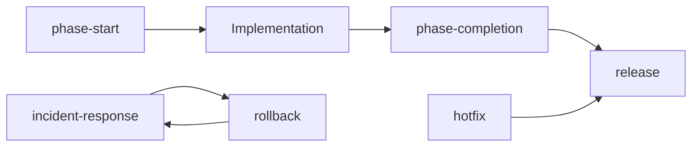

# Playbooks

**Purpose:** End-to-end procedural workflows for recurring engineering operations.  
**Audience:** Project owner, maintainers, all AI assistants.  
**Authority:** Subordinate to [constitution/INDEX.md](../constitution/INDEX.md). Orchestrates [prompts/](../prompts/PROMPT-LIBRARY.md), [review/](../review/README.md), and [phases/](../phases/README.md).

---

## Playbooks vs prompts

| Artifact | Role |
|----------|------|
| **Playbook** | Ordered procedure — multiple steps, gates, sign-offs |
| **Prompt** | Single AI instruction block — one responsibility |

Playbooks reference prompt IDs; they do not duplicate prompt bodies.

---

## Index

| Playbook | When | Owner sign-off |
|----------|------|----------------|
| [phase-start.md](phase-start.md) | Opening phase N+1 after phase N gate | Owner (Readiness READY) |
| [phase-completion.md](phase-completion.md) | Closing phase N | Owner (Gate PASS) |
| [hotfix.md](hotfix.md) | Urgent fix outside normal phase flow | Owner |
| [incident-response.md](incident-response.md) | Production incident declared | Owner / on-call |
| [rollback.md](rollback.md) | Revert deploy or migration | Owner |
| [release.md](release.md) | Scheduled release to production | Owner |

---

## Lifecycle map

---

## Placeholders

Playbooks use `{PLACEHOLDERS}` from [prompts/SCHEMA.md](../prompts/SCHEMA.md). Set per project before execution.

---

*Evolving procedures — MUST NOT weaken constitution or ADR gates.*
