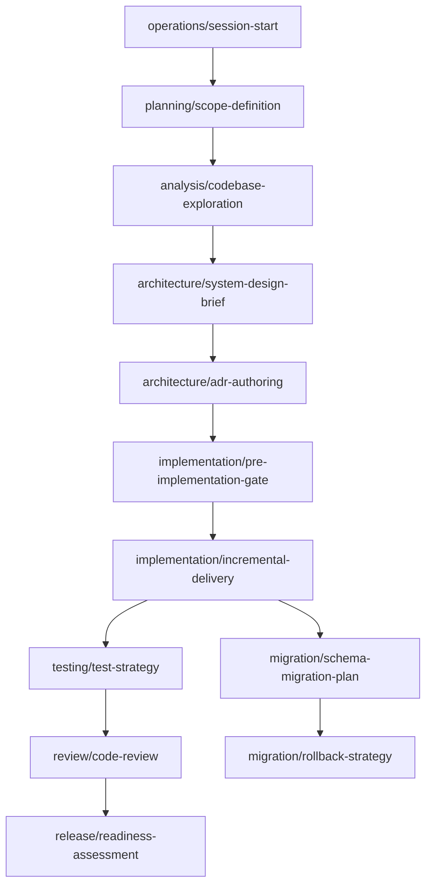

# Prompt Library - Master Catalog

**Purpose:** Reusable, repository-agnostic prompts for AI-assisted software engineering.  
**Schema:** [SCHEMA.md](SCHEMA.md)  
**Version:** 1.0.0

---

## How to use

1. Select a prompt by category and lifecycle stage below.
2. Open the prompt file; read metadata (purpose, dependencies).
3. Replace `{PLACEHOLDERS}` with project-specific values.
4. Copy the **Prompt** block into your AI assistant.
5. Verify output matches **Expected output** before proceeding.

**Governance rule:** Prompts reference project law via `{GOVERNANCE_ROOT}` - they do not override it.

---

## Category index

| Category | Folder | Prompts | Primary lifecycle |
|----------|--------|---------|-------------------|
| Planning | [planning/](planning/README.md) | 4 | Before work is scheduled |
| Analysis | [analysis/](analysis/README.md) | 4 | Before design or change |
| Architecture | [architecture/](architecture/README.md) | 4 | Design and structural decisions |
| Implementation | [implementation/](implementation/README.md) | 4 | During coding |
| Migration | [migration/](migration/README.md) | 4 | Schema and data changes |
| Testing | [testing/](testing/README.md) | 4 | Verification |
| Review | [review/](review/README.md) | 4 | Quality and compliance gates |
| Documentation | [documentation/](documentation/README.md) | 4 | Knowledge capture |
| Release | [release/](release/README.md) | 4 | Shipping |
| Operations | [operations/](operations/README.md) | 4 | Runtime and continuity |

**Total:** 40 prompts.

---

## Full catalog

### Planning

| ID | Prompt | Purpose | When to execute |
|----|--------|---------|-----------------|
| `planning/scope-definition` | [scope-definition.md](planning/scope-definition.md) | Bound work with in/out scope | New feature, phase, or epic |
| `planning/work-breakdown` | [work-breakdown.md](planning/work-breakdown.md) | Decompose into milestones | After scope approved |
| `planning/dependency-planning` | [dependency-planning.md](planning/dependency-planning.md) | Map blockers and sequencing | Before scheduling |
| `planning/risk-register` | [risk-register.md](planning/risk-register.md) | Identify and mitigate risks | Parallel with scope |

### Analysis

| ID | Prompt | Purpose | When to execute |
|----|--------|---------|-----------------|
| `analysis/codebase-exploration` | [codebase-exploration.md](analysis/codebase-exploration.md) | Orient in unfamiliar code | New contributor or module |
| `analysis/requirements-traceability` | [requirements-traceability.md](analysis/requirements-traceability.md) | Map requirements to code | Before implementation |
| `analysis/change-impact` | [change-impact.md](analysis/change-impact.md) | Blast radius of a change | Before design or refactor |
| `analysis/technical-debt-review` | [technical-debt-review.md](analysis/technical-debt-review.md) | Assess debt in an area | Tech-debt sprint or gate |

### Architecture

| ID | Prompt | Purpose | When to execute |
|----|--------|---------|-----------------|
| `architecture/system-design-brief` | [system-design-brief.md](architecture/system-design-brief.md) | High-level design proposal | New capability or module |
| `architecture/adr-authoring` | [adr-authoring.md](architecture/adr-authoring.md) | Draft architecture decision record | Structural decision needed |
| `architecture/interface-contract` | [interface-contract.md](architecture/interface-contract.md) | Define API or port contract | New boundary |
| `architecture/compliance-check` | [compliance-check.md](architecture/compliance-check.md) | Verify design against architecture law | Pre-implementation |

### Implementation

| ID | Prompt | Purpose | When to execute |
|----|--------|---------|-----------------|
| `implementation/pre-implementation-gate` | [pre-implementation-gate.md](implementation/pre-implementation-gate.md) | Gate before any code change | Every implementation task |
| `implementation/incremental-delivery` | [incremental-delivery.md](implementation/incremental-delivery.md) | Safe step-by-step build plan | Multi-commit features |
| `implementation/safe-refactoring` | [safe-refactoring.md](implementation/safe-refactoring.md) | Refactor without behavior change | Internal quality work |
| `implementation/boundary-wiring` | [boundary-wiring.md](implementation/boundary-wiring.md) | Wire adapters at composition root | New port or adapter |

### Migration

| ID | Prompt | Purpose | When to execute |
|----|--------|---------|-----------------|
| `migration/schema-migration-plan` | [schema-migration-plan.md](migration/schema-migration-plan.md) | Forward schema change plan | DDL required |
| `migration/data-migration-plan` | [data-migration-plan.md](migration/data-migration-plan.md) | Backfill or transform data | Data movement required |
| `migration/rollback-strategy` | [rollback-strategy.md](migration/rollback-strategy.md) | Reversal plan | With every migration |
| `migration/zero-downtime-cutover` | [zero-downtime-cutover.md](migration/zero-downtime-cutover.md) | Production cutover steps | Live system migration |

### Testing

| ID | Prompt | Purpose | When to execute |
|----|--------|---------|-----------------|
| `testing/test-strategy` | [test-strategy.md](testing/test-strategy.md) | Overall verification approach | Feature or phase start |
| `testing/unit-test-design` | [unit-test-design.md](testing/unit-test-design.md) | Unit test cases and mocks | Per module |
| `testing/integration-test-design` | [integration-test-design.md](testing/integration-test-design.md) | Cross-boundary tests | API or adapter work |
| `testing/regression-verification` | [regression-verification.md](testing/regression-verification.md) | Prove no regressions | Pre-merge, pre-release |

### Review

| ID | Prompt | Purpose | When to execute |
|----|--------|---------|-----------------|
| `review/code-review` | [code-review.md](review/code-review.md) | Structured code review | Before merge |
| `review/security-review` | [security-review.md](review/security-review.md) | Security-focused review | Auth, data, exposure |
| `review/quality-gate` | [quality-gate.md](review/quality-gate.md) | Formal pass/fail gate | Phase or release end |
| `review/design-review` | [design-review.md](review/design-review.md) | Review design before code | After design brief |

### Documentation

| ID | Prompt | Purpose | When to execute |
|----|--------|---------|-----------------|
| `documentation/api-reference-update` | [api-reference-update.md](documentation/api-reference-update.md) | Update API docs | Contract change |
| `documentation/changelog-authoring` | [changelog-authoring.md](documentation/changelog-authoring.md) | User-facing change log | Release |
| `documentation/runbook-authoring` | [runbook-authoring.md](documentation/runbook-authoring.md) | Operational procedure | New ops surface |
| `documentation/session-handoff` | [session-handoff.md](documentation/session-handoff.md) | Continuity between sessions | Session or phase end |

### Release

| ID | Prompt | Purpose | When to execute |
|----|--------|---------|-----------------|
| `release/readiness-assessment` | [readiness-assessment.md](release/readiness-assessment.md) | Ship/no-ship decision | Pre-release |
| `release/deployment-checklist` | [deployment-checklist.md](release/deployment-checklist.md) | Deploy steps and verification | Deploy day |
| `release/version-coordination` | [version-coordination.md](release/version-coordination.md) | Version bump and tagging | Release branch |
| `release/post-release-verification` | [post-release-verification.md](release/post-release-verification.md) | Smoke test in production | After deploy |

### Operations

| ID | Prompt | Purpose | When to execute |
|----|--------|---------|-----------------|
| `operations/session-start` | [session-start.md](operations/session-start.md) | Open every AI session | Session start |
| `operations/incident-triage` | [incident-triage.md](operations/incident-triage.md) | Initial incident response | Production incident |
| `operations/production-debug` | [production-debug.md](operations/production-debug.md) | Diagnose live issue | Escalated bug |
| `operations/escalation` | [escalation.md](operations/escalation.md) | Halt and escalate blockers | Conflict or gate failure |

---

## Dependency graph (recommended order)

---

## Porting to another repository

1. Copy `prompts/` folder (or subset of categories).
2. Set project placeholders in a local `prompts/LOCAL.md` (optional):
   - `{GOVERNANCE_ROOT}`, `{CONSTITUTION_PATH}`, `{ARCHITECTURE_PATH}`, `{SOURCE_ROOT}`
3. Do not modify prompt bodies for project specifics - use placeholders.
4. Add project-specific prompts in `{category}/local/` if needed (suffix `-local`).

---

*Maintained per [SCHEMA.md](SCHEMA.md). Prompts are evolving; gates are not weakened without owner approval.*
