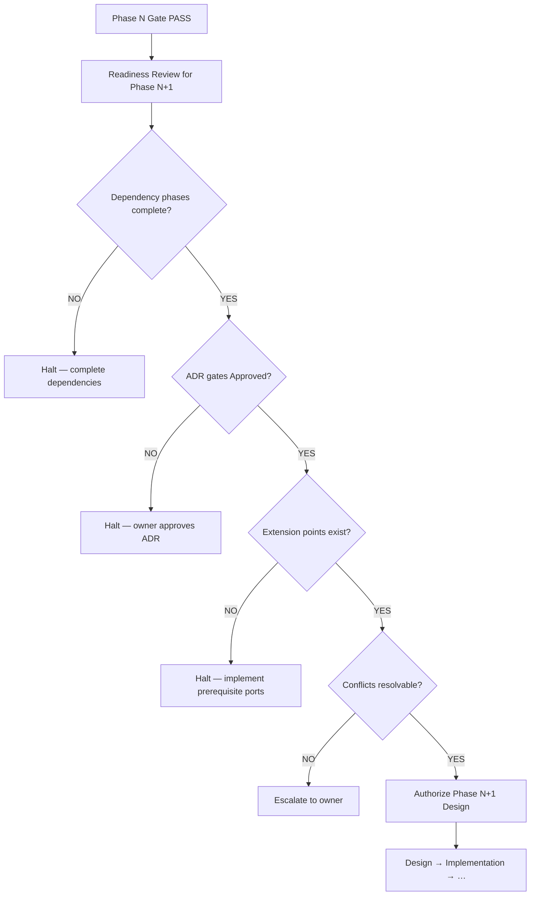

# Phase Readiness Review

**Purpose:** Verify prerequisites before **starting** the next phase — after current phase Phase Gate, before new implementation.  
**Audience:** AI assistants and project owner.  
**Normative keywords:** RFC 2119.

---

## Lifecycle position

```
… → Phase Gate (close phase N) → Readiness Review (open phase N+1) → Next Phase implementation
```

Readiness Review is **not** Phase Gate. It answers: *may we begin design and code on the next phase?*

---

## When to execute

- After phase N receives **PASS** or **PASS WITH OBSERVATIONS** on [00-PHASE-GATE.md](00-PHASE-GATE.md)
- Before rotating [TASK_PROMPT.md](../../TASK_PROMPT.md) to phase N+1 work
- Before any phase N+1 code merge

---

## Readiness flow



---

## Readiness checklist

### A — Governance

- [ ] [constitution/INDEX.md](../constitution/INDEX.md) read for session
- [ ] Phase N **PASS** recorded on [00-PHASE-GATE.md](00-PHASE-GATE.md)
- [ ] [03-PHASE-RETROSPECTIVE.md](03-PHASE-RETROSPECTIVE.md) completed for phase N
- [ ] [09-ROADMAP.md](../../roadmap/09-ROADMAP.md) — phase N marked ✅; phase N+1 scope read

### B — Dependencies

- [ ] All hard dependencies in roadmap §Dependencies for phase N+1 — **complete**
- [ ] Phase N success criteria — verified (not assumed from test count alone)

### C — ADR gates

- [ ] Required ADRs for phase N+1 — status **Approved** (not Proposed)
- [ ] No implementation of Proposed ADRs ([ADR-POLICY.md](../../docs/adr/POLICY.md))

### D — Extension points

- [ ] Required ports/interfaces exist in `src/` ([04-ARCHITECTURE.md](../../architecture/04-ARCHITECTURE.md))
- [ ] Reuse assessment complete — extend before new module ([13-AI-DECISION-FRAMEWORK.md](../../decision-framework/13-AI-DECISION-FRAMEWORK.md))
- [ ] No architecture conflict logged as **BLOCKER** in retrospective

### E — Impact preview

| Area | Assessed | Notes |
|------|----------|-------|
| Migration | | Schema changes required? |
| REST API | | Contract change? |
| MCP | | Tool schema change? |
| Tests | | New suites required? |
| Performance | | New budgets? |
| Security | | New scope rules? |
| Rollback | | Feature flag or revert path? |

### F — Authorization

- [ ] [TASK_PROMPT.md](../../TASK_PROMPT.md) ready to rotate from [template](../templates/task-prompt.md)
- [ ] Owner acknowledges start of phase N+1 (explicit instruction or roadmap action item)

---

## Readiness outcomes

| Verdict | Meaning |
|---------|---------|
| **READY** | Phase N+1 design and implementation may begin |
| **READY WITH CONDITIONS** | Proceed; conditions listed must be tracked in TASK_PROMPT |
| **NOT READY** | Blocked — resolve items before code |
| **BLOCKED** | ADR or constitution issue — owner required |

---

## Decision record

| Field | Value |
|-------|-------|
| **Closing phase** | <!-- N --> |
| **Opening phase** | <!-- N+1 --> |
| **Date** | |
| **Reviewer** | |
| **Verdict** | READY / READY WITH CONDITIONS / NOT READY / BLOCKED |
| **ADR gates** | <!-- e.g. ADR-001 Approved --> |
| **Conditions** | |
| **Authorized** | YES / NO |

---

## Example: Phase 6 readiness (reference)

| Item | Status at audit (2026-07-01) |
|------|------------------------------|
| Phase 5 Gate | ✅ Complete |
| ADR-001 | ❌ Proposed — **NOT READY** |
| `IRetrievalCandidateSource` | ✅ |
| `IEmbeddingStore.searchSimilar` | ✅ |
| Schema migration for Phase 6 | None required |

**Verdict:** **NOT READY** until ADR-001 Approved.

---

## Rules

- Readiness Review MUST NOT be skipped because the previous phase tests pass.
- **NOT READY** MUST block phase N+1 code.
- Conditions from **READY WITH CONDITIONS** MUST appear in TASK_PROMPT constraints.
- AI assistants MUST NOT self-authorize **READY**.

---

## Cross references

| Document | Role |
|----------|------|
| [01-PHASE-CHECKLIST.md](01-PHASE-CHECKLIST.md) | §1 Design — after readiness |
| [05-DEVELOPMENT-WORKFLOW.md](../../workflow/05-WORKFLOW.md) | Workflow gates |
| [prompts/pre-implementation.md](../prompts/pre-implementation.md) | Before first commit |

---

*Subordinate to [00-PHASE-GATE.md](00-PHASE-GATE.md) and [constitution/INDEX.md](../constitution/INDEX.md).*
