# Phase Artifacts

**Purpose:** Per-phase governance folders — design history, implementation evidence, gate records, and handoffs for Phases 1–10.  
**Document schema:** [PHASE-DOCUMENT-SCHEMA.md](PHASE-DOCUMENT-SCHEMA.md)  
**Timeline authority:** [roadmap/phases.md](../roadmap/phases.md) → [09-ROADMAP.md](../../roadmap/09-ROADMAP.md)  
**Process:** [review/](../review/README.md)

---

## Why `phases/` exists

`roadmap/` defines *what phases exist and their success criteria*. `phases/NN-name/` holds *durable evidence* that each phase opened and closed correctly — without losing historical decisions as development continues.

Each phase directory contains **ten documents**, each with a **single responsibility**. Closed phases remain permanently; documents become read-only at phase gate PASS.

---

## Folder tree

```
phases/
├── PHASE-DOCUMENT-SCHEMA.md          ← lifecycle spec for all phase documents
├── README.md                         ← this index
│
├── 01-foundation/                    ✅ Closed
├── 02.5-stabilization/               ✅ Closed
├── 02.6-knowledge/                   ✅ Closed
├── 03-authorization/                 ✅ Closed
├── 04-memory-intelligence/           ✅ Closed
├── 05-embedding/                     ✅ Closed
├── 06-hybrid-retrieval/              🔲 Next (Ready)
├── 07-agent-runtime/                 🔲 Reserved
├── 08-knowledge-graph/               🔲 Reserved
├── 09-multi-ai/                      🔲 Reserved
└── 10-enterprise/                    🔲 Reserved
```

Each `phases/NN-name/` folder:

```
├── README.md           # Phase entry, status, document index
├── DESIGN.md           # Approved design intent (no code)
├── IMPLEMENTATION.md   # Modules, wiring, commit sequence
├── MIGRATION.md        # Schema/data migrations
├── TESTING.md          # Verification strategy and evidence
├── REVIEW.md           # Architecture review + gate verdict
├── COMPLETION.md       # Success criteria → evidence mapping
├── RETROSPECTIVE.md    # Lessons learned
├── CHECKLIST.md        # Gate checklist instance
└── RISKS.md            # Phase risk register
```

---

## Document responsibilities (summary)

| Document | Single responsibility | Read-only when |
|----------|----------------------|----------------|
| **README.md** | Phase index and status | Gate PASS |
| **DESIGN.md** | Boundaries, ports, ADRs, non-goals | Gate PASS |
| **IMPLEMENTATION.md** | What was built and how it was wired | Gate PASS |
| **MIGRATION.md** | Forward/rollback migration record | Gate PASS |
| **TESTING.md** | Test plan and quality-gate evidence | Gate PASS |
| **REVIEW.md** | Review findings and gate verdict | Verdict recorded |
| **COMPLETION.md** | Success criteria proof | Gate PASS |
| **RETROSPECTIVE.md** | Lessons and debt | Next phase Readiness PASS |
| **CHECKLIST.md** | Executable gate checklist | Gate PASS |
| **RISKS.md** | Risks identified, mitigated, deferred | Gate PASS |

Full lifecycle (created when, updated by, roadmap relation): [PHASE-DOCUMENT-SCHEMA.md](PHASE-DOCUMENT-SCHEMA.md).

---

## Phase index

| Phase | Folder | Status | Design source |
|-------|--------|--------|---------------|
| 1 Foundation | [01-foundation/](01-foundation/README.md) | ✅ Closed | — |
| 2.5 Stabilization | [02.5-stabilization/](02.5-stabilization/README.md) | ✅ Closed | [PHASE-2.5.md](../../docs/archive/PHASE-2.5.md) |
| 2.6 Knowledge | [02.6-knowledge/](02.6-knowledge/README.md) | ✅ Closed | [PHASE-2.6-DESIGN.md](../../docs/archive/PHASE-2.6-DESIGN.md) |
| 3 Authorization | [03-authorization/](03-authorization/README.md) | ✅ Closed | [PHASE-3.md](../../docs/archive/PHASE-3.md) |
| 4 Memory Intelligence | [04-memory-intelligence/](04-memory-intelligence/README.md) | ✅ Closed | [PHASE-4-MEMORY-INTELLIGENCE-DESIGN.md](../../docs/archive/PHASE-4-MEMORY-INTELLIGENCE-DESIGN.md) |
| 5 Embedding | [05-embedding/](05-embedding/README.md) | ✅ Closed | [PHASE-5-EMBEDDING-DESIGN.md](../../docs/archive/PHASE-5-EMBEDDING-DESIGN.md) |
| 6 Hybrid Retrieval | [06-hybrid-retrieval/](06-hybrid-retrieval/README.md) | 🔲 Next | [ADR-001](../../docs/adr/001-multi-source-retrieval.md) |
| 7 Agent Runtime | [07-agent-runtime/](07-agent-runtime/README.md) | 🔲 Reserved | External boundary |
| 8 Knowledge Graph | [08-knowledge-graph/](08-knowledge-graph/README.md) | 🔲 Reserved | `IGraphProvider` ADR (future) |
| 9 Multi-AI | [09-multi-ai/](09-multi-ai/README.md) | 🔲 Reserved | [ADR-002](../../docs/adr/002-workspace-identity-model.md) |
| 10 Enterprise | [10-enterprise/](10-enterprise/README.md) | 🔲 Reserved | ADR-002, ADR-005 |

---

## Phase lifecycle

```mermaid
flowchart LR
    RD[09-ROADMAP] --> READY[Readiness Review]
    READY --> OPEN[README + CHECKLIST + DESIGN + RISKS]
    OPEN --> ADR[ADR Approved if structural]
    ADR --> BUILD[IMPLEMENTATION + MIGRATION + TESTING]
    BUILD --> REV[REVIEW]
    REV --> GATE[Gate PASS]
    GATE --> CLOSE[COMPLETION + RETROSPECTIVE]
    CLOSE --> RO[All docs read-only]
    RO --> RD2[Roadmap mark Completed]
```



---

## Ownership

| Role | Responsibility |
|------|----------------|
| **Project owner** | Gate PASS, Readiness READY, ADR Approval |
| **Maintainer** | Folder scaffold, index accuracy, schema compliance |
| **AI assistants** | Draft phase documents; MUST NOT self-approve gates |

---

## Historical preservation rules

1. **Never delete** a closed phase folder — append addenda only.
2. **Never rewrite** closed `DESIGN.md` — link to ADR or archive for corrections.
3. **`docs/archive/PHASE-*.md`** remains canonical for long-form historical design; `DESIGN.md` summarizes and links.
4. **Sub-phases** (2.5, 2.6) have separate folders — do not merge into a parent.
5. **Roadmap sync:** `README.md` status MUST match [09-ROADMAP.md](../../roadmap/09-ROADMAP.md) after gate.

---

## Dependencies

| Depends on | Reason |
|------------|--------|
| `review/` | Gate, readiness, checklist templates |
| `roadmap/` | Phase definitions and success criteria |
| `adr/` | Structural gates per phase |

| Depended on by | Reason |
|----------------|--------|
| `prompts/phase-handoff.md` | Handoff references active phase folder |
| `templates/completion-report.md` | Evidence filed in `COMPLETION.md` |

---

*Subordinate to [roadmap/](../roadmap/README.md) and [review/](../review/README.md).*
