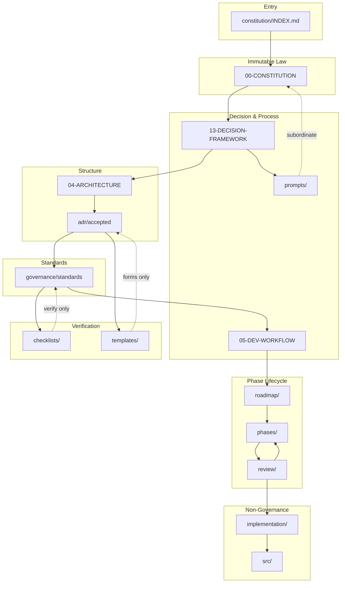

# AI Governance Architecture

**Status:** Canonical design specification for the `.ai/` directory.  
**Audience:** Project owner, maintainers, all AI assistants.  
**Horizon:** 10+ year repository evolution.  
**Normative keywords:** RFC 2119.

---

## 1. Purpose

This document defines the **complete governance architecture** for the AI Memory Cloud repository. It specifies folder structure, document responsibilities, reading hierarchy, dependencies, ownership, and maintenance strategy.

`.ai/` is the tool-neutral control plane. It does not contain application source code. Canonical normative text for many standards lives in `docs/00–14` during migration; `.ai/` registers, routes, and extends that corpus.

**Entry point for assistants:** [constitution/INDEX.md](constitution/INDEX.md)  
**Machine registry:** [INDEX.md](INDEX.md)  
**Maintenance:** [MAINTENANCE.md](MAINTENANCE.md)

---

## 2. Objectives

The governance system MUST support:

| Objective | Primary location |
|-----------|------------------|
| Repository constitution | `constitution/` → [.ai/constitution/00-CONSTITUTION.md](../constitution/00-CONSTITUTION.md) |
| Engineering standards | `governance/standards/` → `docs/01–12` |
| Architecture governance | `architecture/` + `constitution/` |
| ADR management | `adr/` → `docs/adr/` |
| AI decision framework | `workflow/` → [.ai/decision-framework/13-AI-DECISION-FRAMEWORK.md](../decision-framework/13-AI-DECISION-FRAMEWORK.md) |
| Development workflow | `workflow/` → [.ai/workflow/05-WORKFLOW.md](../workflow/05-WORKFLOW.md) |
| Phase planning | `roadmap/` + `phases/` |
| Phase reviews | `review/` |
| Prompt library | `prompts/` |
| Templates | `templates/` |
| Future roadmap | `roadmap/` → [.ai/roadmap/09-ROADMAP.md](../roadmap/09-ROADMAP.md) |

---

## 3. Directory tree

```
.ai/
├── GOVERNANCE-ARCHITECTURE.md     ← this document
├── MAINTENANCE.md                 ← long-term upkeep strategy
├── README.md                      ← directory entry
├── INDEX.md                       ← document registry
├── DEPENDENCY-HIERARCHY.md
├── READING-ORDER.md
├── OWNERSHIP.md
│
├── constitution/                  # Immutable law & reading hierarchy
├── governance/                    # Standards, policy, module registry
├── architecture/                  # Structural law (registry)
├── adr/                           # Architecture Decision Records (registry)
├── workflow/                      # Decision framework & dev process
├── communication/                 # AI output & doc form
├── roadmap/                       # Capability timeline (Phases 1–10)
├── phases/                        # Per-phase artifacts & handoffs
├── review/                        # Phase gate, readiness, scorecard
├── prompts/                       # Executable session instructions
├── playbooks/                     # Multi-step operational procedures
├── audits/                        # Phase and architecture audit records
├── templates/                     # Blank forms (not instructions)
├── checklists/                    # Pass/fail gates only
└── implementation/                # Boundary — pointers to non-governance docs
```

---

## 4. Folder specifications

### 4.1 `constitution/`

| Attribute | Value |
|-----------|-------|
| **Purpose** | Highest authority routing; mandatory reading hierarchy for every AI session |
| **Ownership** | Project owner amends; AI read-only |
| **When to use** | Every session start; any architectural uncertainty |
| **Dependents** | All folders inherit constraints from constitution |

**Documents:**

| Document | Purpose | Immutable / evolving | When AI reads | Arch approval to modify |
|----------|---------|----------------------|---------------|-------------------------|
| [INDEX.md](constitution/INDEX.md) | Reading order, authority chain, navigation flowchart | Evolving (order clarifications) | **First — every session** | **Yes — owner** |
| [governance/constitution/README.md](governance/constitution/README.md) | Registry stub → [00-CONSTITUTION](../constitution/00-CONSTITUTION.md) | Stub only | Via INDEX step 1 | No (points to canonical) |

---

### 4.2 `governance/`

| Attribute | Value |
|-----------|-------|
| **Purpose** | Normative engineering law — standards, amendment policy, canonical module registry |
| **Ownership** | Owner (standards); maintainer (registry stubs) |
| **When to use** | Before coding; when placing modules; when amending process |
| **Dependents** | `workflow/`, `checklists/`, `prompts/`, `review/` |

**Subfolders:**

| Subfolder | Purpose |
|-----------|---------|
| `constitution/` | Stub to immutable constitution |
| `standards/` | One file per concern → `docs/01–12` |
| `policy/` | ADR policy, amendment policy |
| `registry/` | Module owners → `AI_BRAIN_CONSTITUTION.md` |

**Key documents (registry → canonical):**

| Document | Immutable / evolving | When AI reads | Arch approval |
|----------|----------------------|---------------|---------------|
| `standards/engineering.md` | Evolving (owner) | INDEX step 5; before structural code | **Yes** |
| `standards/security.md` | Evolving (owner) | Auth/MCP/scope changes | **Yes** |
| `policy/adr-policy.md` | Evolving (owner) | Before drafting ADR | **Yes** |
| `policy/amendment-policy.md` | Evolving (owner) | Before governance edits | **Yes** |
| `registry/module-owners.md` | Evolving (owner/maintainer) | Before adding modules | **Yes** |

---

### 4.3 `architecture/`

| Attribute | Value |
|-----------|-------|
| **Purpose** | Durable structural description — layers, ports, extension points |
| **Ownership** | Owner for structural law; maintainer for operational snapshot stubs |
| **When to use** | Layer placement; port design; phase extension planning |
| **Dependents** | `adr/`, `phases/`, `workflow/`, `review/` |

| Document | Purpose | Immutable / evolving | When AI reads | Arch approval |
|----------|---------|----------------------|---------------|---------------|
| `structural-law.md` | → [04-ARCHITECTURE](../architecture/04-ARCHITECTURE.md) | Evolving (owner) | INDEX step 3 | **Yes** |
| `operational-snapshot.md` | → [ARCHITECTURE](../architecture/10-PHASE-STATUS.md) | Evolving (maintainer) | After INDEX; task context | Maintainer PR |

---

### 4.4 `adr/`

| Attribute | Value |
|-----------|-------|
| **Purpose** | Architecture Decision Record lifecycle — proposed, accepted, superseded |
| **Ownership** | Author proposes; **owner approves** status transitions |
| **When to use** | Structural change; new port family; storage adoption; hybrid retrieval |
| **Dependents** | `phases/`, `review/`, `workflow/`, `implementation/` |

| Document | Purpose | Immutable / evolving | When AI reads | Arch approval |
|----------|---------|----------------------|---------------|---------------|
| [README.md](../../docs/adr/README.md) | ADR lifecycle rules | Evolving | Before structural work | **Yes** |
| `template.md` | Blank ADR form | Stable form | When drafting ADR | Maintainer |
| `accepted/README.md` | Index of Approved ADRs | Evolving | Task-relevant ADRs | Maintainer |
| `docs/adr/NNN-*.md` | **Canonical ADR content** | **Immutable history** once Approved | Before implementing | **Yes — owner approves** |

**Rule:** Approved ADRs MUST NOT be rewritten; supersede via new ADR.

**Alias:** [decisions/](decisions/README.md) redirects here for backward compatibility.

---

### 4.5 `workflow/`

| Attribute | Value |
|-----------|-------|
| **Purpose** | How to decide and how to deliver — decision framework, dev workflow, analysis format |
| **Ownership** | Owner (normative); maintainer (cross-refs) |
| **When to use** | Before every code change; planning commits; pre-merge |
| **Dependents** | `prompts/`, `checklists/`, `review/` |

| Document | Purpose | Immutable / evolving | When AI reads | Arch approval |
|----------|---------|----------------------|---------------|---------------|
| `decision-framework.md` | → [13-AI-DECISION-FRAMEWORK](../decision-framework/13-AI-DECISION-FRAMEWORK.md) | Evolving (owner) | INDEX step 2; pre-code | **Yes** |
| `development-workflow.md` | → [05-DEVELOPMENT-WORKFLOW](../workflow/05-WORKFLOW.md) | Evolving (owner) | INDEX step 8 | **Yes** |
| `engineering-analysis.md` | → [ENGINEERING](../workflow/05-WORKFLOW.md) | Evolving | Pre-implementation | Maintainer |

---

### 4.6 `communication/`

| Attribute | Value |
|-----------|-------|
| **Purpose** | How assistants write responses and author documentation (form, not substance) |
| **Ownership** | Owner |
| **When to use** | Authoring docs; structuring assistant output |
| **Dependents** | All `docs/` authors |

| Document | Purpose | Immutable / evolving | When AI reads | Arch approval |
|----------|---------|----------------------|---------------|---------------|
| `ai-protocol.md` | → [10-AI-COMMUNICATION](../ai-rules/11-AI-RULES.md) | Evolving | Session output | Owner |
| `writing-standard.md` | → [14-WRITING-STANDARD](../supplementary/WRITING.md) | Evolving | Doc changes | Owner |

---

### 4.7 `roadmap/`

| Attribute | Value |
|-----------|-------|
| **Purpose** | Long-horizon capability evolution — Phases 1–10 timeline |
| **Ownership** | Owner (phase definitions); maintainer (status markers) |
| **When to use** | Phase planning; future compatibility checks |
| **Dependents** | `phases/`, `review/`, `constitution/INDEX.md` step 12 |

| Document | Purpose | Immutable / evolving | When AI reads | Arch approval |
|----------|---------|----------------------|---------------|---------------|
| `phases.md` | → [09-ROADMAP](../roadmap/09-ROADMAP.md) | Evolving | INDEX step 12; phase transitions | **Yes** for phase definition changes |

---

### 4.8 `phases/`

| Attribute | Value |
|-----------|-------|
| **Purpose** | Per-phase governance folders — design, implementation evidence, gate records, handoffs |
| **Ownership** | Maintainer scaffolds; owner approves gate/readiness verdicts |
| **When to use** | Phase transition; auditing phase N before starting N+1 |
| **Dependents** | `review/`, `roadmap/`, `adr/` |

| Document | Purpose | Immutable / evolving | When AI reads | Arch approval |
|----------|---------|----------------------|---------------|---------------|
| [README.md](phases/README.md) | Phase index and folder conventions | Evolving | Phase transitions | Maintainer |
| [PHASE-DOCUMENT-SCHEMA.md](phases/PHASE-DOCUMENT-SCHEMA.md) | Ten-document lifecycle spec | Stable process | First phase work in session | **Yes** |
| `phases/NN-name/README.md` | Phase entry, status, document index | Evolving → frozen | Active or adjacent phase | Owner for gate |
| `phases/NN-name/DESIGN.md` | Approved design intent | Frozen at gate PASS | Before implementation | Owner via ADR |
| `phases/NN-name/IMPLEMENTATION.md` | Build plan and modules | Frozen at gate PASS | During implementation | No |
| `phases/NN-name/MIGRATION.md` | Schema/data migrations | Frozen at gate PASS | When persistence changes | Owner if breaking |
| `phases/NN-name/TESTING.md` | Verification evidence | Frozen at gate PASS | Pre-gate | No |
| `phases/NN-name/REVIEW.md` | Architecture review + gate verdict | Verdict immutable | Phase gate | **Yes** |
| `phases/NN-name/COMPLETION.md` | Success criteria evidence | Frozen at gate PASS | Phase close | Owner |
| `phases/NN-name/RETROSPECTIVE.md` | Lessons learned | Append-only after next readiness | After gate | No |
| `phases/NN-name/CHECKLIST.md` | Gate checklist instance | Frozen at gate PASS | Throughout phase | Owner signs |
| `phases/NN-name/RISKS.md` | Phase risk register | Frozen at gate PASS | Design through gate | Owner validates |

**Folders:** `01-foundation` through `10-enterprise` (sub-phases `02.5`, `02.6` separate). **Historical rule:** closed folders MUST NOT be deleted.

---

### 4.9 `review/`

| Attribute | Value |
|-----------|-------|
| **Purpose** | Formal phase close (gate) and next-phase open (readiness) |
| **Ownership** | Owner issues gate verdict; assistants prepare evidence |
| **When to use** | End of phase; before starting next phase |
| **Dependents** | `phases/`, `roadmap/`, `templates/completion-report.md` |

| Document | Purpose | Immutable / evolving | When AI reads | Arch approval |
|----------|---------|----------------------|---------------|---------------|
| [00-PHASE-GATE.md](review/00-PHASE-GATE.md) | Close phase — verdict | Stable process | Phase end | **Yes** |
| [01-PHASE-CHECKLIST.md](review/01-PHASE-CHECKLIST.md) | Lifecycle verification | Evolving | Throughout phase | Owner |
| [02-PHASE-SCORECARD.md](review/02-PHASE-SCORECARD.md) | Quality dimensions | Evolving | Phase gate | Owner |
| [03-PHASE-RETROSPECTIVE.md](review/03-PHASE-RETROSPECTIVE.md) | Lessons template | Stable form | After gate | No |
| [04-PHASE-READINESS.md](review/04-PHASE-READINESS.md) | Open next phase | Stable process | Before phase N+1 | **Yes** |

**Lifecycle:**

```
Design → Implementation → Tests → Architecture Review → Phase Gate → Readiness Review → Next Phase
```

---

### 4.10 `prompts/`

| Attribute | Value |
|-----------|-------|
| **Purpose** | Repository-agnostic executable prompt library for AI-assisted engineering |
| **Ownership** | Maintainer PR; MUST NOT weaken gates |
| **When to use** | Per lifecycle stage — see [PROMPT-LIBRARY.md](prompts/PROMPT-LIBRARY.md) |
| **Dependents** | None override — subordinate to constitution |

| Document | Purpose | Immutable / evolving | When AI reads | Arch approval |
|----------|---------|----------------------|---------------|---------------|
| [PROMPT-LIBRARY.md](prompts/PROMPT-LIBRARY.md) | Master catalog (40 prompts) | Evolving | Selecting a prompt | Maintainer |
| [SCHEMA.md](prompts/SCHEMA.md) | Metadata and placeholder rules | Stable | Adding prompts | Maintainer |
| `{category}/{slug}.md` | Single-responsibility prompt | Evolving | Per lifecycle trigger | Maintainer |
| `operations/session-start` | Session entry | Evolving | **Every session** | Maintainer |
| `implementation/pre-implementation-gate` | Pre-code gate | Evolving | Before code | Maintainer |
| `documentation/session-handoff` | Continuity | Evolving | Session end | Maintainer |
| `operations/escalation` | Stop conditions | Evolving | On conflict | **Yes** if weakens gates |

**Categories:** planning, analysis, architecture, implementation, migration, testing, review, documentation, release, operations.

**Rule:** Prompts use `{PLACEHOLDERS}` — MUST NOT hardcode repository paths or weaken gates.

---

### 4.11 `templates/`

| Attribute | Value |
|-----------|-------|
| **Purpose** | Blank forms — fill per task; not live instructions |
| **Ownership** | Maintainer |
| **When to use** | New ADR, task prompt, design discussion, completion report |
| **Dependents** | `adr/`, `phases/`, `implementation/` |

| Document | Purpose | Immutable / evolving | When AI reads | Arch approval |
|----------|---------|----------------------|---------------|---------------|
| `adr.md` | ADR blank | Stable form | Drafting ADR | Maintainer |
| `task-prompt.md` | Phase task blank | Stable form | Phase rotation | Maintainer |
| `design-discussion.md` | Pre-implementation design | Stable form | New module design | Maintainer |
| `completion-report.md` | Phase closure | Stable form | Phase gate | Maintainer |

---

### 4.12 `checklists/`

| Attribute | Value |
|-----------|-------|
| **Purpose** | Pass/fail verification — no normative law |
| **Ownership** | Owner + maintainer |
| **When to use** | Pre-code, pre-merge, release |
| **Dependents** | Links upward to governance and workflow |

---

### 4.13 `playbooks/`

| Attribute | Value |
|-----------|-------|
| **Purpose** | End-to-end procedures — phase start/close, release, hotfix, incident, rollback |
| **Ownership** | Maintainer; owner signs verdicts |
| **When to use** | Recurring operations spanning multiple prompts and gates |
| **Dependents** | `prompts/`, `review/`, `phases/`, `audits/` |

| Document | Purpose | Immutable / evolving | When AI reads | Arch approval |
|----------|---------|----------------------|---------------|---------------|
| [README.md](playbooks/README.md) | Playbook index | Evolving | Selecting procedure | Maintainer |
| [phase-start.md](playbooks/phase-start.md) | Open phase N+1 | Evolving | After phase N gate | Owner (Readiness) |
| [phase-completion.md](playbooks/phase-completion.md) | Close phase N | Evolving | Phase end | Owner (Gate) |
| [hotfix.md](playbooks/hotfix.md) | Urgent fix | Evolving | Production defect | Owner |
| [incident-response.md](playbooks/incident-response.md) | Incident procedure | Evolving | SEV1–4 | Owner / on-call |
| [rollback.md](playbooks/rollback.md) | Revert deploy/migration | Evolving | Failed deploy | Owner |
| [release.md](playbooks/release.md) | Scheduled release | Evolving | Ship candidate | Owner |

**Rule:** Playbooks orchestrate prompts — they MUST NOT weaken gates.

---

### 4.14 `audits/`

| Attribute | Value |
|-----------|-------|
| **Purpose** | Independent architecture and phase compliance audit trail |
| **Ownership** | AI prepares; owner signs verdict |
| **When to use** | Phase close; pre-next-phase; quarterly debt review |
| **Dependents** | `phases/`, `playbooks/phase-completion.md` |

| Document | Purpose | Immutable / evolving | When AI reads | Arch approval |
|----------|---------|----------------------|---------------|---------------|
| [README.md](audits/README.md) | Audit index and rules | Evolving | Audit context | Maintainer |
| `phase-NN.md` | Per-phase audit record | Frozen at close | Historical phase | Owner |
| [latest.md](audits/latest.md) | Aggregate active audit | Evolving until next refresh | **Pre-implementation** | Owner |

**Rule:** Audits are append-only — do not rewrite closed verdicts.

---

### 4.15 `implementation/`

| Attribute | Value |
|-----------|-------|
| **Purpose** | Explicit boundary — what is NOT governance |
| **Ownership** | Maintainer |
| **When to use** | Locating TASK_PROMPT, PANDUAN, archive — not for law |
| **Dependents** | None (lowest in governance tree) |

---

## 5. Reading hierarchy for AI assistants

### 5.1 Authority chain (conflict resolution)

```
Owner instruction (session)
  → 00-CONSTITUTION
  → 13-AI-DECISION-FRAMEWORK
  → 04-ARCHITECTURE
  → Approved ADRs
  → 01-ENGINEERING-STANDARD
  → 02-CODING-STYLE
  → 03-NAMING-CONVENTION
  → 05-DEVELOPMENT-WORKFLOW
  → 06-TESTING / 07-DOCUMENTATION / 08-REVIEW
  → 09-ROADMAP
  → Module registry / TASK_PROMPT / codebase
  → Tool defaults
```

Full detail: [constitution/INDEX.md](constitution/INDEX.md), [DEPENDENCY-HIERARCHY.md](DEPENDENCY-HIERARCHY.md).

### 5.2 Session reading sequence

| Step | Document | Folder |
|------|----------|--------|
| 0 | `constitution/INDEX.md` | constitution |
| 1–12 | Governance chain (Constitution → Roadmap) | registry → `docs/` |
| + | `.ai/TASK_PROMPT.md` | implementation |
| Before code | `prompts/pre-implementation.md` | prompts |
| Structural | Relevant `adr/accepted/` | adr |
| Phase end | `review/00-PHASE-GATE.md` | review |
| Phase start | `review/04-PHASE-READINESS.md` | review |

### 5.3 What NOT to read first

- `templates/` at session start (blanks, not instructions)
- `implementation/` for coding decisions
- Proposed ADRs as binding law
- `src/` before constitution chain

---

## 6. Dependency diagram



**Dependency rules:**

- Arrows indicate **inherits / must not violate**.
- Dotted lines: subordinate artifacts never override solid-line authorities.
- `docs/` canonical files are authoritative over `.ai/` registry stubs.

---

## 7. Immutable vs evolving summary

| Class | Examples | Amendment |
|-------|----------|-----------|
| **Immutable** | `00-CONSTITUTION`, Approved ADR text, `AI_BRAIN_CONSTITUTION` | Owner only |
| **Stable process** | Phase gate, readiness, template forms | Owner or maintainer PR |
| **Evolving standards** | `01–14` docs, amendment policy | Owner approval |
| **Living operational** | `ARCHITECTURE.md`, `TASK_PROMPT.md`, phase records | Maintainer / per-phase |
| **Generated** | Filled templates, retrospectives, gate records | Per task — not law |

---

## 8. Architectural approval matrix

| Change type | Approval required |
|-------------|-------------------|
| Constitution, decision framework, structural architecture | **Owner** |
| ADR status → Approved | **Owner** |
| Engineering/security standards | **Owner** |
| Phase gate / readiness process | **Owner** |
| Reading hierarchy in constitution/INDEX | **Owner** |
| Prompts (no gate weakening) | Maintainer PR |
| Templates, checklists cross-refs | Maintainer PR |
| Operational snapshot, phase status | Maintainer PR |
| Filled retrospective, completion report | Author — not governance amendment |

---

## 9. Maintenance strategy

See [MAINTENANCE.md](MAINTENANCE.md) for full procedure. Summary:

| Activity | Frequency | Owner |
|----------|-----------|-------|
| Registry accuracy (`INDEX.md`) | Every new `.ai/` or `docs/` governance file | Maintainer |
| Roadmap phase status | On phase gate PASS | Owner + maintainer |
| ADR index | On Approve/Supersede | Maintainer |
| Constitution chain review | Annually or before major phase | Owner |
| Prompt alignment audit | After decision framework change | Maintainer |
| Stale stub detection | Quarterly | Maintainer |
| 10-year archive | `phases/NN/` + `docs/archive/` | Maintainer |

**Migration principle:** Canonical normative text lives in `.ai/`; `docs/` holds human documentation and ADRs. Authority follows `.ai/` paths; update redirect stubs in `docs/` when paths change.

**Anti-patterns:**

- Duplicating normative text in `.ai/` and `docs/`
- Amending governance during unrelated feature PRs
- Marking roadmap ✅ without Phase Gate
- Implementing Proposed ADRs

---

## 10. Scalability (10-year horizon)

| Growth vector | Mechanism |
|---------------|-----------|
| New phases 11+ | Add `roadmap/` row + `phases/NN-name/` |
| New standards | Add `governance/standards/<concern>.md` + `docs/NN` |
| New ADRs | `docs/adr/NNN-title.md` + `adr/accepted/` index |
| New port families | ADR + `architecture/` extension — no monolith doc |
| New AI tools | `prompts/` only — no tool-specific law in constitution |
| Enterprise tenancy | ADR-002 path + `phases/10-enterprise/` |
| Content offload | ADR-005 + `IContentStore` registry entry |

**Invariant:** One file, one responsibility. Many small documents over few large ones.

---

## 11. Cross references

| External | Role |
|----------|------|
| [.ai/constitution/00-CONSTITUTION.md](../constitution/00-CONSTITUTION.md) | Immutable law |
| [.ai/roadmap/09-ROADMAP.md](../roadmap/09-ROADMAP.md) | Phase authority |
| [docs/adr/POLICY.md](../docs/adr/POLICY.md) | ADR process |
| [.cursor/rules/](../.cursor/rules/) | IDE reminders — subordinate to `.ai/` |

---

*Canonical design for `.ai/`. Amendments: project owner. Subordinate to explicit owner instruction only.*
