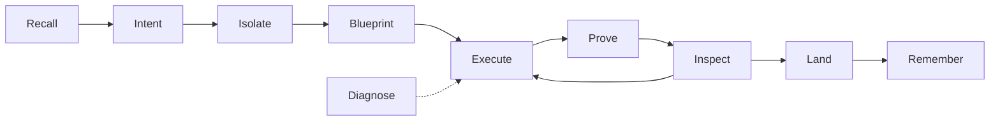

# Agent Forge — Pipeline

| Stage | Skill | Trigger | Output / gate |
|-------|-------|---------|---------------|
| **Recall** | `forge-recall` | Every session start | Context from MCP + `.ai/TASK_PROMPT.md` |
| **Intent** | `forge-intent` | New feature / ambiguous ask | `.ai/designs/drafts/{slug}.md` — owner approves sections |
| **Isolate** | `forge-isolate` | After intent approved | Git worktree + clean test baseline |
| **Blueprint** | `forge-blueprint` | Sandbox ready | `{slug}-plan.md` — tasks with paths & verify steps |
| **Execute** | `forge-execute` | Blueprint approved | Code in isolated branch; checkpoint or subagent per task |
| **Prove** | `forge-prove` | During execute | Failing test → minimal fix → green before next task |
| **Inspect** | `forge-inspect` | Between tasks | Spec compliance, then quality; critical blocks |
| **Land** | `forge-land` | All tasks done | merge / PR / keep / discard + worktree cleanup |
| **Remember** | `forge-remember` | Session end | MCP `save_memory` handoff |

**Supporting:** `forge-diagnose` (failures), `forge-parallel` (independent tracks), `forge-skillcraft` (new skills), `forge-intro` (onboarding).

Machine-readable: [manifest.json](manifest.json)
