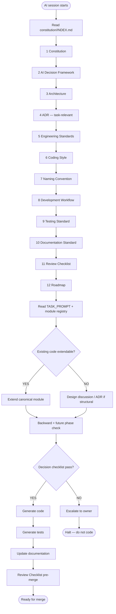

# Constitution Index

**Status:** Mandatory entry point for every AI assistant session.  
**Audience:** ChatGPT, Claude, Cursor, Codex, Gemini, OpenHands, and successors.  
**Normative keywords:** RFC 2119 (MUST, MUST NOT, SHOULD, SHOULD NOT, MAY).

---

# Purpose

This file is the **first document** every AI assistant MUST read when starting work on this repository.

It defines:

- **Reading order** — sequential documents to absorb before writing code  
- **Dependency hierarchy** — which documents inherit from or constrain others  
- **Authority hierarchy** — which document wins when instructions conflict  
- **Consultation triggers** — when to open each document during a task  

Governance detail lives in linked documents. This index does not restate their rules.

**Canonical registry:** [.ai/START-HERE.md](../../START-HERE.md)  
**Amendment authority:** [OWNERSHIP.md](../OWNERSHIP.md)

---

**Master index:** [.ai/README.md](../../README.md) — AI Operating System entry. Human docs: [docs/README.md](../../../docs/README.md).

---

# Reading Order

AI assistants MUST read documents **in this order** at session start.

| Step | Document | Canonical path |
|------|----------|----------------|
| 1 | **Constitution** | [.ai/core/constitution/00-CONSTITUTION.md](../constitution/00-CONSTITUTION.md) |
| 2 | **AI Decision Framework** | [.ai/core/decision-framework/13-AI-DECISION-FRAMEWORK.md](../decision-framework/13-AI-DECISION-FRAMEWORK.md) |
| 3 | **Architecture** | [.ai/core/architecture/04-ARCHITECTURE.md](../architecture/04-ARCHITECTURE.md) |
| 4 | **ADR** | [.ai/adr/](../../adr/) — task-relevant records only |
| 5 | **Engineering** | [.ai/core/standards/01-ENGINEERING.md](../standards/01-ENGINEERING.md) |
| 6 | **Coding** | [.ai/core/standards/02-CODING.md](../standards/02-CODING.md) |
| 7 | **Naming** | [.ai/core/standards/03-NAMING.md](../standards/03-NAMING.md) |
| 8 | **Workflow** | [.ai/workflow/05-WORKFLOW.md](../../workflow/05-WORKFLOW.md) |
| 9 | **Testing** | [.ai/core/standards/06-TESTING.md](../standards/06-TESTING.md) |
| 10 | **Documentation** | [.ai/core/standards/07-DOCUMENTATION.md](../standards/07-DOCUMENTATION.md) |
| 11 | **Review** | [.ai/core/standards/08-REVIEW.md](../standards/08-REVIEW.md) |
| 12 | **Roadmap** | [.ai/phases/roadmap/09-ROADMAP.md](../../phases/roadmap/09-ROADMAP.md) |

**Governance chain:**

```
00-CONSTITUTION
        │
        ▼
13-AI-DECISION-FRAMEWORK
        │
        ▼
04-ARCHITECTURE
        │
        ▼
ADR
        │
        ▼
01-ENGINEERING-STANDARD
        │
        ▼
02-CODING-STYLE
        │
        ▼
03-NAMING-CONVENTION
        │
        ▼
05-DEVELOPMENT-WORKFLOW
        │
        ▼
06-TESTING-STANDARD
        │
        ▼
07-DOCUMENTATION-STANDARD
        │
        ▼
08-REVIEW-CHECKLIST
        │
        ▼
09-ROADMAP
```

After step 12, read **task-scoped** documents only:

| Document | Canonical path | When |
|----------|----------------|------|
| Module registry | [.ai/core/ai-rules/11-AI-RULES.md](../ai-rules/11-AI-RULES.md) | Before adding or locating modules |
| Glossary | [.ai/core/glossary/GLOSSARY.md](../glossary/GLOSSARY.md) | When terminology is ambiguous |
| Operational snapshot | [.ai/core/architecture/10-PHASE-STATUS.md](../architecture/10-PHASE-STATUS.md) | For current phase and port status |
| Active task | [.ai/TASK_PROMPT.md](../../TASK_PROMPT.md) | For scoped work and definition of done |

AI assistants MUST NOT skip the numbered sequence because a task appears small.

---

# Authority Hierarchy

The governance chain above is also the **authority hierarchy** for the numbered document series. When two sources in the chain conflict, the higher step wins.

Higher priority overrides lower priority. Lower levels MUST NOT violate higher levels.

| Priority | Source | Role |
|----------|--------|------|
| 1 | Explicit owner instruction (current session) | Stated override |
| 2 | [Constitution](../constitution/00-CONSTITUTION.md) | Immutable law |
| 3 | [AI Decision Framework](../decision-framework/13-AI-DECISION-FRAMEWORK.md) | Decision procedure and principles |
| 4 | [Architecture](../architecture/04-ARCHITECTURE.md) | Layer and port law |
| 5 | Approved [ADRs](../../adr/) | Structural decisions |
| 6 | [Engineering Standards](../standards/01-ENGINEERING.md) | Domain engineering rules |
| 7 | [Coding Style](../standards/02-CODING.md) | Format and refactor scope |
| 8 | [Naming Convention](../standards/03-NAMING.md) | Identifiers across codebase |
| 9 | [Development Workflow](../../workflow/05-WORKFLOW.md) | Process gates |
| 10 | [Testing Standard](../standards/06-TESTING.md) | Verification requirements |
| 11 | [Documentation Standard](../standards/07-DOCUMENTATION.md) | Doc update triggers |
| 12 | [Review Checklist](../standards/08-REVIEW.md) | Pre-merge pass/fail |
| 13 | [Roadmap](../../roadmap/09-ROADMAP.md) | Planned evolution |
| 14 | Module registry · operational snapshot · active task | Scoped context |
| 15 | Existing codebase (`src/`) | Established patterns |
| 16 | User request | When not conflicting with 1–15 |
| 17 | Tool or model defaults | Lowest authority |

**Supplementary standards** (subordinate to the chain; consult when relevant):

- [10-AI-COMMUNICATION.md](../ai-rules/11-AI-RULES.md) — response structure
- [11-SECURITY-STANDARD.md](../../supplementary/SECURITY.md) — security rules
- [12-PERFORMANCE-STANDARD.md](../../supplementary/PERFORMANCE.md) — performance budgets
- [14-WRITING-STANDARD.md](../../supplementary/WRITING.md) — documentation form

Equal priority at the same tier → halt and escalate per [13-AI-DECISION-FRAMEWORK.md § Escalation](../decision-framework/13-AI-DECISION-FRAMEWORK.md#escalation-rules).

---

# Dependency Hierarchy

Each document inherits constraints from all documents above it in the governance chain.

```
Owner instruction
      │
      ▼
00-CONSTITUTION
      │
      ▼
13-AI-DECISION-FRAMEWORK
      │
      ▼
04-ARCHITECTURE
      │
      ▼
ADR (approved)
      │
      ▼
01-ENGINEERING-STANDARD
      │
      ├──► 02-CODING-STYLE
      └──► 03-NAMING-CONVENTION
      │
      ▼
05-DEVELOPMENT-WORKFLOW
      │
      ├──► 06-TESTING-STANDARD
      ├──► 07-DOCUMENTATION-STANDARD
      └──► 08-REVIEW-CHECKLIST
      │
      ▼
09-ROADMAP
      │
      ▼
Task-scoped docs · codebase · user request
```

| Document | Depends on | Constrains |
|----------|------------|------------|
| Constitution | Owner instruction | All documents |
| AI Decision Framework | Constitution | How every decision is made |
| Architecture | Constitution, Decision Framework | Layer boundaries, ports |
| ADR | Constitution, Architecture | Specific structural choices |
| Engineering Standards | Constitution, Architecture, ADR | Code structure, layers, ports |
| Coding Style | Engineering Standards | Format and refactor scope |
| Naming Convention | Engineering Standards | Identifiers across codebase |
| Development Workflow | Engineering Standards | Stage gates, merge discipline |
| Testing Standard | Development Workflow | Verification requirements |
| Documentation Standard | Development Workflow | Doc update triggers |
| Review Checklist | Testing, Documentation | Pre-merge pass/fail |
| Roadmap | Constitution, Architecture | Future phase compatibility |

---

# When to Consult Each Document

| Document | Consult when |
|----------|--------------|
| **Constitution** | Every session; any change; any uncertainty about allowed architecture |
| **AI Decision Framework** | Before every code change; when choosing extend vs new module; when conflicted |
| **Architecture** | Layer placement, dependency direction, port design, MCP boundary, future capability slots |
| **ADR** | Structural change, new port family, storage adoption, contract change; before implementing Proposed ADRs |
| **Engineering Standards** | Adding modules, ports, services, repositories, controllers, API handlers, migrations |
| **Coding Style** | Writing or refactoring functions, classes, or files |
| **Naming Convention** | Creating files, types, interfaces, env vars, endpoints, tables, or tests |
| **Development Workflow** | Starting a task, planning commits, pre-merge, release |
| **Testing Standard** | Adding or changing behavior; choosing test type; mocking persistence |
| **Documentation Standard** | Updating README, Swagger, changelog, ADR status, phase markers |
| **Review Checklist** | Before opening PR; before merge; self-review |
| **Roadmap** | Phase transitions; assessing future compatibility; scoping multi-phase work |
| **Module registry** | Locating canonical owner; preventing duplicate services |
| **Glossary** | Resolving ambiguous or deprecated terminology |
| **Operational snapshot** | Current phase status, active ports, composition roots |
| **Active task** | Scoped requirements and definition of done only |

---

# Navigation Flowchart

Execute this flow **before writing code**.



---

# Rules

- AI assistants MUST treat this file as the first read in every session.
- Reading order and authority hierarchy are the same governance chain for steps 1–12.
- This index MUST NOT duplicate normative text from linked documents — follow canonical paths.
- Supplementary `.ai/` prompts and checklists are subordinate to this hierarchy:
  - [session-start.md](../prompts/session-start.md)
  - [pre-implementation.md](../prompts/pre-implementation.md)
  - [decision-gate.md](../checklists/decision-gate.md)

---

# Cross References

| Document | Role |
|----------|------|
| [.ai/README.md](../../docs/README.md) | Governance folder overview |
| [.ai/DEPENDENCY-HIERARCHY.md](../DEPENDENCY-HIERARCHY.md) | Extended authority detail |
| [.ai/READING-ORDER.md](../READING-ORDER.md) | Supplementary session sequences |
| [.ai/adr/POLICY.md](../../adr/POLICY.md) | ADR lifecycle |
| [.ai/core/glossary/GLOSSARY.md](../../glossary/GLOSSARY.md) | Canonical vocabulary |
| [.ai/core/ai-rules/11-AI-RULES.md](../ai-rules/11-AI-RULES.md) | Response structure |
| [.ai/core/supplementary/WRITING.md](../../supplementary/WRITING.md) | Documentation form |
| [.ai/core/vision/01-COLLABORATIVE-MEMORY-PLATFORM.md](../vision/01-COLLABORATIVE-MEMORY-PLATFORM.md) | Platform vision charter (architecture planning; not normative override) |

---

*First read for every AI assistant. Subordinate only to explicit owner instruction.*
