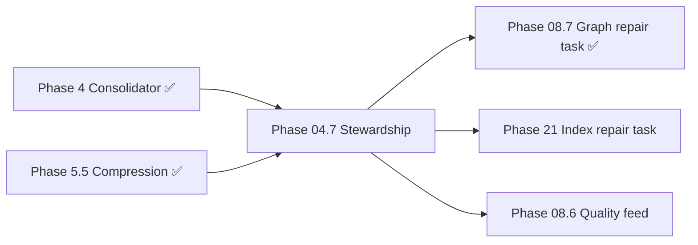

# Phase 04.7 — Self-Managing Memory Stewardship — DESIGN

**Document:** DESIGN  
**Phase status:** Implemented (2026-07-04) · ADR-045 Accepted  
**Schema:** [PHASE-DOCUMENT-SCHEMA.md](../PHASE-DOCUMENT-SCHEMA.md)  
**Authority:** [00-CONSTITUTION.md](../../core/constitution/00-CONSTITUTION.md) → [04-ARCHITECTURE.md](../../core/architecture/04-ARCHITECTURE.md) → [ADR-045](../../../docs/adr/045-self-managing-memory-stewardship.md)  
**Roadmap placement:** Extension track **04.7** — memory hygiene orchestration after Phase 4 consolidator  
**Flag:** `MEMORY_STEWARDSHIP_ENABLED=false` (default)

---

## 1. Purpose

Define **Self-Managing Memory Stewardship** as a deterministic maintenance pipeline that orchestrates existing memory hygiene capabilities without introducing a planner, autonomous agent, or LLM merge.

Phase 04.7 composes — does not replace — existing artifacts:

- `MemoryConsolidator` (Phase 4) — duplicate detection, merge, compress, archive, stale promotion
- `RuleBasedCompressionPolicy` (Phase 5.5) — when `COMPRESSION_ENABLED=true`
- Knowledge/intelligence backfill scripts — metadata repair detection
- Embedding backfill runner — embedding gap detection
- Retrieval policy version — corpus health reporting

Phase 04.7 adds:

- **`IMemoryStewardshipOrchestrator`** — fixed-order async pipeline with dry-run default
- **`IMaintenanceTask`** — pluggable deterministic step contract
- **`IStewardshipRunStore`** — audit trail of runs (default in-memory)
- **`steward:memories` CLI** — operator entry point
- **Manifest flag** `capabilities.supportsSelfManagement`

Phase 04.7 does **not** add agent reasoning, LLM merge, or changes to `MemoryService` signatures.

---

## 2. Architecture Analysis

### 2.1 Position on roadmap

| Dimension | Assessment |
|-----------|------------|
| **Predecessors** | Phase 4 ✅ (consolidator), Phase 5.5 ✅ (compression policy), Phase 8.5 ✅ (access signals) |
| **Successors** | Phase 08.7 (graph repair task ✅), Phase 21 (index repair task), Phase 08.6 (quality recommendations feed) |
| **Priority** | **P1 extension** — hygiene automation; not blocking core CRUD |
| **Placement rationale** | Numbered 04.7 because it **orchestrates Phase 4 domain maintenance** without rewriting memory intelligence |



### 2.2 Dependencies

#### Hard dependencies (must be ✅ before implementation)

| Phase / ADR | Requirement |
|-------------|-------------|
| Phase 4 | `MemoryConsolidator`, semantic hash dedup |
| ADR-008 | Ports unchanged — stewardship sits above services |
| Constitution | No planner/agent; MemoryService signatures frozen |

#### Soft dependencies (parallel OK)

| Phase | Relationship |
|-------|--------------|
| Phase 5.5 | Compression policy wired when `COMPRESSION_ENABLED=true` |
| Phase 8.7 | `GraphRepairTask` registered at `graph-repair` (wraps `IRelationInferenceOrchestrator`) |
| Phase 21 | Index repair task slot reserved (Meilisearch/Neo4j sync) |

#### Forward dependencies (future phases plug into 04.7)

| Future need | Extension enabled |
|-------------|-------------------|
| Graph orphan repair | `GraphRepairTask` at stage `graph-repair` ✅ |
| Search index sync | Register `IndexRepairTask` at stage `index-repair` (Phase 21) |
| Ranking refresh | Register `RankingRefreshTask` at stage `ranking-refresh` |
| SQL run history | Swap `InMemoryStewardshipRunStore` for SQL adapter |

### 2.3 Interface impact

| Interface | Change |
|-----------|--------|
| `IMaintenanceTask` | **New** — one deterministic step |
| `IMemoryStewardshipOrchestrator` | **New** — pipeline coordinator |
| `IStewardshipRunStore` | **New** — run audit trail |
| `MemoryConsolidator` | **Unchanged** — wrapped by `ConsolidationTask` |
| All service interfaces | **Unchanged** |
| All repository ports | **Unchanged** |

### 2.4 Repository / schema impact

**None.** Run history defaults to in-memory. No DDL. Future SQL-backed run store is swappable behind `IStewardshipRunStore`.

### 2.5 Service impact

**None to business logic.** Stewardship composes existing services from composition root and CLI — never invoked on CRUD hot path.

---

## 3. Fixed Stage Order

`STEWARDSHIP_STAGE_ORDER` (`src/memory/stewardship/stewardship.types.ts`):

| # | Stage | Default task | Mutates? |
|---|-------|--------------|----------|
| 1 | `metadata-repair` | `MetadataAuditTask` | Read-only audit |
| 2 | `duplicate-detection` | *(via ConsolidationTask)* | Dry-run reports |
| 3 | `merge-compress` | `ConsolidationTask` | Yes when `--execute` |
| 4 | `archive` | *(via ConsolidationTask)* | Yes when `--execute` |
| 5 | `graph-repair` | `GraphRepairTask` | Yes when `--execute` + `RELATION_INFERENCE_ENABLED` |
| 6 | `embedding-repair` | `EmbeddingAuditTask` | Read-only audit |
| 7 | `index-repair` | *(reserved)* | Future Phase 21 |
| 8 | `ranking-refresh` | *(reserved)* | Future |
| 9 | `retrieval-optimization` | `RetrievalOptimizationTask` | Read-only report |

The orchestrator sorts registered tasks by `STAGE_INDEX` — registration order is irrelevant; execution is reproducible.

---

## 4. Architecture

```
┌─────────────────────────────────────────────────────────────────────────┐
│                     Application (unchanged signatures)                   │
│  MemoryService · ContextService · GraphService                          │
└───────────────────────────────┬─────────────────────────────────────────┘
                                │ composed from outside
                                ▼
┌─────────────────────────────────────────────────────────────────────────┐
│              IMemoryStewardshipOrchestrator (Phase 04.7)                 │
│  fixed-order · dry-run default · per-task error isolation               │
└───────────────────────────────┬─────────────────────────────────────────┘
                                │
     ┌──────────────────────────┼──────────────────────────┐
     ▼                          ▼                          ▼
┌─────────────┐      ┌──────────────────┐      ┌─────────────────────┐
│ MetadataAudit│      │ ConsolidationTask │      │ EmbeddingAudit      │
│ (read-only)  │      │ → MemoryConsolidator│    │ (read-only)          │
└─────────────┘      └──────────────────┘      └─────────────────────┘
                                │
                                ▼
                    ┌──────────────────────┐
                    │ RetrievalOptimization │  ← read-only health report
                    └──────────┬───────────┘
                               ▼
                    ┌──────────────────────┐
                    │ IStewardshipRunStore  │  ← default: in-memory
                    └──────────────────────┘
```

### Design invariants

1. **No planner, no agent, no LLM** — every task is deterministic and idempotent.
2. **Dry-run default** — `dryRun: true` unless operator passes `--execute`.
3. **Error isolation** — a failing task records `status: 'error'`; pipeline continues.
4. **Scope enforced** — all tasks receive `MemoryScope` (`ownerId` + optional filters).
5. **Additive contracts** — manifest flag only; no REST/MCP endpoint changes required for gate.

---

## 5. Ports & Interfaces

```typescript
interface IMaintenanceTask {
  readonly id: string;
  readonly stage: StewardshipStage;
  run(ctx: MaintenanceContext): Promise<MaintenanceTaskResult>;
}

interface IMemoryStewardshipOrchestrator {
  run(scope: MemoryScope, options?: StewardshipRunOptions): Promise<StewardshipRunReport>;
}

interface IStewardshipRunStore {
  save(report: StewardshipRunReport): Promise<void>;
  list(ownerId: string, limit?: number): Promise<StewardshipRunReport[]>;
  latest(ownerId: string): Promise<StewardshipRunReport | null>;
}
```

| Port | File | Role |
|------|------|------|
| `IMaintenanceTask` | `imaintenance-task.interface.ts` | One deterministic step; must not mutate in dry-run |
| `IMemoryStewardshipOrchestrator` | `imemory-stewardship-orchestrator.interface.ts` | Runs tasks in fixed order, isolates failures |
| `IStewardshipRunStore` | `istewardship-run-store.interface.ts` | Audit trail (default in-memory, swappable) |

---

## 6. Module Structure

```
src/
  memory/
    stewardship/
      stewardship.types.ts              # STEWARDSHIP_STAGE_ORDER, STAGE_INDEX
      imaintenance-task.interface.ts
      imemory-stewardship-orchestrator.interface.ts
      istewardship-run-store.interface.ts
      memory-stewardship-orchestrator.ts
      in-memory-stewardship-run-store.ts
      tasks/
        metadata-audit.task.ts
        consolidation.task.ts
        embedding-audit.task.ts
        retrieval-optimization.task.ts
      index.ts
  composition/
    create-memory-stewardship-ports.ts    # composition root
scripts/
  steward-memories.ts                   # CLI — dry-run default
```

---

## 7. Data Flow

### Operator path (CLI)

```
npm run steward:memories [--execute] [--project=<id>]
  → createMemoryStewardshipPorts(sql, env)
  → for each owner in DB:
       orchestrator.run({ ownerId }, { dryRun, projectId })
  → StewardshipRunReport printed + persisted to run store
```

### Task execution (single owner)

```
orchestrator.run(scope, { dryRun: true })
  → sort tasks by STAGE_INDEX
  → for each task:
       try task.run({ scope, dryRun, projectId, now })
       catch → record status: 'error', continue
  → aggregate StewardshipRunReport
  → runStore.save(report)
```

### Consolidation path (via ConsolidationTask)

```
ConsolidationTask.run(ctx)
  → MemoryConsolidator.run(scope, { dryRun, generateSummary: !dryRun })
  → duplicate detection → archive / summary / relations / stale promotion
  → respects COMPRESSION_ENABLED + RuleBasedCompressionPolicy when set
```

---

## 8. Env & Manifest

| Env | Default | Purpose |
|-----|---------|---------|
| `MEMORY_STEWARDSHIP_ENABLED` | `false` | Master switch; manifest reflects capability |
| `COMPRESSION_ENABLED` | `false` | Passed through to consolidator in composition |
| `RETRIEVAL_POLICY_VERSION` | `1` | Tagged in retrieval optimization report |

| Manifest field | When true |
|----------------|-----------|
| `capabilities.supportsSelfManagement` | `MEMORY_STEWARDSHIP_ENABLED=true` |

---

## 9. API / MCP Impact

| Surface | Change |
|---------|--------|
| REST `/api/v1/*` | **None** — no new endpoints required |
| MCP tools | **None** — existing 20 tools unchanged |
| Capability manifest | **Additive** — `supportsSelfManagement` flag |
| CLI | **New** — `steward:memories` / `steward:memories:execute` |

Optional future: MCP tool `run_stewardship` (deferred — CLI sufficient for gate).

---

## 10. Non-goals

- Planner or autonomous agent loop
- LLM-based merge or summarization
- `MemoryService` signature changes
- New persistence schema (run store in-memory by default)
- Automatic scheduling (cron) — operator or future scheduler invokes CLI

---

## 11. MemoryService impact

**None.** Services, repositories, and storage ports are untouched; stewardship composes them from the outside via composition root and CLI.

---

## 12. Success Criteria

- [x] ADR-045 **Accepted** and linked
- [x] Three ports implemented (`IMaintenanceTask`, `IMemoryStewardshipOrchestrator`, `IStewardshipRunStore`)
- [x] Fixed-order orchestrator with dry-run default and error isolation
- [x] Five default tasks wired in composition root (incl. `GraphRepairTask`)
- [x] CLI `steward:memories` (dry-run) and `steward:memories:execute`
- [x] Manifest `supportsSelfManagement` reflects flag
- [x] Zero changes to `MemoryService` method signatures
- [x] Tests green (493+ total; 7 new stewardship tests)
- [x] Graph/index/ranking stages — graph repair registered; index (Phase 21) and ranking reserved

---

## 13. Future Phase

| Phase | Interaction |
|-------|-------------|
| **08.7** | `GraphRepairTask` at `graph-repair` stage ✅ |
| **21** | Register `IndexRepairTask` at `index-repair` stage (search-graph-prod) |
| **08.6** | Quality recommendations feed into stewardship triggers |
| **09.7** | Memory evolution distinct from duplicate rollup (04.7) |
| **25** | Telemetry on stewardship runs via event bus |

---

## 14. References

| Document | Relevance |
|----------|-----------|
| [ADR-045](../../../docs/adr/045-self-managing-memory-stewardship.md) | Structural gate |
| [04-ARCHITECTURE.md](../../core/architecture/04-ARCHITECTURE.md) | Memory domain § stewardship |
| [Phase 4 DESIGN](../04-memory-intelligence/DESIGN.md) | Consolidator baseline |
| [Phase 5.5 DESIGN](../05.5-semantic-compression/DESIGN.md) | Compression policy |
| `src/memory/consolidator.ts` | Wrapped by ConsolidationTask |
| [IMPLEMENTATION.md](IMPLEMENTATION.md) | What was built |
| [TESTING.md](TESTING.md) | Verification evidence |
| [CHECKLIST.md](CHECKLIST.md) | Gate checklist |

---

*Subordinate to [00-CONSTITUTION.md](../../core/constitution/00-CONSTITUTION.md). Do not contradict Approved ADRs.*
