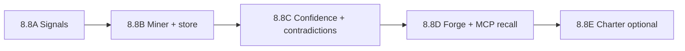

# Phase 8.8 — Inspection Pattern Ledger — DELIVERY TRACK

**Status:** ✅ Complete (2026-07-05)  
**Authority:** [DESIGN.md](DESIGN.md) · [ADR-059](../../adr/059-inspection-pattern-ledger.md)

---

## Ship order

| Wave | ID | Deliverable | Verify |
|------|-----|-------------|--------|
| **8.8A** | D88-A1 | `inspection_outcome` in signal types + normalizer | Unit: normalizer accepts/rejects payloads |
| **8.8A** | D88-A2 | `LearningEventRecorder` maps inspection events | Integration with 8.5 + 8.6 flags ON |
| **8.8B** | D88-B1 | `IInspectionPatternStore` + SQL migration | Migration idempotent |
| **8.8B** | D88-B2 | `IInspectionPatternMiner` (L23) deterministic aggregation | Fixture: 3 resolved events → 1 pattern |
| **8.8C** | D88-C1 | `IInspectionConfidencePolicy` decay + protected | Unit: aging → archived unless protected |
| **8.8C** | D88-C2 | Contradiction detection → graph `contradicts` | Test: opposing patterns both surfaced |
| **8.8D** | D88-D1 | MCP search tags + optional list endpoint | Recall returns scoped patterns |
| **8.8D** | D88-D2 | Update `forge-inspect` / `forge-recall` skills | Skill doc references ledger hook |
| **8.8E** | D88-E1 | `ICharterPatternPromoter` + Federation policy | Flag off = no cross-org exchange |

---

## Env flags (planned)

| Variable | Default | Requires |
|----------|---------|----------|
| `INSPECTION_LEDGER_ENABLED` | `false` | — |
| `INSPECTION_LEDGER_STORE_PROVIDER` | `sql` | SQL migration |
| `INSPECTION_CHARTER_ENABLED` | `false` | Federation + org RBAC |

When `INSPECTION_LEDGER_ENABLED=false`, signal type may still be accepted by 8.5 but **not** mined or surfaced.

---

## Learning track mapping

| L# | Name | Phase 8.8 owner |
|----|------|-----------------|
| L23 | Pattern Mining | `IInspectionPatternMiner` — primary v1 implementation |
| L27 | Feedback Learning | Confidence updates from `inspection_outcome` + explicit feedback |

Remaining L23/L27 generic stubs in 8.6 may delegate to inspection specialization when this flag is ON.
