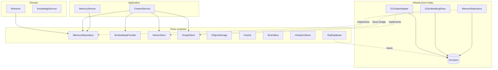

# Phase 9.5 — Platform Architecture — DESIGN

**Status:** Approved (ADR-008)  
**Schema:** [PHASE-DOCUMENT-SCHEMA.md](../PHASE-DOCUMENT-SCHEMA.md)

---

## Objective

Prepare extension points so enterprise infrastructure (SQL variants, object storage, vector/graph DBs, cache, analytics, event bus) can be added **without changing domain or application services**.

## Layer model

```
┌─────────────────────────────────────────┐
│  Application (services/, controllers/)   │  ← orchestration, scope params
├─────────────────────────────────────────┤
│  Domain (memory/, knowledge/, search/)   │  ← pure rules, retrieval, ranking
├─────────────────────────────────────────┤
│  Ports (src/ports/)                      │  ← interfaces ONLY (this phase)
├─────────────────────────────────────────┤
│  Infrastructure (repositories/, db/, …)  │  ← D1 adapters today
├─────────────────────────────────────────┤
│  Physical storage (D1, R2, Redis, …)   │  ← vendor engines (future)
└─────────────────────────────────────────┘
```

**Rule:** Domain and application layers depend on **ports**, never on D1, PostgreSQL, Pinecone, Redis, or Kafka types.

## Port registry

| Port | Canonical path | Current MVP adapter |
|------|----------------|---------------------|
| `ISqlDatabase` | `ports/sql/` | `D1Client` (not yet wired to port) |
| `IMemoryRepository` | `ports/memory/` | `MemoryRepository` |
| `IRelationRepository` | `ports/relation/` | `MemoryRelationRepository` |
| `IEmbeddingProvider` | `ports/embedding/` | OpenAI / noop providers |
| `IVectorStore` | `ports/vector/` | `D1EmbeddingStore` via `IEmbeddingStore` bridge (future) |
| `IGraphStore` | `ports/graph/` | `D1GraphAdapter` via `IGraphProvider` |
| `IObjectStorage` | `ports/storage/` | None (ADR-005) |
| `ICache` | `ports/cache/` | None |
| `IEventBus` | `ports/events/` | None |
| `IAnalyticsStore` | `ports/analytics/` | None |

## Dependency diagram



## Non-goals (Phase 9.5)

- Implement PostgreSQL, Pinecone, Redis, Kafka, or other adapters
- Rewire composition roots to `ISqlDatabase`
- Enterprise RBAC, org schema, or new REST/MCP endpoints
- Remove or rename existing working interfaces (additive aliases only)

## ADR

[ADR-008 Platform Architecture](../../adr/008-platform-architecture.md)

---

*Do not contradict [09-ROADMAP.md](../../roadmap/09-ROADMAP.md).*
