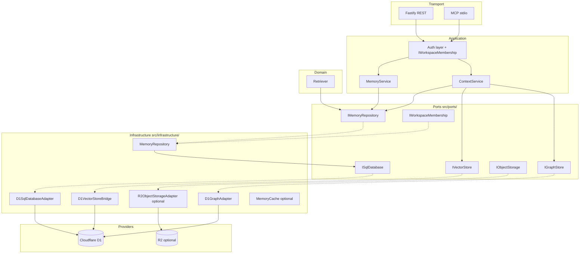

# Phase 10 — Enterprise Infrastructure — DESIGN

**Document:** DESIGN  
**Phase status:** Ready (awaiting Readiness Review + sub-ADRs Approved)  
**Schema:** [PHASE-DOCUMENT-SCHEMA.md](../PHASE-DOCUMENT-SCHEMA.md)  
**Depends on:** Phase 9 ✅ · Phase 9.5 ✅ · ADR-008 Implemented  

**Authority chain:** [00-CONSTITUTION.md](../../core/constitution/00-CONSTITUTION.md) → [04-ARCHITECTURE.md](../../core/architecture/04-ARCHITECTURE.md) → Approved ADRs → this document.

---

## Lifecycle

| Attribute | Value |
|-----------|-------|
| **Created when** | Design phase begins — before implementation commits |
| **Updated by** | AI assistant drafts; owner approves via sub-ADRs |
| **Read-only when** | Phase gate PASS — frozen as historical design record |
| **Roadmap relation** | Phase 10 row in [09-ROADMAP.md](../../roadmap/09-ROADMAP.md) |

---

## 1. Purpose

Phase 9.5 declared **storage-agnostic ports** (`src/ports/`) without changing runtime behavior. Production still binds directly to **Cloudflare D1** at the composition root.

**Problem Phase 10 solves:**

1. **Infrastructure coupling** — Repositories, embedding store, and graph adapter accept `D1Client` concretely; swapping to PostgreSQL, pgvector, R2, or Redis requires untyped refactors.
2. **Scale ceiling** — D1 in-process vector search (T-04), monolithic SQL repository (T-01), and inline `content` columns block enterprise scale documented in [10-PHASE-STATUS.md](../../core/architecture/10-PHASE-STATUS.md).
3. **Enterprise tenancy** — ADR-002 defines `organizationId`, workspace RBAC, and membership ports; Phase 9 activated workspace scope but not organization-level isolation or role-based access.
4. **Operational gaps** — Cache, analytics, and event bus ports wired with NoOp/default adapters; object storage R2 adapter landed ([ADR-005 Implemented](../../../docs/adr/005-content-object-store.md)); content offload consumer deferred to Phase 13.

**Outcome:** Wire **infrastructure adapters** behind existing ports, activate enterprise scope/RBAC at the **composition boundary**, and preserve all REST/MCP contracts additively — **without rewriting** `MemoryService`, `Retriever`, or domain cores.

---

## 2. Scope

### Included

| Track | Deliverable |
|-------|-------------|
| **A — Composition wiring** | `createPlatformAdapters()` factory; D1 adapters implement `ISqlDatabase`; bridges for `IVectorStore`, `IGraphStore` |
| **B — SQL infrastructure** | `D1SqlDatabaseAdapter` (typing bridge); optional `PostgresSqlDatabaseAdapter` behind feature flag (sub-ADR required) |
| **C — Vector infrastructure** | `D1VectorStoreBridge` implementing `IVectorStore` over legacy `IEmbeddingStore`; optional pgvector adapter (sub-ADR) |
| **D — Object storage** | `InlineObjectStorage` (dev/no-op); optional `R2ObjectStorageAdapter` per ADR-005 when Approved |
| **E — Enterprise tenancy** | `organizations` + `workspace_memberships` schema; `IWorkspaceMembership` port; `organizationId` in effective `MemoryScope` |
| **F — Auth expansion** | JWT claims for `organizationId` / workspace roles; permission checks via membership port at controller edge |
| **G — Observability ports** | Optional `NoOpEventBus`, `NoOpAnalyticsStore`, `MemoryCache` (in-process) wired at root — no domain dependency until used |
| **H — Migration & ops** | Dual-write or read-fallback scripts; env-driven adapter selection; zero-downtime rollout plan |

### Explicitly excluded

- New user-facing product features unrelated to tenancy/infra (no new MCP tools unless additive registry/list).
- Implementing **every** provider listed in Phase 9.5 design brief (Pinecone, Kafka, Snowflake, Neo4j, etc.) — **one reference adapter per port family** only.
- Agent runtime, planner, executor, workflow engine (Constitution forbidden).
- `MemoryServiceV2`, `RetrieverV2`, or service rewrites.
- Breaking REST/MCP response shapes or removal of `owner_id` solo mode.
- Phase 10 code before sub-ADRs marked **Approved** (Postgres, R2, RBAC schema).

---

## 3. Architecture

### Layer stack (target end state)

```
┌─────────────────────────────────────────────────────────────────┐
│  External AI (Cursor, Claude, bots) — outside repo               │
└────────────────────────────┬────────────────────────────────────┘
                             │ MCP (stdio) / REST (HTTP)
┌────────────────────────────▼────────────────────────────────────┐
│  APPLICATION — controllers/, mcp/, services/                     │
│  Orchestration only; scope resolved at edge                      │
└────────────────────────────┬────────────────────────────────────┘
                             │ depends on ports + domain
┌────────────────────────────▼────────────────────────────────────┐
│  DOMAIN — memory/, knowledge/, search/, embedding/ (pure rules)  │
│  No vendor types; no SQL                                       │
└────────────────────────────┬────────────────────────────────────┘
                             │ depends on ports
┌────────────────────────────▼────────────────────────────────────┐
│  PORTS — src/ports/ (ADR-008)                                    │
│  ISqlDatabase · IMemoryRepository · IVectorStore · …           │
└────────────────────────────┬────────────────────────────────────┘
                             │ implemented by
┌────────────────────────────▼────────────────────────────────────┐
│  INFRASTRUCTURE — src/infrastructure/ (NEW in Phase 10)          │
│  Adapters + bridges; env-selected implementations                │
└────────────────────────────┬────────────────────────────────────┘
                             │ talks to
┌────────────────────────────▼────────────────────────────────────┐
│  PROVIDERS — vendor engines                                      │
│  D1 · PostgreSQL · R2 · pgvector · Redis · (future)              │
└─────────────────────────────────────────────────────────────────┘
```

### Composition root flow (after Phase 10)



### Adapter selection (environment-driven)

| Env flag | Default | Effect |
|----------|---------|--------|
| `SQL_PROVIDER` | `d1` | `d1` \| `postgres` (postgres requires sub-ADR + credentials) |
| `VECTOR_PROVIDER` | `d1` | `d1` \| `pgvector` |
| `OBJECT_STORAGE_PROVIDER` | `inline` | `inline` \| `r2` |
| `CACHE_PROVIDER` | `none` | `none` \| `memory` \| `redis` |
| `EVENT_BUS_PROVIDER` | `none` | `none` \| `noop` \| future |
| `ENTERPRISE_RBAC` | `false` | When `true`, enforce `IWorkspaceMembership` |

**Rule:** Default configuration reproduces **today's production behavior** (all flags at MVP defaults).

---

## 4. Dependency Rules

### Allowed

| From | To |
|------|-----|
| `controllers/`, `mcp/`, `services/` | `ports/`, `domain/`, `types/`, auth abstractions |
| `domain/` | `ports/`, `types/`, pure utilities |
| `infrastructure/` | `ports/`, `types/`, vendor SDKs **only inside adapter files** |
| `repositories/` (during transition) | `ISqlDatabase` (after refactor), `types/` |
| Composition roots (`server.ts`, `mcp/server.ts`, `create-*.ts`) | All layers — **sole wiring location** |

### Forbidden

| Rule | Rationale |
|------|-----------|
| `services/` or `domain/` imports `D1Client`, `pg`, `@aws-sdk/*`, `ioredis`, etc. | Constitution replaceability |
| `infrastructure/` imports `Fastify`, MCP SDK, controllers | Layer separation |
| Adapters call other adapters directly (skip ports) | DIP violation |
| Business logic in `infrastructure/` | SRP / layer law |
| Domain imports `infrastructure/` | Inward dependency inversion |
| New `*V2` service classes | Constitution canonical names |

### Import migration target

New code imports from `src/ports/index.js`. Legacy paths (`repositories/*.interface.ts`) remain as re-export shims until a cleanup milestone — **not required for gate PASS**.

---

## 5. Interfaces

### 5.1 Existing ports (unchanged contracts — implement/adopt only)

| Interface | Location | Phase 10 action |
|-----------|----------|-----------------|
| `ISqlDatabase` | `ports/sql/` | **Adopt** — D1 adapter implements |
| `IMemoryRepository` | `ports/memory/` | **Existing** — D1 repo continues; Postgres optional |
| `IRelationRepository` | `ports/relation/` | **Existing** — unchanged |
| `IEmbeddingProvider` | `ports/embedding/` | **Existing** — unchanged |
| `IVectorStore` | `ports/vector/` | **Adopt** — bridge from `IEmbeddingStore` |
| `IGraphStore` | `ports/graph/` | **Existing** — D1 graph adapter already satisfies |
| `IObjectStorage` | `ports/storage/` | **Adopt** — inline + optional R2 |
| `ICache` | `ports/cache/` | **Adopt** — optional memory/redis adapter |
| `IEventBus` | `ports/events/` | **Adopt** — NoOp default |
| `IAnalyticsStore` | `ports/analytics/` | **Adopt** — NoOp default; DuckDB dev optional |

### 5.2 Modified types (additive only)

| Type | Change |
|------|--------|
| `MemoryScope` | Activate optional `organizationId` when `ENTERPRISE_RBAC=true` |
| `InsertMemoryData` / persistence types | Optional `organizationId` column when schema migrated |
| JWT claims payload | Additive `organizationId`, `workspaceRoles[]` |

### 5.3 New ports (enterprise — ADR-002 contract)

| Interface | Responsibility | Phase |
|-----------|----------------|-------|
| `IWorkspaceMembership` | `assertAccess(userId, workspaceId, permission)` | 10B |
| `IOrganizationStore` | CRUD organizations (admin API) | 10B |
| `IMemoryContentReader` | Resolve inline vs object storage body (ADR-005) | 10A optional |

**Note:** `IScopeResolver`, `IAgentIdentity`, `ISyncManager` from Phase 9 remain **unchanged**; composition root injects membership check **after** scope resolution.

### 5.4 Legacy aliases (deprecated, not removed)

| Legacy | Canonical | Bridge |
|--------|-----------|--------|
| `D1Client` | `ISqlDatabase` | `D1SqlDatabaseAdapter` |
| `IEmbeddingStore` | `IVectorStore` | `D1VectorStoreBridge` |
| `IGraphProvider` | `IGraphStore` | identity (same adapter) |

---

## 6. Migration Strategy

### Principles

1. **Zero downtime** — Feature flags default to current D1-only path; new adapters opt-in per environment.
2. **Backward compatibility** — Solo `owner_id` + default workspace (Phase 9) continues indefinitely.
3. **Strangler pattern** — Introduce `src/infrastructure/` alongside existing `repositories/`; refactor constructors to accept `ISqlDatabase` one repository at a time.
4. **No big-bang cutover** — Postgres migration is a **separate operational runbook**, not a deploy-time switch without backfill.

### Rollout phases

| Step | Action | Production impact |
|------|--------|-------------------|
| **10.1** | Add `src/infrastructure/` + `createPlatformAdapters()`; D1 bridges; tests | None — defaults identical |
| **10.2** | Refactor `MemoryRepository` constructor: `D1Client` → `ISqlDatabase` | None — D1 adapter wraps existing client |
| **10.3** | Wire `IVectorStore` bridge in `createContextService` behind flag | None until `VECTOR_PROVIDER` changed |
| **10.4** | Schema: `organizations`, `workspace_memberships` + backfill script | Additive DDL; existing rows unchanged |
| **10.5** | Enable `IWorkspaceMembership` when `ENTERPRISE_RBAC=true` | Opt-in per deploy |
| **10.6** | Postgres adapter + dual-write script (sub-ADR) | Staged; read fallback to D1 |
| **10.7** | R2 content offload (ADR-005 Approved) | Dual-write inline + object_key |

### Rollback

- Revert env flags to defaults → immediate return to D1-only.
- RBAC: set `ENTERPRISE_RBAC=false` → owner-only path (Phase 9 behavior).
- Schema migrations are additive — rollback is forward-fix, not column drop in production.

---

## 7. Risks

| ID | Risk | Likelihood | Impact | Mitigation |
|----|------|------------|--------|------------|
| R10-01 | Adapter wiring breaks 310-test regression | Medium | Critical | Default flags = current behavior; E2E before any flag flip |
| R10-02 | Dual port naming confusion (`IEmbeddingStore` / `IVectorStore`) | Medium | Low | Bridges only in infrastructure; single factory |
| R10-03 | Postgres SQL dialect drift from D1 SQLite | High | High | Separate adapter + integration tests; no SQL in services |
| R10-04 | RBAC logic leaks into `MemoryService` | Medium | High | Enforce at auth layer + `IWorkspaceMembership` only |
| R10-05 | Org schema migration on live D1 data | Medium | High | Idempotent migrations; backfill script; dry-run |
| R10-06 | Object storage dual-write inconsistency | Medium | Medium | ADR-005 rollback: inline content remains source |
| R10-07 | Scope expansion breaks cross-workspace E2E | Medium | Critical | Extend `cross-workspace-leak.test.ts` for org isolation |
| R10-08 | Premature Redis/Kafka wiring | Low | Medium | NoOp defaults; sub-ADR per provider |
| R10-09 | `MemoryRepository` refactor scope creep | High | Medium | ADR-004 Phase 2 incremental; one concern per commit |
| R10-10 | Performance regression from extra indirection | Low | Low | Bridge is thin delegate; benchmark context build |

---

## 8. Testing Strategy

### Unit

- Each infrastructure adapter: mock provider SDK boundary.
- `D1VectorStoreBridge`: maps scope keys ↔ ownerId; preserves search ordering.
- `D1SqlDatabaseAdapter`: delegates to `D1Client` without mutation.
- `IWorkspaceMembership` mock: allow/deny matrix.

### Integration

- Testcontainers PostgreSQL (optional track): `PostgresSqlDatabaseAdapter` CRUD smoke.
- MinIO/R2 local emulator: `IObjectStorage` put/get round-trip.
- pgvector extension: similarity search parity vs D1 in-process ( tolerance-based).

### Contract

- Extend `tests/ports/platform-ports.test.ts` harness — **each adapter must pass shared port tests**.
- Existing `igraph-provider.interface.test.ts` pattern for new adapters.

### Performance

- Context build p95 with `CACHE_PROVIDER=memory` vs none — target: no regression >10% at default.
- Batch `recordAccess` (T-03) optional milestone — benchmark N≤20 updates.

### Compatibility

- Full suite **310+ tests** green at default env.
- `cross-owner-leak` (23) + `cross-workspace-leak` (17) must pass unchanged at Step 10.1–10.3.
- New: `cross-organization-leak` E2E when RBAC enabled.

---

## 9. Deliverables

**Design and governance only in this document. Implementation files listed for planning — not to be created until Readiness PASS.**

### ADRs (required before code)

| ADR | Title | Status needed |
|-----|-------|---------------|
| ADR-009 | PostgreSQL metadata adapter (proposed) | Approved before Postgres code |
| ADR-005 | Content object store | Approved before R2 adapter |
| ADR-010 | Workspace membership RBAC (proposed) | Approved before org schema |
| ADR-008 | Platform architecture | ✅ Implemented |

### Source (planned paths)

```
src/infrastructure/
  composition/create-platform-adapters.ts
  sql/d1-sql-database.adapter.ts
  sql/postgres-sql-database.adapter.ts          # ADR-009 gate
  vector/d1-vector-store.bridge.ts
  vector/pgvector-store.adapter.ts              # optional
  storage/inline-object-storage.adapter.ts
  storage/r2-object-storage.adapter.ts          # ADR-005 gate
  cache/memory-cache.adapter.ts
  cache/noop-cache.adapter.ts
  events/noop-event-bus.adapter.ts
  analytics/noop-analytics-store.adapter.ts
  enterprise/d1-workspace-membership.adapter.ts
  enterprise/d1-organization-store.adapter.ts

src/ports/enterprise/
  iworkspace-membership.port.ts                 # NEW
  iorganization-store.port.ts                   # NEW

src/db/migrations.ts                            # org + membership DDL
scripts/backfill-organizations.ts

tests/infrastructure/
  d1-sql-database.adapter.test.ts
  d1-vector-store.bridge.test.ts
  platform-adapters.defaults.test.ts
tests/api/cross-organization-leak.test.ts       # when RBAC live
```

### Gate documents

| File | Responsibility |
|------|----------------|
| `.ai/phases/10-enterprise/IMPLEMENTATION.md` | Commit sequence |
| `.ai/phases/10-enterprise/MIGRATION.md` | DDL + backfill + dual-write |
| `.ai/phases/10-enterprise/TESTING.md` | Evidence |
| `.ai/phases/10-enterprise/RISKS.md` | Living register |
| `.ai/phases/10-enterprise/CHECKLIST.md` | Gate instance |

### Explicit non-deliverables

- Pinecone, Weaviate, Kafka, Snowflake, Neo4j adapters (future ADRs).
- UI / admin dashboard.
- Multi-region deployment runbook (documentation stub only).

---

## 10. Success Criteria

Measurable gates for Phase 10 PASS:

| # | Criterion | Measurement |
|---|-----------|-------------|
| SC-01 | Default deploy identical to pre-Phase-10 behavior | 310+ tests green; zero env change |
| SC-02 | Composition root uses `createPlatformAdapters()` | No direct `new D1EmbeddingStore(db)` in `server.ts` |
| SC-03 | `MemoryRepository` depends on `ISqlDatabase`, not `D1Client` | Typecheck + constructor audit |
| SC-04 | `IVectorStore` wired in context pipeline via bridge | Hybrid retrieval E2E passes |
| SC-05 | Org + membership schema migrated + backfilled | Migration test + dry-run script |
| SC-06 | `ENTERPRISE_RBAC=true` enforces workspace roles | New E2E deny/allow cases |
| SC-07 | Cross-org isolation E2E | ≥10 security tests |
| SC-08 | No service imports vendor SDKs | Lint rule or grep gate in REVIEW |
| SC-09 | Sub-ADRs recorded for Postgres/R2 if implemented | ADR index updated |
| SC-10 | Gate docs REVIEW PASS + COMPLETION evidence | Owner sign-off |

**Sub-milestone gates (recommended split):**

- **10A Infrastructure wiring** — SC-01 through SC-04  
- **10B Enterprise tenancy** — SC-05 through SC-07  
- **10C Optional providers** — SC-09 (Postgres/R2 per ADR)

---

## Non-goals (Constitution alignment)

- ❌ Planner / Executor / Workflow Engine / Autonomous Loop inside repo  
- ❌ Reasoning engine or tool orchestrator  
- ❌ Breaking solo-owner MCP/REST workflows  
- ❌ Implementing all providers from the Phase 9.5 brief  

---

## References

- [ADR-002 Workspace identity model](../../../docs/adr/002-workspace-identity-model.md)
- [ADR-004 Repository port types](../../../docs/adr/004-repository-port-types.md)
- [ADR-005 Content object store](../../../docs/adr/005-content-object-store.md)
- [ADR-008 Platform architecture](../../../docs/adr/008-platform-architecture.md)
- [Phase 9.5 DESIGN](../09.5-platform-architecture/DESIGN.md)
- [09-ROADMAP Phase 10](../../roadmap/09-ROADMAP.md)
- [04-ARCHITECTURE.md](../../core/architecture/04-ARCHITECTURE.md)

---

*Design draft 2026-07-03. Implementation blocked until Readiness Review + sub-ADRs Approved. No code in this document.*
