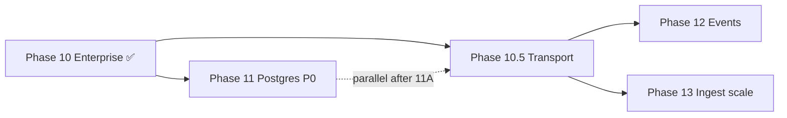

# Phase 10.5 — Transport & Connectivity Layer — DESIGN

**Document:** DESIGN  
**Phase status:** Implemented — ADR-027 Implemented (2026-07-04); **tracks 10.5A–10.5F ✅** (gate REVIEW/COMPLETION pending)  
**Schema:** [PHASE-DOCUMENT-SCHEMA.md](../PHASE-DOCUMENT-SCHEMA.md)  
**Authority:** [00-CONSTITUTION.md](../../core/constitution/00-CONSTITUTION.md) → [04-ARCHITECTURE.md](../../core/architecture/04-ARCHITECTURE.md) → [ADR-027](../../adr/027-transport-connectivity-layer.md)  
**Roadmap placement:** Extension track **10.5** — parallel with Phase 11 after 11A; **does not block** Postgres P0

---

## 1. Architecture Analysis

### 1.1 Position on roadmap

| Dimension | Assessment |
|-----------|------------|
| **Predecessors** | Phase 10 ✅ (enterprise ports), Phase 7.5 ✅ (capability manifest), Phase 3 ✅ (auth at edge) |
| **Successors** | Phase 12 (event consumers), Phase 13 (batch ingest), Phase 14 (prod index sync), distributed fabric |
| **Priority** | **P1 extension** — not P0; Phase 11 Postgres remains P0 |
| **Placement rationale** | Numbered 10.5 because it **formalizes the edge layer** introduced in Phases 1–3 before operational cutover phases complete; structurally completes Clean Architecture stack started in Phase 9.5 (ports) |



### 1.2 Dependencies

#### Hard dependencies (must be ✅ before implementation)

| Phase / ADR | Requirement |
|-------------|-------------|
| Phase 10 | Composition root patterns, platform adapters |
| ADR-025 | `CapabilityManifestBuilder` for transport section extension |
| ADR-008 | Ports unchanged — transport sits above services |
| Phase 3 | Auth middleware patterns at edge |

#### Soft dependencies (parallel OK)

| Phase | Relationship |
|-------|--------------|
| Phase 11 | Independent — storage cutover does not require gRPC |
| Phase 12 | Benefits from gRPC event consumer transport |
| Phase 13 | Batch ingest workers benefit from gRPC client-stream |

#### Forward dependencies (future phases depend on 10.5)

| Future need | Extension enabled |
|-------------|-------------------|
| Cross-region memory fabric | gRPC + `TransportContext` metadata |
| MCP HTTP/SSE (spec evolution) | `ITransportServer` registry |
| Enterprise service mesh | mTLS gRPC interceptors |
| `@ratary/client` SDK | OpenAPI + proto artifacts |

### 1.3 Extension points

| Extension point | Location | Purpose |
|-----------------|----------|---------|
| `ITransportServer` | `transport/registry/` | Register new protocol servers |
| `TransportContext` | `transport/shared/` | Cross-protocol scope + auth |
| `IApplicationHandler<TIn,TOut>` | `transport/shared/handlers/` | Single use-case entry per operation |
| `AICapabilityManifest.transport` | `capabilities/` | Discoverable transport matrix |
| gRPC interceptors | `transport/grpc/interceptors/` | Auth, tracing, compression |
| Proto package `ontorata.ratary.v1` | `transport/grpc/proto/` | Versioned wire contract |

### 1.4 Interface impact

| Interface | Change |
|-----------|--------|
| `ITransportServer` | **New** — lifecycle only |
| `TransportRegistry` | **New** — composition root |
| `TransportContext` | **New** — cross-protocol DTO |
| `IApplicationHandler` | **New** — thin handler contract |
| `AICapabilityManifest` | **Extend** — additive `transport` block |
| All service interfaces | **Unchanged** |
| All repository ports | **Unchanged** |
| All storage ports (ADR-008) | **Unchanged** |

### 1.5 Repository impact

**None.** Transport layer does not access persistence. Repositories remain invoked only through application services.

### 1.6 Service impact

**None to business logic.** `MemoryService`, `SearchService`, `KnowledgeService`, `ContextService`, `GraphService` signatures and orchestration unchanged.

Optional: handlers receive already-constructed service instances via DI — same as controllers today.

### 1.7 Migration impact

| Category | Impact |
|----------|--------|
| Database schema | **None** |
| Data backfill | **None** |
| Folder structure | **Strangler move** with re-export aliases |
| Env vars | **Additive:** `GRPC_ENABLED`, `GRPC_PORT`, `GRPC_TLS_*` (optional) |
| Deploy | Default unchanged; gRPC documented for K8s/VM |

### 1.8 Protocol impact

| Protocol | Impact |
|----------|--------|
| REST `/api/v1` | **Unchanged** URLs and response shapes |
| MCP stdio | **Unchanged** tool schemas; optional path move only |
| gRPC | **New opt-in** — separate port, proto v1 |
| OpenAPI | **Extend** — document transport env; no endpoint removal |
| SDK (external) | **New artifacts** — proto publish; no in-repo package |

### 1.9 Testing impact

| Area | Change |
|------|--------|
| Default CI (`npm test`) | Unchanged — 457+ tests green |
| New: handler parity suite | REST vs MCP vs gRPC same fixture |
| New: transport contract tests | Proto breaking-change check (optional `buf`) |
| New: optional gRPC CI job | `GRPC_ENABLED=true` — not default gate |
| Lint gate | No `fastify`/`@grpc/grpc-js` imports in `services/` |

### 1.10 Breaking change assessment

| Check | Result |
|-------|--------|
| REST response shape change | ❌ None — **STOP not triggered** |
| MCP tool rename/remove | ❌ None |
| DB schema change | ❌ None |
| Service signature change | ❌ None |
| Permission model change | ❌ None |

**Verdict:** No breaking change. ADR-027 **Proposed** for structural formalization; implementation blocked until **Approved**.

---

## 2. Purpose — Mengapa phase ini diperlukan?

Constitution §17 states transport is distinct from application orchestration, yet edge code evolved organically across `routes/`, `controllers/`, and `mcp/`. Without a canonical transport layer:

1. **Drift risk** — REST controllers and MCP tools may diverge in mapping logic.
2. **Enterprise gap** — batch embedding, vector ingest, and streaming context need gRPC; bolting gRPC onto controllers violates layer law.
3. **Protocol evolution** — MCP HTTP/SSE and federated memory nodes require a **registry pattern**, not another one-off server file.
4. **Discoverability** — ADR-025 manifest must report which transports are active in deployment.

Phase 10.5 **closes the architectural gap** between Phase 9.5 (storage ports) and Phase 11–14 (operational scale) by making connectivity **explicit, testable, and swappable**.

---

## 3. Roadmap placement — Mengapa di posisi ini?

| Reason | Detail |
|--------|--------|
| **After Phase 10** | Enterprise ports and auth RBAC stable; transport is the remaining outer layer |
| **Before / parallel Phase 12–13** | Event consumers and ingest workers need gRPC path |
| **Not before Phase 11 P0** | Postgres cutover is storage concern; must not compete for owner attention |
| **Numbered 10.5** | Extension track pattern (like 5.5–8.5, 7.5, 9.5) — additive, non-blocking |
| **Not Phase 15** | Problem is structural now; delaying increases MCP/REST drift debt |

---

## 4. Scope

### Included

| Track | Deliverable |
|-------|-------------|
| **10.5A** | `TransportContext`, unified scope resolution, transport error mapping |
| **10.5B** | Shared `IApplicationHandler` for ≥10 high-traffic use cases |
| **10.5C** | REST migration to `transport/rest/` (strangler re-exports) |
| **10.5D** | MCP migration to `transport/mcp/` |
| **10.5E** | gRPC server (Memory, Context stream, Health) — `GRPC_ENABLED=false` |
| **10.5F** | Manifest `transport` section; PANDUAN § transport; 04-ARCHITECTURE update |

### Excluded

- GraphQL
- `@ratary/client` npm package in repo
- Agent runtime
- Business logic / repository / storage changes
- gRPC on Vercel serverless (document limitation)
- Full REST↔gRPC endpoint parity in v1

---

## 5. Architecture

### 5.1 Target layer stack

```
┌─────────────────────────────────────────────────────────────────────┐
│  External consumers (AI clients, bots, enterprise services)          │
└───────────────────────────────┬─────────────────────────────────────┘
                                │
┌───────────────────────────────▼─────────────────────────────────────┐
│  TRANSPORT LAYER — src/transport/                                    │
│  REST (Fastify) │ MCP (stdio) │ gRPC (opt-in) │ [GraphQL deferred]  │
│  Auth hooks · rate limits · protocol encode/decode · scope bootstrap │
└───────────────────────────────┬─────────────────────────────────────┘
                                │ TransportContext
┌───────────────────────────────▼─────────────────────────────────────┐
│  APPLICATION HANDLERS (thin) — transport/shared/handlers/            │
│  One handler per use case; invoked by all transports                 │
└───────────────────────────────┬─────────────────────────────────────┘
                                │
┌───────────────────────────────▼─────────────────────────────────────┐
│  APPLICATION SERVICES — UNCHANGED                                    │
│  MemoryService │ SearchService │ KnowledgeService │ ContextService   │
└───────────────────────────────┬─────────────────────────────────────┘
                                │
┌───────────────────────────────▼─────────────────────────────────────┐
│  DOMAIN + PORTS + INFRASTRUCTURE — UNCHANGED                         │
└─────────────────────────────────────────────────────────────────────┘
```

### 5.2 Design invariants

1. **One behavioral path** — all transports → same handler → same service.
2. **MCP does not traverse REST** — direct service invocation (existing rule preserved).
3. **Inward dependencies** — `services/` never imports transport frameworks.
4. **Additive contracts** — REST v1 + MCP tools stable; gRPC is new surface.
5. **Default OFF** — no gRPC listener without explicit env.
6. **Storage agnostic** — transport unaware of D1/Postgres/Pinecone.
7. **AI agnostic** — MCP for IDE clients; REST for Actions; gRPC for backends.

### 5.3 Module structure

```
src/
  transport/
    shared/
      transport-context.types.ts
      resolve-transport-scope.ts      # unify REST + MCP + gRPC metadata
      transport-errors.ts
      handlers/
        memory-create.handler.ts
        memory-search.handler.ts
        memory-get.handler.ts
        context-build.handler.ts
        capabilities-get.handler.ts
        ... (≥10 handlers)
    rest/
      rest-server.ts                  # from server.ts bootstrap
      routes/                         # migrate from src/routes/
      controllers/                    # migrate from src/controllers/
      plugins/                        # swagger, rate-limit, otel (transport-only)
    mcp/
      mcp-server.ts
      stdio.ts
      tools/                          # thin tool → handler dispatch
      tool-registry.ts                # SSOT with MCP_TOOL_NAMES
    grpc/
      grpc-server.ts
      proto/ontorata/ratary/v1/*.proto
      services/                       # gRPC → handler
      interceptors/                   # auth, logging
    registry/
      transport-registry.ts
      transport-capabilities.ts
  services/                           # UNCHANGED
  capabilities/                       # EXTEND manifest.transport
  server.ts                           # thin → TransportRegistry.startAll()
  routes/                             # DEPRECATED re-exports during migration
  controllers/                        # DEPRECATED re-exports during migration
  mcp/                                # DEPRECATED re-exports during migration
```

### 5.4 Interface design

```typescript
/** Lifecycle — one implementation per protocol */
interface ITransportServer {
  readonly protocol: 'rest' | 'mcp-stdio' | 'grpc';
  start(): Promise<void>;
  stop(): Promise<void>;
  health(): { status: 'ok' | 'degraded' | 'down'; details?: Record<string, unknown> };
}

/** Cross-protocol context — no Fastify/gRPC types inward */
interface TransportContext {
  readonly requestId: string;
  readonly ownerId: string;
  readonly workspaceId?: string;
  readonly agentId?: string;
  readonly organizationId?: string;
  readonly auth: AuthPrincipal | null;
  readonly source: 'rest' | 'mcp-stdio' | 'grpc';
}

/** Single use-case entry — all transports delegate here */
interface IApplicationHandler<TInput, TOutput> {
  handle(ctx: TransportContext, input: TInput): Promise<TOutput>;
}

/** Composition root */
interface ITransportRegistry {
  register(server: ITransportServer): void;
  startAll(): Promise<void>;
  stopAll(): Promise<void>;
  listActive(): Array<'rest' | 'mcp-stdio' | 'grpc'>;
}
```

**Note:** Avoid monolithic `ITransport` request/response types — violates Interface Segregation (13-AI-DECISION-FRAMEWORK).

### 5.5 gRPC v1 surface

| gRPC Service | RPC | Maps to | Streaming |
|--------------|-----|---------|-----------|
| `MemoryService` | Create/Get/Update/Delete/List | `MemoryService` | Unary |
| `SearchService` | Search | `SearchService` | Unary |
| `ContextService` | BuildContext | `ContextService` | **Server stream** |
| `HealthService` | Check | Liveness | Unary |
| `EmbeddingIngestService` | *(Phase 13)* | `EmbeddingJobRunner` | Client stream — **stub/defer OK in 10.5E** |

Proto package: `ontorata.ratary.v1`. Breaking changes → new package `ai.brain.v2`.

### 5.6 Transport capability matrix

| Capability | REST | gRPC | MCP | SDK (external) |
|------------|------|------|-----|----------------|
| Memory CRUD | ✅ public | ✅ v1 | ✅ tools | wraps REST/gRPC |
| Search | ✅ | ✅ | ✅ | ✅ |
| Context | ✅ | ✅ + stream | ✅ | ✅ |
| Capabilities | ✅ GET public | ✅ | ✅ tool | bootstrap |
| Streaming | ❌ (SSE later) | ✅ native | partial | transport-dependent |
| Auth | JWT/API key | metadata + mTLS | MCP_OWNER_ID | API key |
| Compression | HTTP gzip | channel | N/A stdio | transparent |
| Health | `/health` | gRPC health | process | ping |
| Versioning | `/api/v1` | proto v1 | manifest | semver |

### 5.7 Manifest extension (ADR-025 additive)

```typescript
// Add to AICapabilityManifest — clients ignore unknown keys
transport: {
  rest: { enabled: true; version: 'v1'; baseUrl: string };
  mcp: { enabled: true; transport: 'stdio'; toolCount: number };
  grpc: { enabled: boolean; port?: number; protoVersion?: string };
  sdk: { packageName: '@ratary/client'; status: 'planned' | 'published' };
};
```

---

## 6. Boundary

| Inside Phase 10.5 | Outside |
|-------------------|---------|
| Protocol adapters, handlers, registry | Business rules |
| Scope bootstrap at edge | Domain ranking/scoring |
| gRPC proto + server | Storage adapters |
| Transport section in manifest | `@ratary/client` implementation |
| Auth hook invocation | Permission policy definition (auth/) |
| Folder migration | Repository decomposition (Phase 11C) |

---

## 7. Compatibility matrix — AI runtimes

| Consumer | Primary transport | Phase 10.5 impact |
|----------|-------------------|-------------------|
| Cursor | MCP stdio | None |
| Claude Code | MCP stdio | None |
| Gemini CLI | MCP stdio | None |
| Cline / Roo / Copilot | MCP stdio | None |
| ChatGPT Actions | REST | None |
| OpenAI Agents SDK | REST | Optional gRPC self-hosted |
| LangGraph | REST | None |
| CrewAI / AutoGen | REST | None |
| Internal enterprise | REST + gRPC | **Primary gRPC beneficiary** |

---

## 8. Migration strategy

### Strangler sequence

1. **10.5A** — Add `transport/shared/`; controllers/tools call shared scope resolver (internal refactor).
2. **10.5B** — Extract handlers; wire REST controller + MCP tool to same handler.
3. **10.5C/D** — Move files; leave `src/routes/index.ts` re-exporting from `transport/rest/`.
4. **10.5E** — Add gRPC; default flag off.
5. **10.5F** — Docs + manifest; remove re-exports only after gate PASS.

### Rollback

- `GRPC_ENABLED=false` — immediate.
- Git revert per track — re-exports preserve consumer imports.

---

## 9. Testing strategy

| Suite | Purpose | Default CI |
|-------|---------|------------|
| Handler parity | Same input → same output across REST/MCP/gRPC | ✅ |
| Transport contract | OpenAPI snapshot; MCP tools; proto lint | ✅ |
| gRPC integration | Unary + context stream | Optional job |
| Performance | Stream latency vs REST context | Manual/benchmark |
| Regression | 457+ existing tests | ✅ |
| Layer lint | No transport imports in `services/` | ✅ grep gate |

---

## 10. Success criteria

| ID | Criterion |
|----|-----------|
| SC-10.5-01 | ADR-027 **Approved** |
| SC-10.5-02 | `src/transport/` canonical; 04-ARCHITECTURE updated |
| SC-10.5-03 | Zero logic change in Memory/Search/Knowledge services |
| SC-10.5-04 | REST + MCP E2E green at default env |
| SC-10.5-05 | Handler parity ≥10 use cases |
| SC-10.5-06 | `GRPC_ENABLED=false` default; no Vercel regression |
| SC-10.5-07 | Manifest `transport` section accurate |
| SC-10.5-08 | REVIEW gate PASS |

---

## 11. Wajib dijawab — Change summary

| Question | Answer |
|----------|--------|
| **Mengapa diperlukan?** | Formalize transport layer; prevent drift; enable gRPC for enterprise/ingest |
| **Mengapa posisi roadmap?** | Extension 10.5 after enterprise ports; parallel Phase 11; enables 12–13 |
| **Apa yang berubah?** | Folder structure; shared handlers; optional gRPC; manifest transport section |
| **Apa yang tetap?** | Services, repositories, ports, storage, REST v1, MCP tools, default deploy |
| **Extension points?** | `ITransportServer`, `TransportContext`, `IApplicationHandler`, proto v1, manifest |
| **Service lama berubah?** | **Tidak** — logic unchanged |
| **Repository lama berubah?** | **Tidak** |
| **API berubah?** | **Tidak** — additive manifest fields only |
| **MCP berubah?** | **Tidak** — schemas unchanged; optional internal path move |
| **Protocol berubah?** | **Additive** — gRPC opt-in; REST/MCP roles unchanged |
| **Database berubah?** | **Tidak** |
| **Deployment berubah?** | **Default tidak** — gRPC documented for long-running Node |
| **Testing berubah?** | **Additive** — parity + contract suites |
| **Documentation berubah?** | **Ya** — 04-ARCHITECTURE, PANDUAN § transport, POST-ROADMAP |

---

## 12. Future compatibility

| Horizon | Enablement |
|---------|------------|
| Phase 12 events | gRPC fan-out consumers |
| Phase 13 ingest | gRPC client-stream embeddings |
| MCP HTTP/SSE | New `ITransportServer` implementation |
| Global memory fabric | Federated manifest + gRPC peering |
| GraphQL | Separate ADR; resolvers → handlers only |

---

## 13. References

| Document | Relevance |
|----------|-----------|
| [ADR-027](../../adr/027-transport-connectivity-layer.md) | Structural gate |
| [ADR-025](../../adr/025-capability-discovery-api.md) | Manifest extension |
| [04-ARCHITECTURE.md](../../core/architecture/04-ARCHITECTURE.md) | Layer law |
| [07.5 DESIGN](../07.5-runtime-compatibility/DESIGN.md) | SDK external |
| [10-POST-ROADMAP.md](../roadmap/10-POST-ROADMAP.md) | Phase sequence |
| Architecture Review 2026-07-04 | Parent review |

---

*Subordinate to [00-CONSTITUTION.md](../../core/constitution/00-CONSTITUTION.md). **No implementation until ADR-027 Approved and owner authorization recorded in CHECKLIST.md §F.***
