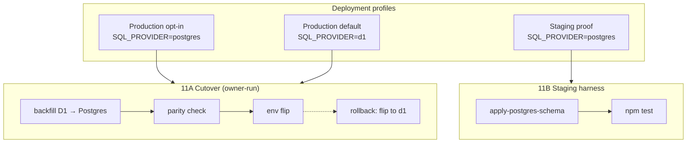
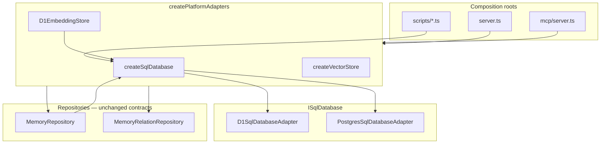
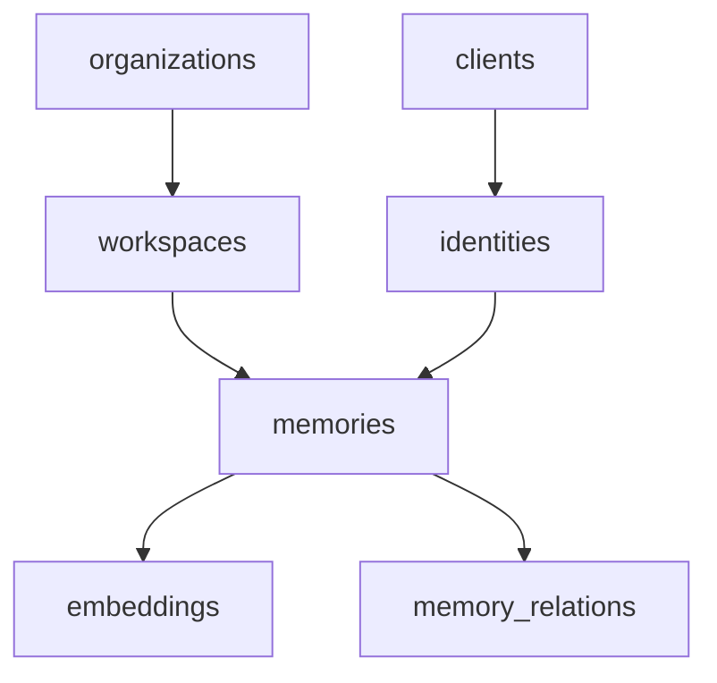

# Phase 11 — Production Operations — DESIGN

**Document:** DESIGN  
**Phase status:** ✅ Gate PASS (2026-07-04)  
**Schema:** [PHASE-DOCUMENT-SCHEMA.md](../PHASE-DOCUMENT-SCHEMA.md)  
**Depends on:** Phase 10 ✅ · ADR-009 Implemented · ADR-018 **Approved**

**Authority chain:** [00-CONSTITUTION.md](../../core/constitution/00-CONSTITUTION.md) → [04-ARCHITECTURE.md](../../core/architecture/04-ARCHITECTURE.md) → Approved ADRs → this document.

---

## Lifecycle

| Attribute | Value |
|-----------|-------|
| **Created when** | Phase folder scaffolded (2026-07-03) |
| **Updated by** | AI assistant drafts; owner approves via ADR-018 |
| **Read-only when** | Phase gate PASS — frozen as historical design record |
| **Roadmap relation** | [10-POST-ROADMAP.md — Phase 11](../../roadmap/10-POST-ROADMAP.md) |

---

## 1. Purpose

Phase 10 delivered `PostgresSqlDatabaseAdapter` (ADR-009), `createSqlDatabase()`, and env-driven `createPlatformAdapters()` while **default production remains D1**. The adapter passes unit and contract tests with a mock pool, but **no gate evidence** exists for full-suite integration on a real Postgres instance.

**Problem Phase 11 solves:**

1. **Unproven cutover path** — Repositories already depend on `ISqlDatabase`, yet staging has not run 405+ tests against live Postgres DDL + data paths.
2. **Operational gap** — ADR-009 defines adapter mechanics; it does not define owner runbook, backfill procedure, parity checks, or rollback limits.
3. **Schema bootstrap gap** — `runMigrations()` accepts `D1Client` only; Postgres environments need an equivalent idempotent schema apply path derived from the same canonical DDL as `schema.sql` / `MIGRATION_SQL`.
4. **Maintainability (T-01)** — `MemoryRepository` (~622 lines) implements both `IMemoryReader` and `IMemoryWriter` in one class (ADR-004 Option A). Postgres-first operations benefit from internal reader/writer boundaries before optional engine-specific adapters (ADR-004 Option B).

**Outcome:** Documented, reversible Postgres metadata cutover; staging proof at full test-suite scale; default D1 deploy unchanged — **without rewriting** `MemoryService`, `Retriever`, or domain cores.

---

## 2. Scope

### Included

| Track | Deliverable | Design intent |
|-------|-------------|---------------|
| **11A — Cutover runbook** | Owner-facing procedure in `MIGRATION.md` | Ordered steps: schema apply → backfill → parity check → env flip → smoke → rollback |
| **11B — Staging harness** | Repeatable Postgres test job | `SQL_PROVIDER=postgres` + `DATABASE_URL` runs full `npm test` (or documented manual equivalent) |
| **11C — Repository hardening** | Optional internal split | Extract reader/writer modules behind `MemoryRepository` facade; ADR-019 if new files cross layer boundaries |
| **11D — Ops docs** | Production env matrix | PANDUAN §8 + README env table: secrets, pooling, which flags stay `d1` during metadata cutover |

### Explicitly excluded

- Production flip without owner sign-off and ADR-018 **Approved**.
- Automatic dual-write in application code (unless ADR-018 Approved strategy explicitly requires it).
- Vector cutover (`VECTOR_PROVIDER=pgvector`), R2 content offload, Meilisearch, Neo4j — Phases 13–14.
- Event bus consumers, analytics fan-out, OTel production runbook — Phase 12.
- Agent runtime, planner, executor (Constitution forbidden).
- `MemoryServiceV2`, `RetrieverV2`, or breaking REST/MCP response shapes.
- Mandatory Postgres for all deployments — remains opt-in via `SQL_PROVIDER`.
- Replacing SQLite-oriented migration authoring in `migrations.ts` with Postgres-native DDL (parity translation is a bootstrap concern, not a dialect rewrite of repositories).

---

## 3. Architecture

### 3.1 Current state (Phase 10 baseline)

Phase 10 closed with:

- `createPlatformAdapters(d1Client, env)` → `createSqlDatabase()` → `D1SqlDatabaseAdapter` | `PostgresSqlDatabaseAdapter`
- All metadata repositories (`MemoryRepository`, auth repos, enterprise stores, `D1EmbeddingStore`) receive `ISqlDatabase` from the factory
- Default env: `SQL_PROVIDER=d1` — **405 tests** green, no Postgres service required in CI

Phase 11 adds **operational proof** on top of this wiring — not a new layer.

### 3.2 Target operational state



### 3.3 Composition root flow (unchanged)



**Rule:** Phase 11 MUST NOT introduce SQL provider selection outside `createSqlDatabase()` and documented scripts.

### 3.4 Environment contract

| Env var | Default | Phase 11 role |
|---------|---------|---------------|
| `SQL_PROVIDER` | `d1` | `postgres` only in staging harness and owner-approved production cutover |
| `DATABASE_URL` | — | Required when `SQL_PROVIDER=postgres`; never committed |
| `CLOUDFLARE_*`, `D1_*` | required when `d1` | Still required for D1 backfill source during cutover |
| `VECTOR_PROVIDER` | `d1` | **Unchanged** during metadata cutover — vector SQL stays in `D1EmbeddingStore` on same `ISqlDatabase` |
| `OBJECT_STORAGE_PROVIDER` | `inline` | Unchanged |
| `ENTERPRISE_RBAC` | `false` | Unchanged; org schema already on both engines after bootstrap |

Validation lives in `src/config/env.ts` — Phase 11 documents behavior; changes only if harness reveals gaps.

### 3.5 Cutover states

| State | `SQL_PROVIDER` | Metadata writes | Rollback |
|-------|----------------|-----------------|----------|
| **S0 — Baseline** | `d1` | D1 | N/A |
| **S1 — Staging proof** | `postgres` (isolated DB) | Staging Postgres only | Drop staging DB |
| **S2 — Backfill complete** | `d1` (prod still live) | D1 primary; Postgres has copy | Discard Postgres copy |
| **S3 — Cutover** | `postgres` | Postgres primary | Flip to `d1` (see limits below) |
| **S4 — Rollback** | `d1` | D1 primary | Postgres retained for re-attempt |

**Rollback limit (design constraint):** Env flip to `d1` is immediate for **reads and writes** against D1. Rows written only to Postgres during S3 are **not** automatically synced back to D1. Runbook MUST document this and recommend a read-only or quiesce window during flip.

**Approved cutover strategy ([ADR-018](../../../docs/adr/018-production-postgres-cutover.md) Option A):**

1. Quiesce / write freeze on production.
2. Final incremental backfill D1 → Postgres.
3. Parity verification via `verify-postgres-parity` script (counts + spot checks).
4. Flip `SQL_PROVIDER=postgres`; run smoke tests.
5. Retain D1 read-only snapshot **≥ 30 days** (no destructive D1 purge in Phase 11).

Application dual-write is **explicitly rejected** — see ADR-018 Alternatives Option B.

### 3.6 Schema parity model

Canonical DDL: `schema.sql` ↔ `src/db/migrations.ts` (`MIGRATION_SQL` + phase migration functions).

| Concern | D1 today | Postgres Phase 11 |
|---------|----------|-------------------|
| Authoring | SQLite DDL in `migrations.ts` | Same strings applied via `ISqlDatabase` bootstrap script |
| Types | `TEXT`, `INTEGER` booleans | Preserve for repository SQL reuse (ADR-009 placeholder translation only) |
| Transactions | `BEGIN IMMEDIATE` in `executeTransaction()` | Bootstrap script uses Postgres-compatible transaction syntax where needed |
| Idempotency | `CREATE TABLE IF NOT EXISTS` | Same — bootstrap must be re-runnable |

Phase 11 introduces a **Postgres schema apply path** (script or `runPostgresMigrations(sql: ISqlDatabase)`) that mirrors D1 end-state schema without forking repository SQL.

### 3.7 Track details

#### 11A — Cutover runbook

Owner-facing content in `MIGRATION.md` (not this document):

- Prerequisites checklist (ADR-018 Approved, staging PASS, secrets in vault)
- Table inventory for backfill ordering (respect FK: organizations → workspaces → memories → embeddings → relations)
- Parity verification queries (counts, spot-check by `owner_id`)
- Smoke test commands post-flip
- Rollback procedure with data-loss boundaries
- Sign-off template for `REVIEW.md`

#### 11B — Staging harness

Minimum bar:

- Provision ephemeral Postgres (CI service container, Docker Compose, or managed staging instance)
- Apply schema bootstrap
- Run `npm test` with `SQL_PROVIDER=postgres` and `DATABASE_URL`
- Default CI job continues running `SQL_PROVIDER=d1` (or implicit mock) first — **no regression to 405-test baseline**

Optional escalation (not gate-required):

- Testcontainers job for local reproducibility
- Subset integration suite tagged `@postgres` if full suite runtime is prohibitive — must be justified in `TESTING.md` and cover all repository + E2E scope paths

#### 11C — Repository hardening (optional)

ADR-004 deferred **Option B**: split implementation, keep `MemoryRepository` as facade implementing `IMemoryRepository`.

| Module (proposed) | Responsibility | Port |
|-------------------|----------------|------|
| `memory-reader.sql.ts` | SELECT, search, list, retrieval projections | `IMemoryReader` methods |
| `memory-writer.sql.ts` | INSERT, UPDATE, DELETE, `recordAccessBatch` | `IMemoryWriter` methods |
| `memory.repository.ts` | Delegates to reader/writer; **canonical class name unchanged** | `IMemoryRepository` |

**Gate:** Proceed only after 11B staging PASS. Structural file split requires **ADR-019 Approved** if it changes port locations or adds new public types.

#### 11D — Ops docs

Update human-facing docs with:

- When to choose Postgres vs D1
- Connection pooling guidance (`pg.Pool` created in `createPostgresSqlDatabase` — document max connections, graceful shutdown via `unwrapPool()`)
- Secrets: `DATABASE_URL` via env only ([SECURITY.md](../../core/supplementary/SECURITY.md))
- Flag matrix: metadata on Postgres while `VECTOR_PROVIDER=d1` still means embeddings table lives on metadata DB (same `ISqlDatabase`) — not a separate vector engine until Phase 13

---

## 4. Dependency Rules

### Allowed (Phase 11)

| From | To |
|------|-----|
| `scripts/apply-postgres-schema.ts` (planned) | `ISqlDatabase`, `migrations.ts` exports |
| `scripts/backfill-d1-to-postgres.ts` (planned) | D1 client (source), `ISqlDatabase` (target), existing `backfill-cli` patterns |
| `.github/workflows/*` (planned) | Documented env vars only |
| `infrastructure/sql/postgres-*` | Bugfixes for staging failures only — no contract change |

### Forbidden

| Rule | Rationale |
|------|-----------|
| `services/` or `domain/` imports `pg` | ADR-009 / Constitution |
| Provider selection in repositories | Composition root only |
| Cutover automation without ADR-018 Approved | Governance gate |
| D1 schema changes without `schema.sql` sync | Single canonical DDL |
| Big-bang `MemoryRepository` rewrite coupled to cutover | Risk R11-06; split is optional 11C |

Same layer rules as [Phase 10 DESIGN §4](../10-enterprise/DESIGN.md#4-dependency-rules) apply unchanged.

---

## 5. Interfaces

### 5.1 Unchanged ports

| Interface | Phase 11 action |
|-----------|-----------------|
| `ISqlDatabase` | **Prove** on live Postgres via harness — no signature change |
| `IMemoryRepository` / `IMemoryReader` / `IMemoryWriter` | **Unchanged** at port level |
| `IRelationRepository`, enterprise ports, auth repos | **Unchanged** — ride same `ISqlDatabase` |
| `IVectorStore`, `IObjectStorage`, `IEventBus`, etc. | **Unchanged** — not part of metadata cutover |

### 5.2 Optional internal modules (11C only)

No new public ports. Internal SQL modules are implementation details behind `MemoryRepository`.

### 5.3 Scripts (planned — ADR-018 gate)

| Script | Responsibility |
|--------|----------------|
| `scripts/apply-postgres-schema.ts` | Idempotent Postgres DDL from canonical migrations |
| `scripts/backfill-d1-to-postgres.ts` | D1 → Postgres row copy; `--dry-run` default |
| `scripts/verify-postgres-parity.ts` | Count/checksum comparison for cutover sign-off |

Reuse patterns from `scripts/lib/backfill-sql.ts` and `scripts/lib/backfill-cli.ts`.

---

## 6. Migration Strategy

### Principles

1. **Default unchanged** — All existing D1 deployments keep `SQL_PROVIDER=d1` until owner opts in.
2. **Prove before flip** — Staging harness PASS is gate evidence for 11B; production cutover follows 11A runbook only.
3. **Same repository SQL** — Postgres adapter translates `?` placeholders only; no dialect fork in repositories.
4. **Idempotent backfill** — Upsert by primary key; safe to re-run after partial failure.
5. **Forward-fix rollback** — Reverting env does not drop Postgres data; D1 is restored as primary, not rebuilt from Postgres automatically.

### Rollout phases

| Step | Action | Production impact |
|------|--------|-------------------|
| **11.1** | ADR-018 **Approved**; Readiness PASS | None |
| **11.2** | Postgres schema bootstrap script + staging DB | None — isolated |
| **11.3** | Staging harness: full test suite on Postgres | None — CI/staging only |
| **11.4** | Backfill script (dry-run validated on staging copy of prod data) | None until owner runs on prod |
| **11.5** | Owner cutover per runbook (S2 → S3) | Write path moves to Postgres |
| **11.6** | Optional 11C reader/writer split | None if refactor-only |

### Data backfill ordering



Auth and audit tables follow same dependency order documented in `MIGRATION.md`.

### Rollback

| Action | Effect |
|--------|--------|
| Set `SQL_PROVIDER=d1` | Immediate return to D1 adapter |
| Redeploy with D1 env | No Postgres connection required |
| Postgres data | Retained for forward-fix / re-cutover |
| Writes during Postgres primary | **Lost on D1** unless manually backfilled — runbook must warn |

---

## 7. Risks

Full register: [RISKS.md](RISKS.md).

| ID | Risk | Likelihood | Impact | Mitigation |
|----|------|------------|--------|------------|
| R11-01 | Schema drift D1 ↔ Postgres | Medium | High | Shared canonical DDL; bootstrap from `MIGRATION_SQL` |
| R11-02 | Cutover downtime / data loss | Medium | Critical | Quiesce window; parity script; ADR-018 rollback |
| R11-03 | Staging not representative | Medium | High | Document prod sizing; full E2E on staging |
| R11-04 | `DATABASE_URL` leakage | Low | Critical | SECURITY.md; CI secrets only |
| R11-05 | Default D1 regression | Medium | High | CI default env first; 405+ tests unchanged |
| R11-06 | 11C scope creep | Medium | Medium | Defer until 11B PASS; ADR-019 gate |
| R11-07 | SQL dialect edge cases | Medium | Medium | Expand adapter tests; fix in infrastructure only |
| R11-08 | Cutover without parity check | Low | High | Runbook blocks flip until verify script PASS |

---

## 8. Testing Strategy

### Unit (existing + extend)

- `PostgresSqlDatabaseAdapter` — placeholder translation, `execute` meta mapping (✅ exists)
- `describeSqlDatabaseContract` shared harness (✅ exists)
- Add tests for any bootstrap SQL splitter edge cases if new script logic is introduced

### Integration (Phase 11 gate evidence)

| Test | Purpose |
|------|---------|
| Staging harness full suite | **Primary gate** — all tests green on live Postgres |
| Schema bootstrap idempotency | Run apply script twice; no error |
| Backfill dry-run | No writes; logs counts |
| Backfill round-trip | Seed D1 fixture → backfill → query Postgres |

### Contract

- All repositories continue to use `?` placeholders — verified by adapter tests, not duplicated per repo
- `cross-owner-leak`, `cross-workspace-leak`, `cross-org` E2E must pass on Postgres harness same as D1

### Compatibility

- **405+ tests** green at default env (`SQL_PROVIDER=d1` or implicit test mocks)
- Postgres harness may run in separate CI job — must not block default job

Detailed plan: `TESTING.md` (to be authored at implementation start).

---

## 9. Deliverables

**Design-only in this document. Implementation sequencing belongs in `IMPLEMENTATION.md`.**

### ADRs

| ADR | Title | Status needed |
|-----|-------|---------------|
| [ADR-009](../../../docs/adr/009-postgresql-metadata-adapter.md) | PostgreSQL metadata adapter | ✅ Approved |
| [ADR-018](../../../docs/adr/018-production-postgres-cutover.md) | Production Postgres cutover | ✅ Approved |
| ADR-019 (optional) | Repository module split | Approved before 11C structural split |

### Artifacts by track

| Track | Artifacts |
|-------|-----------|
| 11A | `MIGRATION.md`, owner sign-off in `REVIEW.md` |
| 11B | CI/workflow or documented Compose harness; `TESTING.md` evidence |
| 11C | Internal reader/writer modules (optional); ADR-019 if required |
| 11D | PANDUAN §8, README env matrix updates |

### Planned paths (ADR-018 gate)

```
scripts/apply-postgres-schema.ts
scripts/backfill-d1-to-postgres.ts
scripts/verify-postgres-parity.ts
.github/workflows/postgres-staging.yml   # or equivalent documented harness
```

---

## 10. Success Criteria

| ID | Criterion | Evidence |
|----|-----------|----------|
| SC-11-01 | Full test suite passes on Postgres staging harness | CI log or `TESTING.md` |
| SC-11-02 | Cutover + rollback documented with data boundaries | `MIGRATION.md` |
| SC-11-03 | Default D1 deploy unchanged; 405+ tests at default env | CI default job |
| SC-11-04 | No `MemoryService` / `Retriever` rewrite | Architecture review / grep |
| SC-11-05 | Owner sign-off on cutover strategy | `REVIEW.md` |
| SC-11-06 | ADR-018 **Approved** before merge of cutover scripts | ADR index |

Optional (11C):

| ID | Criterion | Evidence |
|----|-----------|----------|
| SC-11-07 | `MemoryRepository` delegates to reader/writer modules | Code review; tests unchanged |

---

## 11. Owner decisions (ratified in ADR-018)

| Question | Decision |
|----------|----------|
| Managed Postgres vendor | Owner choice — standard `DATABASE_URL`; pool limits in ops runbook |
| Cutover window | Quiesce / write freeze (not dual-write) |
| CI Postgres | GitHub Actions service container + documented Docker Compose |
| 11C repository split | Defer until 11B PASS; ADR-019 if structural |
| D1 retention post-cutover | ≥ 30 days read-only snapshot |

Implementation commits require **Readiness PASS** in addition to ADR-018 Approved.

---

## 12. References

| Document | Role |
|----------|------|
| [10-POST-ROADMAP.md](../../roadmap/10-POST-ROADMAP.md) | Phase 11 scope authority |
| [Phase 10 DESIGN](../10-enterprise/DESIGN.md) | Adapter architecture baseline |
| [ADR-004](../../../docs/adr/004-repository-port-types.md) | Reader/writer split policy |
| [10-PHASE-STATUS.md](../../core/architecture/10-PHASE-STATUS.md) | T-01 debt tracking |
| [RISKS.md](RISKS.md) | Phase risk register |

---

*Draft expanded 2026-07-03. Frozen at Phase 11 gate PASS.*

---

*Do not contradict [10-POST-ROADMAP.md](../../roadmap/10-POST-ROADMAP.md) or Approved ADRs.*
