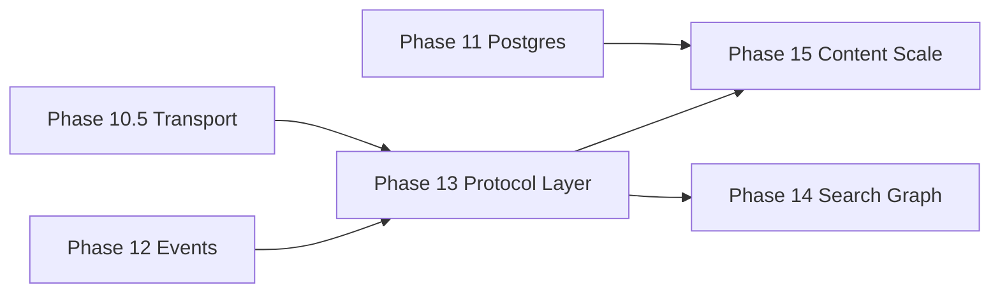

# Phase 13 — Protocol Layer — DESIGN

**Document:** DESIGN  
**Phase status:** Ready — Architecture Review draft (2026-07-04); **awaiting owner approval**  
**Schema:** [PHASE-DOCUMENT-SCHEMA.md](../PHASE-DOCUMENT-SCHEMA.md)  
**Authority:** [00-CONSTITUTION.md](../../core/constitution/00-CONSTITUTION.md) → [04-ARCHITECTURE.md](../../core/architecture/04-ARCHITECTURE.md) → [ADR-028](../../adr/028-protocol-layer.md)  
**Predecessor:** Phase 10.5 (Transport foundation) · Phase 12 (events — recommended)

---

## 1. Architecture Analysis

### 1.1 Position on roadmap

| Dimension | Assessment |
|-----------|------------|
| **Was** | POST-ROADMAP Phase 13 = Content & Vector Scale |
| **Now** | Phase 13 = **Protocol Layer**; Content Scale → **Phase 15** |
| **Rationale** | Protocol work is orthogonal to R2/pgvector; completes connectivity stack after 10.5 + 12 |
| **Priority** | P1 — after Phase 10.5 Implemented and Phase 11 metadata stable |
| **Parallel** | Phase 14 (search/graph prod) independent |



### 1.2 Dependencies

#### Hard dependencies

| Dependency | Reason |
|------------|--------|
| Phase 10 ✅ | Application services, auth, composition root |
| Phase 10.5 ✅ or ADR-027 Implemented | Shared handlers, `ProtocolContext`, transport registry |
| ADR-025 ✅ | Manifest extension for protocol capabilities |
| Phase 3 ✅ | Auth at protocol boundary |

#### Soft dependencies

| Dependency | Reason |
|------------|--------|
| Phase 12 | WebSocket/SSE event subscriptions |
| Phase 11 | Postgres staging — not blocking protocol adapters |

#### Forward dependencies

| Consumer | Benefit |
|----------|---------|
| Phase 15 | gRPC client-stream batch ingest |
| Phase 12 | Push audit/memory events to WS/SSE clients |
| Enterprise mesh | Protocol benchmark guides deployment choice |

### 1.3 Extension points

| Extension point | Module | Purpose |
|-----------------|--------|---------|
| `IProtocolServer` | `protocol/registry/` | Lifecycle per protocol |
| `ProtocolContext` | `protocol/shared/` | Scope + auth; no wire types inward |
| `IUseCaseHandler<TIn,TOut>` | `protocol/shared/handlers/` | Single use-case entry (all protocols) |
| `IStreamPublisher` | `protocol/shared/streaming/` | Push chunks to SSE/WS/gRPC consumer |
| `IContextStreamSource` | `protocol/shared/streaming/` | Read-only iterator from `ContextService` result |
| `IProtocolBenchmarkRunner` | `protocol/benchmark/` | Measure protocols; not in request path |
| Manifest `protocols` | `capabilities/` | Discover streaming support |

### 1.4 Repository impact

**None.** Repositories continue through service ports only. No protocol types, headers, or wire metadata in SQL layer.

### 1.5 Service impact

**None to business logic.** Optional additive port consumed by protocol layer only:

```typescript
/** Application layer — optional thin port for streaming; implemented by ContextService adapter */
interface IContextStreamSource {
  /** Yields pre-built context chunks (summaries, sections) — no HTTP/ws types */
  streamContext(input: ContextBuildInput, scope: MemoryScope): AsyncIterable<ContextChunk>;
}
```

`MemoryService`, `SearchService`, `KnowledgeService` — **unchanged signatures**.

### 1.6 Migration impact

| Area | Impact |
|------|--------|
| Database | **None** |
| REST unary routes | **Unchanged** |
| New routes | Additive: `GET /api/v1/context/stream` (SSE, flag-gated) |
| WebSocket | New listener port when `WEBSOCKET_ENABLED=true` |
| Env | Additive flags only |

### 1.7 Protocol impact

| Protocol | Phase 13 change |
|----------|-----------------|
| REST | Unary unchanged; **additive** SSE stream endpoint |
| gRPC | Complete server-stream Context RPC (extends 10.5) |
| WebSocket | **New** — subscribe + unary RPC-over-WS envelope |
| SSE | **New** — context stream, optional event stream (Phase 12) |
| MCP stdio | **Unchanged** — not a streaming HTTP protocol |

### 1.8 Testing impact

| Suite | Purpose |
|-------|---------|
| Handler parity | REST / gRPC / WS / SSE same fixture → same service outcome |
| Stream contract | Chunk order, budget respect, connection teardown |
| Protocol benchmark | Report schema; CI optional job |
| Layer lint | No protocol imports in `services/`, `repositories/` |
| Default gate | 457+ tests green; flags off |

### 1.9 Breaking change assessment

**No breaking changes identified.** ADR-028 Proposed sufficient. **STOP not triggered.**

---

## 2. Purpose — Mengapa Phase 13 diperlukan?

Phase 10.5 establishes transport structure and unary multi-protocol access. Real-world consumers still need:

1. **Streaming context** — deliver ranked memories incrementally (token budget friendly).
2. **WebSocket** — live memory/workspace updates for dashboards and multi-agent coordination.
3. **SSE** — browser-native unidirectional stream without WebSocket complexity.
4. **Protocol benchmark** — evidence-based choice (REST vs gRPC vs SSE vs WS) for deployment.

All of this must remain **protocol adapter** work — the same `MemoryService` answers every call.

---

## 3. Clean Architecture — Layer stack

```
┌──────────────────────────────────────────────────────────────────────────┐
│  PROTOCOL ADAPTERS (outermost) — src/protocol/                            │
│  REST │ gRPC │ WebSocket │ SSE │ MCP (stdio)                              │
│  Wire encode/decode · auth hooks · rate limits · stream framing           │
│  FORBIDDEN: business rules · SQL · repository imports                     │
└───────────────────────────────┬──────────────────────────────────────────┘
                                │ ProtocolContext + domain DTOs
┌───────────────────────────────▼──────────────────────────────────────────┐
│  USE-CASE HANDLERS (thin) — protocol/shared/handlers/                     │
│  Map protocol input → service call → map output                           │
│  FORBIDDEN: storage SDKs · direct repository access                       │
└───────────────────────────────┬──────────────────────────────────────────┘
                                │ DI-injected services
┌───────────────────────────────▼──────────────────────────────────────────┐
│  APPLICATION SERVICES — UNCHANGED                                         │
│  MemoryService │ SearchService │ KnowledgeService │ ContextService      │
│  FORBIDDEN: Fastify · gRPC · ws · SSE · MCP types                         │
└───────────────────────────────┬──────────────────────────────────────────┘
                                │ port interfaces only
┌───────────────────────────────▼──────────────────────────────────────────┐
│  REPOSITORY / STORE PORTS — UNCHANGED                                     │
│  IMemoryRepository │ IEmbeddingStore │ …                                  │
│  FORBIDDEN: protocol awareness                                            │
└───────────────────────────────┬──────────────────────────────────────────┘
                                │
┌───────────────────────────────▼──────────────────────────────────────────┐
│  INFRASTRUCTURE ADAPTERS — UNCHANGED (ADR-008)                            │
└──────────────────────────────────────────────────────────────────────────┘
```

### Dependency rules (enforced)

| Layer | May depend on | Must NOT depend on |
|-------|---------------|-------------------|
| Protocol adapter | Handlers, auth, protocol libs | Services concrete, repositories, storage |
| Handler | Application services (interfaces), domain DTOs | Repositories, storage SDKs, protocol servers |
| Service | Domain, repository **ports** | Protocol, HTTP, ws, gRPC |
| Repository | Storage port, mappers | Protocol, services, controllers |

---

## 4. Module structure

```
src/
  protocol/
    shared/
      protocol-context.types.ts       # owner, workspace, agent, auth, requestId
      resolve-protocol-scope.ts
      protocol-errors.ts              # map AppError → wire envelope
      handlers/
        memory-create.handler.ts
        memory-get.handler.ts
        memory-search.handler.ts
        context-build.handler.ts
        context-stream.handler.ts     # uses IContextStreamSource
        ...
      streaming/
        istream-publisher.interface.ts
        icontext-stream-source.interface.ts
        context-chunk.types.ts
    rest/
      rest-protocol-server.ts
      routes/                         # existing v1 routes
      controllers/                    # delegate → handlers only
      sse/
        sse-context.controller.ts     # SSE adapter
    grpc/
      grpc-protocol-server.ts
      proto/ai/brain/v1/
      services/                       # gRPC → handlers
    websocket/
      websocket-protocol-server.ts
      ws-message.envelope.ts          # typed JSON envelope (not business logic)
      ws-router.ts                    # route WS messages → handlers
    sse/
      sse-protocol-server.ts          # shared SSE utilities
    mcp/                              # from 10.5 — stdio AI protocol
    registry/
      protocol-registry.ts            # DI: register IProtocolServer[]
      protocol-capabilities.ts
    benchmark/
      protocol-benchmark.runner.ts
      protocol-benchmark.report.ts
      fixtures/                       # standard context/search fixtures
  services/                           # UNCHANGED
  repositories/                       # UNCHANGED
  capabilities/                       # EXTEND manifest.protocols
```

**Naming note:** If Phase 10.5 lands as `src/transport/`, Phase 13 **renames or nests** to `src/protocol/` with re-exports for one release cycle. Canonical name after Phase 13 gate: **`protocol/`** (aligns with "Protocol Layer" phase name).

---

## 5. Interface design

### 5.1 Protocol server lifecycle

```typescript
interface IProtocolServer {
  readonly protocol: ProtocolKind;
  start(deps: ProtocolServerDeps): Promise<void>;
  stop(): Promise<void>;
  health(): ProtocolHealth;
}

type ProtocolKind = 'rest' | 'grpc' | 'websocket' | 'sse' | 'mcp-stdio';
```

### 5.2 Protocol context (cross-cutting)

```typescript
interface ProtocolContext {
  readonly requestId: string;
  readonly ownerId: string;
  readonly workspaceId?: string;
  readonly agentId?: string;
  readonly organizationId?: string;
  readonly auth: AuthPrincipal | null;
  readonly protocol: ProtocolKind;
}
```

### 5.3 Use-case handler (DI)

```typescript
interface IUseCaseHandler<TInput, TOutput> {
  handle(ctx: ProtocolContext, input: TInput): Promise<TOutput>;
}
```

Handlers receive **constructor-injected** service interfaces — same instances wired at composition root for all protocols.

### 5.4 Streaming ports

```typescript
/** Protocol side — implemented by SSE/WS/gRPC adapters */
interface IStreamPublisher<TChunk> {
  publish(chunk: TChunk): Promise<void>;
  close(reason?: string): Promise<void>;
}

/** Application side — implemented by thin adapter over ContextService */
interface IContextStreamSource {
  stream(input: ContextBuildInput, scope: MemoryScope): AsyncIterable<ContextChunk>;
}

interface ContextChunk {
  readonly sequence: number;
  readonly type: 'summary' | 'memory' | 'metadata' | 'done';
  readonly payload: unknown;  // typed DTOs in implementation
}
```

**Rule:** `ContextService.buildContext()` logic is **not duplicated**. Stream source calls build once, then **yields slices** of the result (or progressive policy chunks if ADR-024 enabled).

### 5.5 WebSocket message envelope (wire only)

```typescript
interface WsRequestEnvelope {
  readonly id: string;
  readonly op: 'memory.create' | 'memory.search' | 'context.build' | 'context.stream' | 'subscribe.events';
  readonly payload: unknown;
}

interface WsResponseEnvelope {
  readonly id: string;
  readonly ok: boolean;
  readonly payload?: unknown;
  readonly error?: { code: string; message: string };
}
```

Ops map 1:1 to existing handlers — no new business operations in Phase 13.

### 5.6 Protocol benchmark

```typescript
interface IProtocolBenchmarkRunner {
  run(config: ProtocolBenchmarkConfig): Promise<ProtocolBenchmarkReport>;
}

interface ProtocolBenchmarkReport {
  readonly fixture: string;
  readonly iterations: number;
  readonly results: Array<{
    protocol: ProtocolKind;
    mode: 'unary' | 'stream';
    p50Ms: number;
    p95Ms: number;
    throughputRps?: number;
    bytesTransferred?: number;
  }>;
  readonly timestamp: string;
}
```

CLI: `npm run benchmark:protocols` — compares REST unary vs SSE stream vs gRPC stream vs WS (local in-process servers).

---

## 6. Protocol capability matrix

| Capability | REST | gRPC | WebSocket | SSE | MCP |
|------------|------|------|-----------|-----|-----|
| Memory CRUD | ✅ unary | ✅ unary | ✅ envelope | ❌ | ✅ tools |
| Search | ✅ | ✅ | ✅ | ❌ | ✅ |
| Context build | ✅ POST | ✅ unary | ✅ | ❌ unary |
| **Context stream** | ❌ | ✅ server-stream | ✅ | ✅ | partial |
| Event subscribe | ❌ | 🔲 Phase 12+ | ✅ | ✅ | ❌ |
| Auth | JWT/API key | metadata+mTLS | token query/header | same as REST | MCP_OWNER_ID |
| Compression | gzip | channel | permessage-deflate | none | N/A |
| Health | `/health` | gRPC health | WS ping | N/A | process |
| Default deploy | ✅ | flag | flag | flag | ✅ |

---

## 7. Protocol-specific design

### 7.1 REST (unchanged + additive SSE)

- **Unary:** All existing `/api/v1/*` — no path or body changes.
- **SSE (additive):** `GET /api/v1/context/stream?task=...` when `SSE_ENABLED=true`.
  - Headers: `Authorization`, `X-Workspace-Id`, `Accept: text/event-stream`
  - Events: `event: chunk` / `event: done` / `event: error`
  - Controller → `ContextStreamHandler` → `IContextStreamSource` → `IStreamPublisher` (SSE impl)

### 7.2 gRPC

- Extends 10.5 proto: `ContextService.StreamContext` server-streaming RPC.
- Unary RPCs delegate to same handlers as REST.
- `GRPC_ENABLED=false` default.

### 7.3 WebSocket

- Endpoint: `WS /api/v1/ws` when `WEBSOCKET_ENABLED=true`.
- JSON envelope → handler dispatch table (same handlers as REST).
- `context.stream` op: multiplex chunks on same connection.
- `subscribe.events` op: stub until Phase 12 `IEventBus` consumer wired (returns not-enabled if bus off).

### 7.4 SSE

- Dedicated SSE adapter implementing `IStreamPublisher<SseEvent>`.
- Suitable for browser clients and ChatGPT-like streaming proxies.
- Rate-limited same as REST context endpoint.

### 7.5 Streaming semantics

| Rule | Detail |
|------|--------|
| Budget | Total streamed content respects `ContextService` budget |
| Order | Chunks follow rank order from built context |
| Cancellation | Client disconnect → abort stream; no partial `recordAccess` beyond policy |
| Scope | Every chunk operation scoped via `ProtocolContext` |

---

## 8. Dependency injection (composition root)

```typescript
// Pseudocode — composition root only (server bootstrap)
const memoryService = createMemoryService(deps);
const contextService = createContextService(deps);

const handlers = {
  memoryCreate: new MemoryCreateHandler(memoryService),
  contextStream: new ContextStreamHandler(contextStreamSource),
  // ...
};

const registry = new ProtocolRegistry();
registry.register(new RestProtocolServer(fastify, handlers));
registry.register(new GrpcProtocolServer(handlers));
if (env.WEBSOCKET_ENABLED) registry.register(new WebSocketProtocolServer(handlers));
if (env.SSE_ENABLED) registry.register(new SseProtocolServer(fastify, handlers));
registry.register(new McpProtocolServer(handlers)); // stdio

await registry.startAll();
```

**Single service graph** — all protocols share identical `MemoryService` instance.

---

## 9. Protocol benchmark design

### Goals

- Compare **latency** (p50/p95) and **throughput** for equivalent operations.
- Standard fixture: context build with 20×~2400 char memories (aligns with token benchmark).
- Output: JSON report + markdown summary for README/docs.

### Scenarios

| ID | Operation | Protocols measured |
|----|-----------|-------------------|
| B-01 | Memory get by id | REST, gRPC, WS |
| B-02 | Search top 10 | REST, gRPC, WS |
| B-03 | Context build unary | REST, gRPC, WS |
| B-04 | Context stream 10 chunks | SSE, gRPC stream, WS |

### Non-goals

- Benchmark does not run in production request path.
- Not a load testing framework (use k6 separately for prod).

---

## 10. Manifest extension (ADR-025 additive)

```typescript
protocols: {
  rest: { enabled: true; version: 'v1'; streaming: false };
  grpc: { enabled: boolean; streaming: boolean; protoVersion?: string };
  websocket: { enabled: boolean; path?: string };
  sse: { enabled: boolean; path?: string };
  mcp: { enabled: true; transport: 'stdio' };
  benchmark: { cliCommand: 'npm run benchmark:protocols' };
};
```

---

## 11. Testing strategy

| Layer | Tests |
|-------|-------|
| Handlers | Unit — mock services; protocol-agnostic |
| Parity | Integration — same input via REST/gRPC/WS/SSE → identical service call args |
| Stream | Chunk count, done event, disconnect cleanup |
| Benchmark | Smoke — runner produces valid report schema |
| Layer gate | grep: no `fastify`/`ws`/`@grpc` in `services/`, `repositories/` |
| Regression | Default env full suite green |

---

## 12. Success criteria

| ID | Criterion |
|----|-----------|
| SC-13-01 | ADR-028 **Approved** |
| SC-13-02 | All protocols use shared handlers → same `MemoryService` instance |
| SC-13-03 | Zero business logic change in services/repositories |
| SC-13-04 | REST v1 unary unchanged; SSE/WS/gRPC flag-gated |
| SC-13-05 | Context stream works on SSE + gRPC + WS |
| SC-13-06 | `npm run benchmark:protocols` produces report |
| SC-13-07 | Handler parity suite includes stream scenarios |
| SC-13-08 | Manifest `protocols` section accurate |
| SC-13-09 | REVIEW gate PASS |

---

## 13. Wajib dijawab

| Question | Answer |
|----------|--------|
| **Mengapa diperlukan?** | Streaming + multi-protocol enterprise access without duplicating business logic |
| **Mengapa Phase 13?** | Requires 10.5 foundation + benefits from Phase 12 events; after ops cutover (11) |
| **Apa yang berubah?** | `src/protocol/`, SSE/WS adapters, stream ports, benchmark CLI, manifest |
| **Apa yang tetap?** | MemoryService, repositories, storage, REST unary, MCP tools |
| **Extension points?** | `IProtocolServer`, `IUseCaseHandler`, `IStreamPublisher`, `IContextStreamSource`, benchmark |
| **Service berubah?** | **Tidak** (optional stream source adapter only) |
| **Repository berubah?** | **Tidak** |
| **API berubah?** | **Additive** — SSE route; unary unchanged |
| **MCP berubah?** | **Tidak** |
| **Protocol berubah?** | **Additive** — WS, SSE, gRPC stream completion |
| **Database berubah?** | **Tidak** |
| **Deployment berubah?** | Default tidak; WS/SSE/gRPC documented for long-running Node |
| **Testing berubah?** | Additive parity + stream + benchmark |
| **Documentation berubah?** | Ya — 04-ARCHITECTURE, POST-ROADMAP, PANDUAN |

---

## 14. Relationship to Phase 10.5

| Phase 10.5 | Phase 13 |
|------------|----------|
| Transport structure, handlers, REST/MCP/gRPC unary | Streaming, WS, SSE, benchmark |
| ADR-027 | ADR-028 |
| `transport/` folder | Evolves to `protocol/` |

**Recommendation:** Implement 10.5 first. Phase 13 **extends** — does not replace — 10.5 work.

---

## 15. Roadmap renumbering

| Old | New |
|-----|-----|
| Phase 13 Content & Vector Scale | **Phase 15 — Content & Vector Scale** |
| (new) | **Phase 13 — Protocol Layer** |

Owner approval required for renumber in [10-POST-ROADMAP.md](../roadmap/10-POST-ROADMAP.md).

---

## 16. Non-goals

- GraphQL
- MCP HTTP transport (separate ADR)
- Business logic in protocol adapters
- Repository protocol branching
- Controller direct storage access
- Agent runtime
- Production load test framework

---

## 17. References

- [ADR-028](../../adr/028-protocol-layer.md)
- [ADR-027](../../adr/027-transport-connectivity-layer.md)
- [Phase 10.5 DESIGN](../10.5-transport-connectivity/DESIGN.md)
- [ADR-024 Progressive retrieval](../../../docs/adr/024-progressive-retrieval-policy.md)
- [04-ARCHITECTURE.md](../../core/architecture/04-ARCHITECTURE.md)

---

*No implementation until ADR-028 **Approved**. Subordinate to [00-CONSTITUTION.md](../../core/constitution/00-CONSTITUTION.md).*
