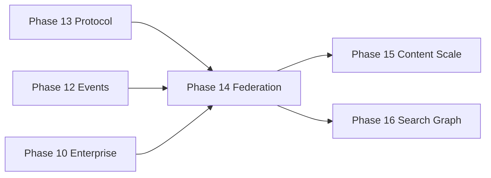

# Phase 14 — Federation — DESIGN

**Document:** DESIGN  
**Phase status:** Implemented (2026-07-04)  
**Schema:** [PHASE-DOCUMENT-SCHEMA.md](../PHASE-DOCUMENT-SCHEMA.md)  
**Authority:** [00-CONSTITUTION.md](../../core/constitution/00-CONSTITUTION.md) → [04-ARCHITECTURE.md](../../core/architecture/04-ARCHITECTURE.md) → [ADR-029](../../adr/029-federation-layer.md)  
**Prerequisites:** Phase 9–10 ✅ · Phase 12 (recommended) · Phase 13 ✅ (protocol transport)

---

## 1. Architecture Analysis

### 1.1 Position on roadmap

| Dimension | Assessment |
|-----------|------------|
| **Was** | POST-ROADMAP Phase 14 = Search & Graph Production |
| **Now** | Phase 14 = **Federation**; Search/Graph → **Phase 16** |
| **Priority** | P1 — after Protocol Layer (13) and Event Pipeline (12) |
| **Theme** | Global Memory Fabric — first milestone |



### 1.2 Dependencies

| Dependency | Required | Reason |
|------------|----------|--------|
| Phase 9 workspace/agent scope | ✅ Hard | FederationScopeRef builds on MemoryScope |
| Phase 10 organization RBAC | ✅ Hard | Cross-org policy |
| Phase 13 protocol layer | ✅ Hard | IFederationTransport binds to protocol adapters |
| Phase 12 event bus | Soft | Async replication fan-out |
| Phase 11 Postgres | Soft | Multi-node usually implies Postgres; not blocking design |

### 1.3 Extension points

| Port | Responsibility |
|------|----------------|
| `IFederationRegistry` | Discover/register peer nodes |
| `IFederationTransport` | Send/receive knowledge bundles (protocol-agnostic) |
| `IFederationTrustStore` | Peer credentials, rotation, mTLS material refs |
| `IFederationPolicy` | Authorize exchange by workspace/org/region/cloud |
| `IFederationScopeMapper` | Remote scope → local MemoryScope |
| `IFederationConflictResolver` | Inbound conflict vs local state |
| `IFederationMetadataStore` | Cursors, peer links, sync state (not MemoryRepository) |
| `IKnowledgeExchangePort` | Pull/push/subscribe operations |
| `IKnowledgeExchangeService` | Orchestrate exchange → MemoryService |

### 1.4 MemoryService impact

**None.** No method signature changes. Federation orchestrator calls:

| Existing API | Federation use |
|--------------|----------------|
| `MemoryService.create` | Apply inbound memory |
| `MemoryService.update` | Apply inbound update |
| `MemoryService.search` / read | Export candidate selection |
| `MemoryService` backup import path | Bulk bundle apply (if exists) |
| `ISyncManager.reconcileWrite` | Local reconcile before/after apply (unchanged) |

### 1.5 Repository impact

**None to IMemoryRepository contract.** Optional federation-specific persistence only via **`IFederationMetadataStore`** (separate port, separate adapter/table).

### 1.6 Service impact

| Service | Change |
|---------|--------|
| `MemoryService` | **None** |
| `SearchService` | **None** |
| `KnowledgeService` | **None** |
| `ContextService` | **None** |
| **`IKnowledgeExchangeService`** | **New** — federation orchestration only |

### 1.7 Breaking change assessment

**No breaking changes.** ADR-029 Proposed. **STOP not triggered.**

---

## 2. Purpose

Multiple AI Brain deployments must exchange knowledge **without**:

- Rewriting `MemoryService`
- Hardcoding cloud provider or region
- Coupling federation logic to D1/Postgres/Neo4j
- Leaking data across unauthorized org/workspace boundaries

Phase 14 defines **how nodes trust, discover, authorize, transport, and apply** federated knowledge — all through swappable ports.

---

## 3. Federation dimensions

| Dimension | Model element | Policy example |
|-----------|---------------|----------------|
| **Cross Workspace** | `FederationScopeRef.workspaceId` | Allow export from workspace A → peer workspace B |
| **Cross Region** | `FederationNodeDescriptor.region` | EU node may pull from EU peers only |
| **Cross Organization** | `FederationScopeRef.organizationId` | B2B trust link required |
| **Cross Cloud** | `FederationNodeDescriptor.cloud` (opaque label) | No code branch — policy filter only |

**Rule:** `cloud`, `region`, `provider` are **descriptor fields** interpreted by **`IFederationPolicy`** — never `switch(cloud)` in services.

---

## 4. Clean Architecture — Layer stack

```
┌─────────────────────────────────────────────────────────────────────────┐
│  FEDERATION ADAPTERS (outer) — src/federation/adapters/                  │
│  ConfigRegistry │ GrpcTransport │ RestTransport │ EventBusTransport       │
│  FileTrustStore │ DefaultPolicy │ SqlFederationMetadataStore              │
│  FORBIDDEN: MemoryService logic · direct MemoryRepository                │
└───────────────────────────────┬─────────────────────────────────────────┘
                                │ federation ports
┌───────────────────────────────▼─────────────────────────────────────────┐
│  FEDERATION APPLICATION — IKnowledgeExchangeService                        │
│  pull · push · subscribe · applyBundle                                     │
│  Calls MemoryService for local persistence ONLY                            │
└───────────────────────────────┬─────────────────────────────────────────┘
                                │
┌───────────────────────────────▼─────────────────────────────────────────┐
│  APPLICATION SERVICES — UNCHANGED                                        │
│  MemoryService │ SearchService │ KnowledgeService │ ContextService       │
└───────────────────────────────┬─────────────────────────────────────────┘
                                │ repository ports
┌───────────────────────────────▼─────────────────────────────────────────┐
│  REPOSITORIES — UNCHANGED · no federation awareness                       │
└─────────────────────────────────────────────────────────────────────────┘
```

### Dependency rules

| Layer | May depend on | Must NOT |
|-------|---------------|----------|
| Federation adapter | Federation ports, vendor SDKs (in adapter only) | MemoryService internals, SQL in policy |
| KnowledgeExchangeService | MemoryService (public API), federation ports, MemoryScope | Repository direct access |
| MemoryService | Domain, repositories | Federation ports, peer descriptors |
| Repository | Storage | Federation, protocol, cloud |

---

## 5. Module structure

```
src/
  federation/
    ports/
      ifederation-registry.port.ts
      ifederation-transport.port.ts
      ifederation-trust-store.port.ts
      ifederation-policy.port.ts
      ifederation-scope-mapper.port.ts
      ifederation-conflict-resolver.port.ts
      ifederation-metadata-store.port.ts
      iknowledge-exchange.port.ts
    types/
      federation-node.descriptor.ts
      federation-scope-ref.ts
      federated-memory.bundle.ts
      federation-exchange-result.ts
    services/
      knowledge-exchange.service.ts    # implements IKnowledgeExchangeService
    adapters/
      registry/
        config-federation-registry.adapter.ts
        static-federation-registry.adapter.ts
      transport/
        grpc-federation-transport.adapter.ts    # uses protocol/grpc — not gRPC in service
        rest-federation-transport.adapter.ts
        event-bus-federation-transport.adapter.ts
      trust/
        file-trust-store.adapter.ts
        jwt-federation-trust-store.adapter.ts
      policy/
        rule-based-federation-policy.adapter.ts
        allow-list-federation-policy.adapter.ts
      scope/
        default-federation-scope-mapper.adapter.ts
      conflict/
        last-write-wins-conflict-resolver.adapter.ts
      metadata/
        sql-federation-metadata-store.adapter.ts
    protocol/                             # REST edge — not business logic
      federation.routes.ts
      federation.controller.ts
    index.ts                              # port registry export
  services/
    memory.service.ts                     # UNCHANGED
  sync/
    isync-manager.interface.ts            # UNCHANGED
    ifederated-sync.port.ts               # NEW optional extension port
```

---

## 6. Interface design

### 6.1 Node identity (provider-agnostic)

```typescript
/** Opaque deployment identity — no vendor logic in core types */
interface FederationNodeDescriptor {
  readonly nodeId: string;           // UUID — this node
  readonly displayName?: string;
  readonly region?: string;          // e.g. ap-southeast-1, eu-west-1
  readonly cloud?: string;           // opaque: aws | gcp | cloudflare | on-prem
  readonly baseUrl?: string;           // REST capability URL
  readonly grpcTarget?: string;       // host:port if gRPC enabled
  readonly protocolVersion: string;   // aligns with capability manifest
  readonly capabilities?: string[];   // from remote GET /capabilities
}
```

### 6.2 Scope reference (cross-boundary)

```typescript
/** Remote or local scope pointer — extends MemoryScope concept without changing MemoryScope type */
interface FederationScopeRef {
  readonly nodeId: string;            // source node
  readonly ownerId: string;
  readonly workspaceId?: string;
  readonly organizationId?: string;
  readonly agentId?: string;
  readonly region?: string;
  readonly cloud?: string;
}
```

### 6.3 Knowledge bundle (wire DTO)

```typescript
interface FederatedMemoryBundle {
  readonly bundleId: string;
  readonly source: FederationScopeRef;
  readonly target: FederationScopeRef;
  readonly memories: FederatedMemoryRecord[];  // subset of memory fields — no storage internals
  readonly relations?: FederatedRelationRecord[];
  readonly exportedAt: string;
  readonly contentHash: string;
  readonly signature?: string;       // trust layer
}

interface FederatedMemoryRecord {
  readonly sourceMemoryId: string;
  readonly codename?: string;
  readonly slug?: string;
  readonly summary?: string;
  readonly body?: string;
  readonly objectKey?: string;       // Phase 15 — blob ref not inline body
  readonly metadata: Record<string, unknown>;
  readonly updatedAt: string;
}
```

### 6.4 Core ports

```typescript
interface IFederationRegistry {
  registerLocal(node: FederationNodeDescriptor): Promise<void>;
  listPeers(filter?: FederationPeerFilter): Promise<FederationNodeDescriptor[]>;
  getPeer(nodeId: string): Promise<FederationNodeDescriptor | null>;
}

interface IFederationTransport {
  pull(request: FederationPullRequest): Promise<FederatedMemoryBundle>;
  push(bundle: FederatedMemoryBundle): Promise<FederationPushResult>;
  /** Optional — Phase 12 event-driven */
  subscribe?(filter: FederationSubscribeFilter, handler: FederationEventHandler): Promise<() => void>;
}

interface IFederationPolicy {
  canExport(from: FederationScopeRef, to: FederationNodeDescriptor): Promise<boolean>;
  canImport(from: FederationNodeDescriptor, to: MemoryScope): Promise<boolean>;
  filterExportable(memoryIds: string[], scope: MemoryScope): Promise<string[]>;
}

interface IFederationTrustStore {
  verifyPeer(nodeId: string, credentials: FederationCredentials): Promise<boolean>;
  signBundle(bundle: FederatedMemoryBundle): Promise<FederatedMemoryBundle>;
  verifyBundle(bundle: FederatedMemoryBundle): Promise<boolean>;
}

interface IFederationScopeMapper {
  toLocalScope(source: FederationScopeRef, trust: FederationTrustContext): Promise<MemoryScope>;
  toRemoteScope(local: MemoryScope, targetNode: FederationNodeDescriptor): Promise<FederationScopeRef>;
}

interface IFederationConflictResolver {
  resolve(local: FederatedMemoryRecord, inbound: FederatedMemoryRecord): Promise<'accept' | 'reject' | 'merge'>;
}

interface IFederationMetadataStore {
  getSyncCursor(peerId: string, scope: MemoryScope): Promise<string | null>;
  setSyncCursor(peerId: string, scope: MemoryScope, cursor: string): Promise<void>;
  recordExchange(result: FederationExchangeResult): Promise<void>;
}
```

### 6.5 Knowledge exchange service (orchestrator)

```typescript
interface IKnowledgeExchangeService {
  /** Pull from remote peer → apply locally via MemoryService */
  pullAndApply(
    peerId: string,
    request: FederationPullRequest,
    localScope: MemoryScope,
  ): Promise<FederationExchangeResult>;

  /** Export from local → push to remote */
  pushToPeer(
    peerId: string,
    memoryIds: string[],
    localScope: MemoryScope,
  ): Promise<FederationExchangeResult>;

  /** List federated peers visible to caller scope */
  listPeers(localScope: MemoryScope): Promise<FederationNodeDescriptor[]>;
}
```

**Internal flow (pullAndApply):**

```
1. registry.getPeer(peerId)
2. trustStore.verifyPeer(...)
3. policy.canImport(peer, localScope) — fail closed
4. transport.pull(request)
5. trustStore.verifyBundle(bundle)
6. FOR each memory: scopeMapper.toLocalScope → conflictResolver → MemoryService.create/update
7. metadataStore.setSyncCursor(...)
8. metadataStore.recordExchange(...)
```

### 6.6 Federated sync extension (optional)

```typescript
/** Cross-node extension — does not replace ISyncManager */
interface IFederatedSyncPort {
  notifyPeerWrite(event: MemoryWriteEvent, peers: string[]): Promise<void>;
}
```

Wired at composition root when `FEDERATION_ENABLED=true` — hooks after local `ISyncManager.reconcileWrite` accepts.

---

## 7. Cross-dimension scenarios

### 7.1 Cross Workspace (same org, same node)

- Export memories from `workspaceId: A` → import to `workspaceId: B` on **same node**.
- Uses `IKnowledgeExchangeService` with `nodeId: local` — transport adapter is **InProcessFederationTransport** (no network).
- Policy: same `organizationId`; workspace pair allow-list.

### 7.2 Cross Region (peer nodes)

- Node `ap-sg` pulls from node `ap-jp` via `GrpcFederationTransport`.
- Policy: `region` prefix match or explicit peer trust.
- Metadata cursor per peer+workspace.

### 7.3 Cross Organization (B2B)

- Org Alpha node trusts Org Beta via `IFederationTrustStore` bilateral link.
- Policy: `canImport` requires trust link + workspace mapping table in metadata store.
- Failed auth → **404/deny** — no leak of remote memory existence.

### 7.4 Cross Cloud

- Node on Cloudflare D1 federates with node on AWS Postgres.
- **No storage coupling** — bundle is wire DTO; each node persists via own `MemoryService` → own repositories.
- `cloud` field used only in policy rules (config-driven), not in code branches.

---

## 8. Provider agnostic — adapter matrix

| Concern | Port | Reference adapters (env-selected) |
|---------|------|----------------------------------|
| Peer discovery | `IFederationRegistry` | `config`, `static`, future: `consul`, `k8s-dns` |
| Transport | `IFederationTransport` | `grpc`, `rest`, `event-bus`, `in-process` |
| Trust | `IFederationTrustStore` | `file`, `jwt`, future: `vault`, `spiffe` |
| Policy | `IFederationPolicy` | `rule-based`, `allow-list` |
| Scope map | `IFederationScopeMapper` | `default`, future: `org-directory` |
| Conflict | `IFederationConflictResolver` | `last-write-wins`, future: `semantic-merge` |
| Metadata | `IFederationMetadataStore` | `sql` (Postgres/D1 via ISqlDatabase), `noop` |
| Sync hook | `IFederatedSyncPort` | `noop`, `event-bus-fanout` |

**Composition root** (`createFederationPorts()`) selects adapters from env — same pattern as `createPlatformAdapters()` (ADR-008).

### Env flags (all default safe)

| Env | Default | Purpose |
|-----|---------|---------|
| `FEDERATION_ENABLED` | `false` | Master gate |
| `FEDERATION_REGISTRY_PROVIDER` | `static` | Peer list source |
| `FEDERATION_TRANSPORT_PROVIDER` | `grpc` | Wire protocol binding |
| `FEDERATION_TRUST_PROVIDER` | `file` | Trust material |
| `FEDERATION_POLICY_PROVIDER` | `rule-based` | Authorization rules |
| `FEDERATION_METADATA_PROVIDER` | `sql` | Cursor store |

**No hardcoded provider names in services** — only composition root reads env.

---

## 9. Protocol & API impact

### REST (additive, gated)

| Method | Endpoint | Purpose |
|--------|----------|---------|
| `GET` | `/api/v1/federation/peers` | List peers for scope |
| `POST` | `/api/v1/federation/exchange/pull` | Pull + apply |
| `POST` | `/api/v1/federation/exchange/push` | Export + push |
| `GET` | `/api/v1/federation/status` | Sync cursors, last exchange |

### MCP (optional additive)

| Tool | Purpose |
|------|---------|
| `list_federation_peers` | Discover peers |
| `pull_federated_memories` | Pull bundle (admin scope) |

### Manifest extension

```typescript
federation: {
  enabled: boolean;
  nodeId: string;
  region?: string;
  cloud?: string;
  peerCount: number;
  transportProvider: string;
  supportsPull: boolean;
  supportsPush: boolean;
  supportsSubscribe: boolean;
};
```

---

## 10. Storage & schema

| Store | Owner | MemoryService impact |
|-------|-------|---------------------|
| `memories` table | IMemoryRepository | None |
| `federation_peers` | IFederationMetadataStore | None |
| `federation_sync_cursors` | IFederationMetadataStore | None |
| `federation_exchange_log` | IFederationMetadataStore | None |

Optional additive memory columns (separate ADR amend if needed):

- `federation_source_node_id`
- `federation_source_memory_id`

Applied via **KnowledgeService enrichment on import** — not required for Phase 14 MVP if bundle mapping stores mapping in metadata store only.

---

## 11. Testing strategy

| Suite | Purpose |
|-------|---------|
| Policy unit tests | Region/org/workspace rules — pure config |
| Scope mapper tests | Remote → local MemoryScope |
| In-process transport | Pull/push without network |
| MemoryService contract | Mock MemoryService — verify call args unchanged API |
| Cross-owner deny | Federation policy fail-closed |
| Parity | Export → import round-trip identity |
| Layer lint | No federation imports in `memory.service.ts`, repositories |

---

## 12. Success criteria

| ID | Criterion |
|----|-----------|
| SC-14-01 | ADR-029 **Approved** |
| SC-14-02 | `MemoryService` diff = zero logic change |
| SC-14-03 | All federation via ports — no cloud/region switch in services |
| SC-14-04 | Cross-workspace exchange on single node (in-process transport) |
| SC-14-05 | Cross-node pull/push via gRPC transport adapter (staging) |
| SC-14-06 | Cross-org denied without trust link |
| SC-14-07 | `FEDERATION_ENABLED=false` — full regression green |
| SC-14-08 | Manifest federation section accurate |
| SC-14-09 | REVIEW gate PASS |

---

## 13. Wajib dijawab

| Question | Answer |
|----------|--------|
| **Mengapa diperlukan?** | Multi-node AI Brain must share knowledge under policy |
| **Mengapa Phase 14?** | Requires protocol (13), org scope (10), events (12) |
| **Apa yang berubah?** | New `federation/` module, ports, additive API |
| **Apa yang tetap?** | MemoryService, repositories, core memory schema |
| **Extension points?** | 8 federation ports + IKnowledgeExchangeService |
| **Hardcode?** | **Forbidden** — env-driven adapter registry |
| **Provider coupling?** | **Forbidden** — adapters only at composition root |
| **MemoryService?** | **Unchanged** — called as library by orchestrator |
| **Repository?** | **Unchanged** — federation metadata separate port |

---

## 14. Non-goals

- CRDT / automatic full bi-directional sync without policy
- Agent runtime or workflow engine
- GraphQL federation
- Changing MemoryService signatures
- Embedding federation logic in MemoryRepository
- Single global primary database

---

## 15. Roadmap renumbering

| Old | New |
|-----|-----|
| Phase 14 Search & Graph Production | **Phase 16** |
| (new) | **Phase 14 Federation** |

---

## 16. References

- [ADR-029](../../adr/029-federation-layer.md)
- [ADR-007](../../../docs/adr/007-multi-ai-workspace-scope.md)
- [ADR-010 RBAC](../../../docs/adr/010-workspace-membership-rbac.md)
- [ADR-028 Protocol layer](../../adr/028-protocol-layer.md)
- [Phase 13 DESIGN](../13-protocol-layer/DESIGN.md)
- [ISyncManager](../../../src/sync/isync-manager.interface.ts)

---

*No implementation until ADR-029 **Approved**.*
