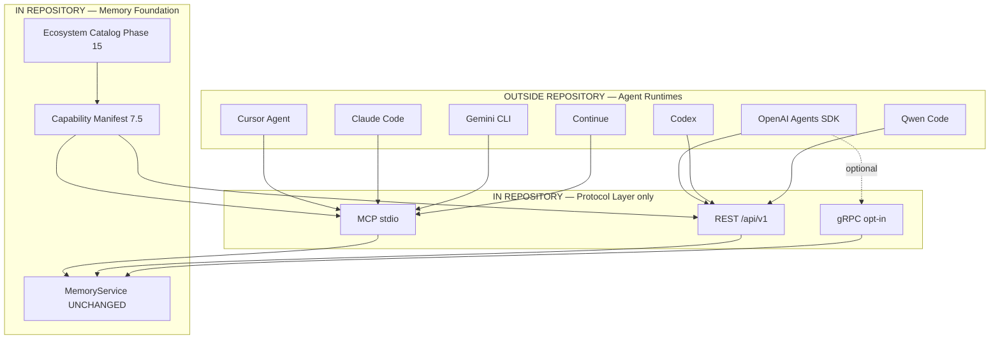

# Phase 15 — Autonomous Agent Ecosystem — DESIGN

**Document:** DESIGN  
**Phase status:** Ready — Architecture Review draft (2026-07-04); **awaiting owner approval**  
**Schema:** [PHASE-DOCUMENT-SCHEMA.md](../PHASE-DOCUMENT-SCHEMA.md)  
**Authority:** [00-CONSTITUTION.md](../../core/constitution/00-CONSTITUTION.md) → [Phase 7 DESIGN](../07-agent-runtime/DESIGN.md) → [ADR-030](../../adr/030-autonomous-agent-ecosystem.md)

---

## 1. Architecture Analysis

### 1.1 Position on roadmap

| Dimension | Assessment |
|-----------|------------|
| **Was** | POST-ROADMAP Phase 15 = Content & Vector Scale |
| **Now** | Phase 15 = **Autonomous Agent Ecosystem**; Content Scale → **Phase 17** |
| **Priority** | P1 — after Phase 13 (protocols) and Phase 9 (multi-AI scope) |
| **Nature** | **Contract + catalog layer** — not agent implementation |



### 1.2 Dependencies

| Phase | Requirement |
|-------|-------------|
| Phase 7 | Agent boundary documented |
| Phase 9 | Workspace + `IAgentIdentity` + `register_agent` |
| Phase 7.5 / ADR-025 | `GET /api/v1/capabilities`, `get_capabilities` |
| Phase 3 | Auth, API keys |
| Phase 13 | gRPC in ecosystem matrix (recommended) |
| Phase 14 | Federated Memory Cloud (optional) |

### 1.3 MemoryService impact

**None.** Ecosystem module does not orchestrate memory operations — agents call existing MCP tools / REST endpoints.

### 1.4 Breaking change assessment

**None.** Additive manifest fields and optional REST route. **STOP not triggered.**

---

## 2. Purpose

### Mengapa phase ini diperlukan?

Multiple autonomous agents from **different vendors** must read/write the **same workspace-scoped Memory Cloud** without:

- Duplicating memory per client
- Implementing agent runtimes inside AI Brain
- Breaking constitution boundary from Phase 7

Phase 15 provides the **ecosystem contract layer**: who can connect, how, with which protocol, and which scope/env — so every external runtime integrates consistently.

### Mengapa Phase 15 (bukan Phase 7 ulang)?

| Phase 7 | Phase 15 |
|---------|----------|
| Boundary definition (documentation) | **Operational ecosystem catalog** |
| Generic external runtime | **Named client profiles** (Cursor, Claude, …) |
| 14 MCP tools contract | Manifest + REST + compatibility gates |
| No code | Minimal **catalog module** (metadata only) |

---

## 3. Scope

### Included

| Track | Deliverable |
|-------|-------------|
| 15A | `AgentClientType` SSOT + client profile registry |
| 15B | `IAgentClientCatalog` port + default adapter |
| 15C | `AgentEcosystemManifestBuilder` extends ADR-025 manifest |
| 15D | `GET /api/v1/ecosystem/clients` (public read-only) |
| 15E | Compatibility matrix + contract tests |
| 15F | PANDUAN § Agent Ecosystem (per-client setup) |

### Excluded (constitution forbidden)

| Capability | Location |
|------------|----------|
| Agent planner / reasoning | External runtime |
| Task orchestration / loops | External runtime |
| Tool execution router | External runtime |
| LangGraph / CrewAI / AutoGen runtime | External |
| `@ai-brain/agent` package | External (if ever) |
| `@ai-brain/client` SDK implementation | External npm repo |

### Repository provides (unchanged role)

| Surface | Role |
|---------|------|
| **REST** | Public API, ChatGPT Actions, OpenAI SDK, headless bots |
| **MCP stdio** | IDE-embedded agents (Cursor, Claude Code, Continue, …) |
| **gRPC** | Enterprise / high-throughput agent backends (Phase 13) |

---

## 4. Memory Cloud model

**Memory Cloud** = one AI Brain deployment (or federated mesh per Phase 14) exposing shared **workspace-scoped** memory to many **external agent identities**.

```
                    ┌─────────────────────────────────┐
                    │         Memory Cloud             │
                    │  (AI Brain deployment / mesh)    │
                    └───────────────┬─────────────────┘
                                    │
              ┌─────────────────────┼─────────────────────┐
              │                     │                     │
        Workspace A           Workspace B           Workspace C
              │                     │                     │
    ┌─────────┼─────────┐   ┌──────┴──────┐              │
    │         │         │   │             │              │
 Cursor   Claude    Codex  OpenAI-bot   Gemini         ...
 agent     agent     agent   (REST)      agent
 (MCP)     (MCP)     (REST)              (MCP)
```

**Rules:**

1. All agents in a workspace share **the same memory pool** (Phase 9).
2. Each agent has **`agentId` attribution** on writes (`IAgentIdentity`).
3. **Owner/org isolation** unchanged (Phase 3/10).
4. Agents never talk to each other through AI Brain — only through **shared memory** + external coordination.

---

## 5. Client profiles (SSOT)

### 5.1 Canonical client types

```typescript
/** SSOT — maps to agents.agent_type in DB when registered */
type AgentClientType =
  | 'cursor'
  | 'claude-code'
  | 'claude-desktop'
  | 'openai-api'
  | 'openai-agents-sdk'
  | 'gemini-cli'
  | 'codex'
  | 'continue'
  | 'qwen-code'
  | 'vscode-copilot'
  | 'custom-rest'
  | 'custom-mcp';
```

### 5.2 Client profile descriptor

```typescript
interface AgentClientProfile {
  readonly clientType: AgentClientType;
  readonly displayName: string;
  readonly vendor: string;
  /** Primary recommended protocol for this client */
  readonly primaryProtocol: 'mcp-stdio' | 'rest' | 'grpc';
  /** Supported protocols on this deployment */
  readonly supportedProtocols: Array<'mcp-stdio' | 'rest' | 'grpc' | 'websocket' | 'sse'>;
  readonly mcp?: {
    configPaths: string[];           // e.g. .cursor/mcp.json
    requiredEnv: string[];           // MCP_OWNER_ID, MCP_WORKSPACE_ID
    setupCommand?: string;           // npm run setup
  };
  readonly rest?: {
    authMethods: Array<'api-key' | 'jwt' | 'oauth'>;
    recommendedEndpoints: string[];  // /memory, /context, /capabilities
  };
  readonly grpc?: {
    required: boolean;               // false for IDE clients
    services: string[];
  };
  readonly workspace: {
    required: boolean;
    registrationTool?: string;       // register_agent
  };
  readonly handoff: {
    supportsMcpSaveMemory: boolean;
    recommendedTags: string[];       // handoff, project-name
  };
  readonly documentationUrl?: string;
}
```

### 5.3 Client matrix (design baseline)

| Client | Primary | MCP | REST | gRPC | Workspace | Notes |
|--------|---------|-----|------|------|-----------|-------|
| **Cursor** | MCP | ✅ | ✅ | opt | ✅ | `.cursor/mcp.json`, `npm run setup` |
| **Claude Code** | MCP | ✅ | ✅ | opt | ✅ | `.mcp.json` |
| **Claude Desktop** | MCP | ✅ | ✅ | ❌ | ✅ | global config |
| **OpenAI API** | REST | ❌ | ✅ | opt | ✅ | Bearer `aic_...` |
| **OpenAI Agents SDK** | REST | ❌ | ✅ | opt | ✅ | External runtime |
| **Gemini CLI** | MCP | ✅ | ✅ | opt | ✅ | `.gemini/settings.json` |
| **Codex** | REST | ⚠️ | ✅ | opt | ✅ | REST-first; MCP if host supports |
| **Continue** | MCP | ✅ | ✅ | opt | ✅ | VS Code MCP settings |
| **Qwen Code** | REST/MCP | ✅ | ✅ | opt | ✅ | Vendor docs; REST fallback |

⚠️ = deployment-dependent; manifest reflects **this** deployment's enabled protocols.

---

## 6. Module structure

```
src/
  ecosystem/
    ports/
      iagent-client-catalog.port.ts
    types/
      agent-client-type.ts
      agent-client-profile.ts
      agent-ecosystem-manifest.types.ts
    catalog/
      agent-client-registry.ts          # SSOT profiles (data)
      default-agent-client-catalog.ts   # implements IAgentClientCatalog
    builders/
      agent-ecosystem-manifest-builder.ts
    protocol/
      ecosystem.routes.ts               # GET /ecosystem/clients
      ecosystem.controller.ts           # thin — no business logic
  capabilities/
    capability-manifest-builder.ts      # EXTEND — embed ecosystem section
  agent/
    iagent-identity.interface.ts        # UNCHANGED — used by register_agent
  services/
    memory.service.ts                   # UNCHANGED
```

**No `src/agent-runtime/` folder. No planner. No executor.**

---

## 7. Interface design

### 7.1 Catalog port

```typescript
interface IAgentClientCatalog {
  listProfiles(): Promise<AgentClientProfile[]>;
  getProfile(clientType: AgentClientType): Promise<AgentClientProfile | null>;
  listCompatibleProfiles(deployment: DeploymentProtocolFlags): Promise<AgentClientProfile[]>;
}
```

`DeploymentProtocolFlags` derived from env + Phase 13 manifest — **not hardcoded**.

### 7.2 Ecosystem manifest (ADR-025 additive)

```typescript
/** Extends AICapabilityManifest */
interface AgentEcosystemManifest {
  memoryCloud: {
    deploymentId: string;
    sharedModel: 'workspace-scoped';
    federationEnabled: boolean;
  };
  clients: AgentClientProfile[];
  agentIdentity: {
    registrationRequired: boolean;
    mcpTools: string[];              // register_agent, list_agents
    scopeEnvVars: string[];
  };
  recommendedFlow: {
    discover: 'GET /api/v1/capabilities';
    registerAgent: 'register_agent' | 'POST /api/v1/agents';
    handoff: 'save_memory with tags handoff';
    context: 'get_context' | 'POST /api/v1/context';
  };
  externalRuntimes: {
    note: 'Agent loops live outside this repository';
    sdkPackage: '@ai-brain/client';
    sdkLocation: 'external';
  };
}
```

### 7.3 External agent integration pattern

```
1. Agent runtime (EXTERNAL) starts
2. GET /api/v1/capabilities + /ecosystem/clients
3. Select protocol (MCP vs REST vs gRPC)
4. Authenticate (API key / MCP env / mTLS)
5. register_agent (optional) → agentId
6. Loop (EXTERNAL):
     get_context / search_memory → reason → save_memory
7. Handoff: save_memory tags=[handoff, project]
```

AI Brain participates in steps 2–5 and tool calls only — **not step 6 loop**.

---

## 8. Protocol binding per client class

| Client class | Bind to | Identity |
|--------------|---------|----------|
| IDE MCP (Cursor, Claude, Continue, Gemini) | MCP stdio | `MCP_OWNER_ID`, `MCP_WORKSPACE_ID`, `MCP_AGENT_ID` |
| Headless REST (OpenAI, Codex, Qwen API) | REST + API key | JWT/API key → owner; headers `X-Workspace-Id` |
| Enterprise backend | gRPC + REST | Metadata token + mTLS (Phase 13) |
| Federated peer agent | Federation pull/push (Phase 14) | Trust store — not local agent |

**All bindings** converge on **`IScopeResolver`** → **`MemoryScope`** → **`MemoryService`** (existing path).

---

## 9. API impact (additive)

| Method | Endpoint | Auth | Purpose |
|--------|----------|------|---------|
| `GET` | `/api/v1/ecosystem/clients` | Public (recommended) | Full client catalog |
| `GET` | `/api/v1/ecosystem/clients/:type` | Public | Single profile |
| — | `/api/v1/capabilities` | Public | Extended with `ecosystem` block |
| — | MCP `get_capabilities` | MCP env | Includes ecosystem JSON |

**Optional MCP tool (additive):**

| Tool | Purpose |
|------|---------|
| `list_agent_clients` | Same as REST catalog — defer if `get_capabilities` sufficient |

Existing MCP memory tools **unchanged**.

---

## 10. Layer law

| Layer | Agent ecosystem role | Forbidden |
|-------|---------------------|-----------|
| Ecosystem catalog | Metadata, manifest, docs SSOT | Agent execution |
| Protocol (REST/MCP/gRPC) | Wire access | Business rules |
| Handlers | Delegate to services | Agent loops |
| MemoryService | CRUD, context | Agent planning |
| Repository | Persistence | Client vendor logic |

---

## 11. Testing strategy

| Test | Purpose |
|------|---------|
| Catalog completeness | All 8 named clients have profiles |
| Manifest contract | `ecosystem.clients.length` ≥ 8 |
| Compatibility | Cursor profile → `primaryProtocol: mcp-stdio` |
| Deployment filter | gRPC-disabled → gRPC not in `supportedProtocols` |
| Boundary lint | No `plan`/`execute`/`orchestrat` modules in `src/` |
| MemoryService isolation | Zero imports from `ecosystem/` in memory.service.ts |
| Phase 7 regression | External runtime ADR still valid |

---

## 12. Success criteria

| ID | Criterion |
|----|-----------|
| SC-15-01 | ADR-030 **Approved** |
| SC-15-02 | Zero agent runtime code in `src/` |
| SC-15-03 | Zero MemoryService logic change |
| SC-15-04 | 8+ client profiles in SSOT catalog |
| SC-15-05 | `GET /api/v1/ecosystem/clients` returns accurate profiles |
| SC-15-06 | Manifest ecosystem section matches catalog |
| SC-15-07 | PANDUAN § ecosystem per client |
| SC-15-08 | All named clients map to workspace-shared Memory Cloud path |
| SC-15-09 | REVIEW gate PASS |

---

## 13. Wajib dijawab

| Question | Answer |
|----------|--------|
| Agent di repo? | **Tidak** — runtime external only |
| Repo menyediakan? | REST, MCP, gRPC (Phase 13), capabilities, ecosystem catalog |
| MemoryService berubah? | **Tidak** |
| MCP berubah? | **Additive only** (optional list tool or manifest embed) |
| Multi-agent same cloud? | **Ya** — workspace scope (Phase 9) |
| OpenAI/Gemini/Codex/Qwen? | REST and/or MCP per profile |
| Hardcode vendor? | **Tidak** — catalog data + env-driven protocol flags |

---

## 14. Roadmap renumbering

| Old | New |
|-----|-----|
| Phase 15 Content & Vector Scale | **Phase 17** |
| (new) | **Phase 15 Autonomous Agent Ecosystem** |

---

## 15. Non-goals

- Agent runtime, planner, executor, workflow engine
- In-repo SDK or agent framework
- Vendor-specific API proxies (OpenAI-compatible shim)
- Automatic agent-to-agent messaging bus
- Changing constitution Phase 7 boundary

---

## 16. References

- [ADR-030](../../adr/030-autonomous-agent-ecosystem.md)
- [Phase 7 DESIGN](../07-agent-runtime/DESIGN.md)
- [Phase 9 DESIGN](../09-multi-ai/DESIGN.md)
- [ADR-007](../../../docs/adr/007-multi-ai-workspace-scope.md)
- [ADR-025](../../../docs/adr/025-capability-discovery-api.md)
- [Phase 13 Protocol](../13-protocol-layer/DESIGN.md)
- [IAgentIdentity](../../../src/agent/iagent-identity.interface.ts)

---

*No implementation until ADR-030 **Approved**. Agent runtime remains **outside** this repository.*
