# Phase Document Schema

**Purpose:** Define the single responsibility, lifecycle, and roadmap relationship for every file in `phases/NN-name/`.  
**Audience:** Project owner, maintainers, all AI assistants.  
**Normative keywords:** RFC 2119.

---

## Folder convention

```
phases/
├── PHASE-DOCUMENT-SCHEMA.md     ← this document
├── README.md                    ← phase index
└── NN-short-name/               ← one directory per roadmap phase
    ├── README.md
    ├── DESIGN.md
    ├── IMPLEMENTATION.md
    ├── MIGRATION.md
    ├── TESTING.md
    ├── REVIEW.md
    ├── COMPLETION.md
    ├── RETROSPECTIVE.md
    ├── CHECKLIST.md
    └── RISKS.md
```

**Naming:** `NN` is zero-padded phase number (`01`, `02.5`, `02.6`, … `10`). `short-name` is kebab-case matching [09-ROADMAP.md](../../roadmap/09-ROADMAP.md).

**Historical rule:** Closed phase folders MUST NOT be deleted or renamed. Corrections append addenda; do not rewrite closed design decisions.

---

## Document responsibilities

| Document | Single responsibility |
|----------|----------------------|
| **README.md** | Phase entry: scope summary, status, links to all sibling documents and external archives |
| **DESIGN.md** | Approved design intent: boundaries, ports, ADR links, non-goals — no implementation steps |
| **IMPLEMENTATION.md** | What was or will be built: modules, wiring, feature flags, commit sequence |
| **MIGRATION.md** | Schema and data migrations: forward path, rollback notes, idempotency |
| **TESTING.md** | Verification strategy: unit, integration, E2E, fixtures, quality gate evidence |
| **REVIEW.md** | Formal review record: architecture review, phase gate verdict, observations |
| **COMPLETION.md** | Closure evidence: success criteria mapping, metrics, TASK_PROMPT archive pointer |
| **RETROSPECTIVE.md** | Lessons learned: what worked, debt accepted, recommendations for next phase |
| **CHECKLIST.md** | Executable gate checklist instance derived from [review/01-PHASE-CHECKLIST.md](../review/01-PHASE-CHECKLIST.md) |
| **RISKS.md** | Phase-specific risks: identified, mitigated, transferred, deferred — see [RISK register status values](#risk-register-status-values-risksmd) |

---

## Lifecycle matrix

| Document | Created when | Updated by | Read-only when | Roadmap relation |
|----------|--------------|------------|----------------|------------------|
| **README.md** | Readiness Review authorizes phase open | Maintainer; status line until gate PASS | Phase gate PASS + README finalized | Mirrors roadmap phase row status (🔲 → 🔄 → ✅) |
| **DESIGN.md** | Design phase begins (before code) | AI drafts; owner approves via ADR if structural | Phase gate PASS — design frozen as historical record | Implements roadmap scope and architecture evolution row |
| **IMPLEMENTATION.md** | First implementation commit planned | Implementing AI assistant; maintainer on handoff | Phase gate PASS | Tracks roadmap milestones (checkboxes) |
| **MIGRATION.md** | Schema or data change identified | Implementing assistant; DBA/owner for production | Phase gate PASS; append-only for post-close hotfixes | Documents dependency migrations listed in roadmap |
| **TESTING.md** | Test plan drafted (parallel with implementation) | Implementing assistant; QA evidence at close | Phase gate PASS | Maps to roadmap success criteria requiring tests |
| **REVIEW.md** | Architecture review scheduled | Reviewer + owner records verdict | Phase gate recorded — immutable verdict section | Gate outcome drives roadmap ✅ mark |
| **COMPLETION.md** | Implementation complete; pre-gate | Owner or maintainer archives completion | Phase gate PASS | Confirms all roadmap success criteria with evidence |
| **RETROSPECTIVE.md** | After phase gate (PASS or PASS WITH OBSERVATIONS) | Owner + assistant within 7 days of gate | Next phase readiness review — then append-only | Informs roadmap risks section for future phases |
| **CHECKLIST.md** | Phase open (from template) | Assistant during phase; owner at gate | Phase gate PASS — frozen snapshot | Every item traces to roadmap milestone or success criterion |
| **RISKS.md** | Design phase (initial register) | Assistant during phase; owner at gate | Phase gate PASS — realized risks locked; deferred risks carry forward | Subset of roadmap cross-phase risks + phase-specific entries |

---

## Phase lifecycle

```mermaid
flowchart LR
    RD[09-ROADMAP row] --> READY[Readiness Review]
    READY --> README[README + CHECKLIST open]
    README --> DESIGN[DESIGN + RISKS draft]
    DESIGN --> ADR[ADR Approved if structural]
    ADR --> IMPL[IMPLEMENTATION + MIGRATION + TESTING]
    IMPL --> REV[REVIEW architecture]
    REV --> GATE[REVIEW gate verdict]
    GATE --> COMP[COMPLETION + RETROSPECTIVE]
    COMP --> RO[All docs read-only]
    RO --> RD2[Roadmap ✅ updated]
```



---

## Status values

| Status | Meaning | Writable documents |
|--------|---------|-------------------|
| **Reserved** | Roadmap defines phase; folder scaffolded | README stub only |
| **Ready** | Readiness PASS; phase authorized | README, CHECKLIST, DESIGN, RISKS |
| **Active** | Implementation in progress | All except REVIEW verdict, COMPLETION |
| **Review** | Code complete; gate pending | TESTING, REVIEW, CHECKLIST |
| **Closed** | Gate PASS | All — append-only addenda only |
| **Superseded** | Phase split or renamed (rare) | Frozen; pointer in README |

---

## RISK register status values (`RISKS.md`)

The **Status** column in every phase `RISKS.md` MUST use one of the values below. At gate PASS, every row MUST be a **closed** status (`Mitigated`, `Resolved`, `Transferred`, `Deferred`, `Accepted`, or `Realized`) — not `Identified`.

| Status | Meaning | Example |
|--------|---------|---------|
| **Mitigated** | Controls implemented in this phase; residual risk remains at reduced likelihood or impact | dry-run default; feature flag OFF; regression tests |
| **Resolved** | Root cause **eliminated in this phase**; no material residual exposure | N× writes replaced by batch API; projection excludes full body |
| **Transferred** | Ownership moved to a **named successor** phase or ADR — not eliminated here | `Transferred — Phase 3`, `Transferred — Phase 7.5 (ADR-025)` |
| **Deferred** | Not treated in this phase; tracked in CHECKLIST **Deferred** section or successor `RISKS.md` | `Deferred — ADR-011`; optional deferred-risk ID table |
| **Accepted** | Residual risk consciously accepted; no further mitigation planned in this phase scope | in-memory MVP; manual operator batch only |
| **Identified** | Pre-gate only — mitigation planned or partial; MUST be upgraded before gate PASS | token benchmark not yet run |
| **Realized** | Risk materialized before or at gate — summarize outcome in `RETROSPECTIVE.md` | production incident during phase |

### Usage rules

1. **`Resolved` vs `Mitigated`** — Both count as handled for gate purposes. Use **Resolved** only when the exposure is fully removed in **this** phase. Use **Mitigated** when controls reduce but do not eliminate residual risk.
2. **Never `Resolved — Phase N`** — Successor ownership is **Transferred**, not Resolved. Wrong: `Resolved — Phase 3`. Right: `Transferred — Phase 3`.
3. **Never `Resolved — ADR-NNN` alone** — Prefer `Transferred — Phase N (ADR-NNN)` when an ADR in another phase closes the risk.
4. **Deferred vs Transferred** — **Transferred** means a successor phase **owns closure** of this risk. **Deferred** means this phase explicitly punts without naming closure evidence yet (often with a deferred-risk ID).
5. **Suffix clutter** — Avoid `Mitigated — gate PASS` or `Accepted — SQL store deferred` at gate close. Put detail in the **Mitigation** column or the deferred-risk table; keep **Status** to one canonical token (optional ` — Phase N` / ` — ADR-NNN` only for **Transferred** and **Deferred**).

---

## Relationship to roadmap

| Roadmap element | Phase folder mapping |
|-----------------|---------------------|
| Phase scope section | `README.md` + `DESIGN.md` |
| Milestones checklist | `IMPLEMENTATION.md` + `CHECKLIST.md` |
| Success criteria | `TESTING.md` + `COMPLETION.md` |
| Dependencies | `README.md` + `DESIGN.md` |
| Architecture evolution row | `DESIGN.md` + `IMPLEMENTATION.md` |
| Phase risks table | `RISKS.md` |
| Status emoji (✅ 🔲) | `README.md` front matter — synced on gate |

**Authority:** [09-ROADMAP.md](../../roadmap/09-ROADMAP.md) is the timeline authority. `phases/` is the **evidence layer** — it MUST NOT contradict Approved ADRs or the constitution. On conflict, roadmap and ADR win; phase docs get an addendum explaining drift.

---

## Relationship to other `.ai/` folders

| Folder | Interaction |
|--------|-------------|
| `review/` | Process templates; verdicts copied into `REVIEW.md` |
| `roadmap/` | Registry pointing to `09-ROADMAP.md` |
| `adr/` | Structural decisions referenced from `DESIGN.md` |
| `templates/` | Blank forms for design discussion, completion report |
| `prompts/phase-handoff.md` | MUST link to phase `README.md` |

---

## Rules

1. One document, one responsibility — do not merge DESIGN into IMPLEMENTATION.
2. Do not delete closed phase folders — history is permanent.
3. Do not mark roadmap ✅ until `REVIEW.md` records gate PASS.
4. `docs/archive/PHASE-*.md` remains canonical for detailed historical design; `DESIGN.md` summarizes and links.
5. Sub-phases (2.5, 2.6) get separate folders — do not collapse into parent phase.

---

*Subordinate to [review/](../review/README.md) and [09-ROADMAP.md](../../roadmap/09-ROADMAP.md).*
