# Phase Artifacts

**Purpose:** Per-phase governance folders — design history, implementation evidence, gate records, and handoffs for **Phases 1–25** (+ extension tracks).  
**Document schema:** [PHASE-DOCUMENT-SCHEMA.md](PHASE-DOCUMENT-SCHEMA.md)  
**Timeline authority:** [roadmap/phases.md](../roadmap/phases.md) → [09-ROADMAP.md](../../roadmap/09-ROADMAP.md)  
**POST-ROADMAP:** [roadmap/10-POST-ROADMAP.md](../roadmap/10-POST-ROADMAP.md)  
**Process:** [review/](../review/README.md)

---

## Why `phases/` exists

`roadmap/` defines *what phases exist and their success criteria*. `phases/NN-name/` holds *durable evidence* that each phase opened and closed correctly — without losing historical decisions as development continues.

Each phase directory contains **ten documents**, each with a **single responsibility**. Closed phases remain permanently; documents become read-only at phase gate PASS.

**Backfill tool:** `node scripts/backfill-phase-governance.mjs` — normalizes missing governance docs for implemented phases.

---

## Folder tree (summary)

| Group | Folders | Status |
|-------|---------|--------|
| **Core 1–11** | `01-foundation` … `11-production-ops` | ✅ Closed / Implemented |
| **Extension tracks** | `04.7`, `05.5`–`09.8`, **`06.6-precision-search`**, **`07.1-agent-forge`**, **`08.8-inspection-pattern-ledger`** | ✅ Implemented (opt-in / workflow) |
| **Transport** | `10.5-transport-connectivity`, `12-event-pipeline`, `13-protocol-layer`, `13.1-remote-mcp-clients` | ✅ Implemented (opt-in) |
| **Enterprise 14–20** | `14-federation` … `20-ai-infrastructure` | ✅ Implemented (opt-in) |
| **Scale 21–24** | `21-search-graph-prod` … `24-ai-brain-platform` | ✅ Implemented (opt-in) |
| **Capstone 25** | `25-global-ai-intelligence` | ✅ Implemented (opt-in) |

Each `phases/NN-name/` folder:

```
├── README.md           # Phase entry, status, document index
├── DESIGN.md           # Approved design intent (no code)
├── IMPLEMENTATION.md   # Modules, wiring, commit sequence
├── MIGRATION.md        # Schema/data migrations (or N/A)
├── TESTING.md          # Verification strategy and evidence
├── REVIEW.md           # Architecture review + gate verdict
├── COMPLETION.md       # Success criteria → evidence mapping
├── RETROSPECTIVE.md    # Lessons learned
├── CHECKLIST.md        # Gate checklist instance
└── RISKS.md            # Phase risk register
```

---

## Document responsibilities (summary)

| Document | Single responsibility | Read-only when |
|----------|----------------------|----------------|
| **README.md** | Phase index and status | Gate PASS |
| **DESIGN.md** | Boundaries, ports, ADRs, non-goals | Gate PASS |
| **IMPLEMENTATION.md** | What was built and how it was wired | Gate PASS |
| **MIGRATION.md** | Forward/rollback migration record | Gate PASS |
| **TESTING.md** | Test plan and quality-gate evidence | Gate PASS |
| **REVIEW.md** | Review findings and gate verdict | Verdict recorded |
| **COMPLETION.md** | Success criteria proof | Gate PASS |
| **RETROSPECTIVE.md** | Lessons and debt | Next phase Readiness PASS |
| **CHECKLIST.md** | Executable gate checklist | Gate PASS |
| **RISKS.md** | Risks identified, mitigated, deferred | Gate PASS |

Full lifecycle: [PHASE-DOCUMENT-SCHEMA.md](PHASE-DOCUMENT-SCHEMA.md).

---

## Phase index — core (1–11)

| Phase | Folder | Gate | ADR / notes |
|-------|--------|------|-------------|
| 1 Foundation | [01-foundation/](01-foundation/README.md) | ✅ | — |
| 2.5 Stabilization | [02.5-stabilization/](02.5-stabilization/README.md) | ✅ | [PHASE-2.5.md](../archive/PHASE-2.5.md) |
| 2.6 Knowledge | [02.6-knowledge/](02.6-knowledge/README.md) | ✅ | [PHASE-2.6-DESIGN.md](../archive/PHASE-2.6-DESIGN.md) |
| 3 Authorization | [03-authorization/](03-authorization/README.md) | ✅ | [PHASE-3.md](../archive/PHASE-3.md) |
| 4 Memory Intelligence | [04-memory-intelligence/](04-memory-intelligence/README.md) | ✅ | Archive design |
| 5 Embedding | [05-embedding/](05-embedding/README.md) | ✅ | [ADR-003](../adr/003-embedding-storage-mvp.md) |
| 6 Hybrid Retrieval | [06-hybrid-retrieval/](06-hybrid-retrieval/README.md) | ✅ | [ADR-001](../adr/001-multi-source-retrieval.md) |
| 7 Agent Runtime | [07-agent-runtime/](07-agent-runtime/README.md) | ✅ | Doc-only boundary |
| 8 Knowledge Graph | [08-knowledge-graph/](08-knowledge-graph/README.md) | ✅ | [ADR-006](../adr/006-igraph-provider.md) |
| 9 Multi-AI | [09-multi-ai/](09-multi-ai/README.md) | ✅ | [ADR-007](../adr/007-multi-ai-workspace-scope.md) |
| 9.5 Platform Architecture | [09.5-platform-architecture/](09.5-platform-architecture/README.md) | ✅ | [ADR-008](../adr/008-platform-architecture.md) |
| 10 Enterprise | [10-enterprise/](10-enterprise/README.md) | ✅ | [ADR-008–016](../adr/README.md) |
| 11 Production Ops | [11-production-ops/](11-production-ops/README.md) | ✅ | [ADR-018](../adr/018-production-postgres-cutover.md) |

---

## Phase index — extension tracks (opt-in)

| Phase | Folder | ADR |
|-------|--------|-----|
| 4.7 Memory Stewardship | [04.7-memory-stewardship/](04.7-memory-stewardship/README.md) | ADR-045 |
| 5.5 Semantic Compression | [05.5-semantic-compression/](05.5-semantic-compression/README.md) | ADR-023 |
| 6.5 Progressive Retrieval | [06.5-progressive-retrieval/](06.5-progressive-retrieval/README.md) | ADR-024 |
| **6.6 Precision Search** | [06.6-precision-search/](06.6-precision-search/README.md) | ADR-060 **Implemented** · gate PASS (2026-07-05) · default OFF |
| 7.5 Runtime Compatibility | [07.5-runtime-compatibility/](07.5-runtime-compatibility/README.md) | ADR-025 |
| **7.1 Agent Forge** | [07.1-agent-forge/](07.1-agent-forge/README.md) | — (workflow; Phase 7 extension) |
| 8.5 Quality Signals | [08.5-observation-reflection-learning/](08.5-observation-reflection-learning/README.md) | ADR-026 |
| 8.6 Learning Intelligence | [08.6-learning-intelligence/](08.6-learning-intelligence/README.md) | ADR-057 |
| 8.7 Graph Relation Inference | [08.7-graph-relation-inference/](08.7-graph-relation-inference/README.md) | ADR-041 |
| **8.8 Inspection Pattern Ledger** | [08.8-inspection-pattern-ledger/](08.8-inspection-pattern-ledger/README.md) | ADR-059 |
| 9.7 Memory Evolution | [09.7-memory-evolution/](09.7-memory-evolution/README.md) | ADR-040 |
| 9.8 Multi-client Sync | [09.8-multi-client-sync/](09.8-multi-client-sync/README.md) | ADR-042 |

---

## Phase index — transport & protocol (opt-in)

| Phase | Folder | ADR |
|-------|--------|-----|
| 10.5 Transport & Connectivity | [10.5-transport-connectivity/](10.5-transport-connectivity/README.md) | ADR-027 |
| 12 Event Pipeline | [12-event-pipeline/](12-event-pipeline/README.md) | ADR-020 |
| 13 Protocol Layer | [13-protocol-layer/](13-protocol-layer/README.md) | ADR-028 |
| 13.1 Remote MCP | [13.1-remote-mcp-clients/](13.1-remote-mcp-clients/README.md) | ADR-048 |

---

## Phase index — enterprise platform (opt-in)

| Phase | Folder | ADR |
|-------|--------|-----|
| 14 Federation | [14-federation/](14-federation/README.md) | ADR-029 |
| 15 Agent Ecosystem | [15-autonomous-agent-ecosystem/](15-autonomous-agent-ecosystem/README.md) | ADR-030 |
| 16 Developer Platform | [16-developer-platform/](16-developer-platform/README.md) | ADR-031 |
| 17 Enterprise Security | [17-enterprise-security/](17-enterprise-security/README.md) | ADR-032 |
| 18 Cloud Platform | [18-cloud-platform/](18-cloud-platform/README.md) | ADR-033 |
| 19 Observability | [19-observability-platform/](19-observability-platform/README.md) | ADR-034 |
| 20 AI Infrastructure | [20-ai-infrastructure/](20-ai-infrastructure/README.md) | ADR-035 |

---

## Phase index — scale & capstone (opt-in)

| Phase | Folder | ADR |
|-------|--------|-----|
| 21 Search & Graph Prod | [21-search-graph-prod/](21-search-graph-prod/README.md) | ADR-022 |
| 22 Content Scale | [22-content-scale/](22-content-scale/README.md) | ADR-021 |
| 23 Knowledge Fabric | [23-enterprise-knowledge-fabric/](23-enterprise-knowledge-fabric/README.md) | ADR-047 |
| 24 Ratary Platform | [24-ai-brain-platform/](24-ai-brain-platform/README.md) | ADR-044 |
| 25 Global Intelligence | [25-global-ai-intelligence/](25-global-ai-intelligence/README.md) | ADR-036/037/038/043 |

**Default:** all enterprise modules **OFF** until env flags enabled — see [README.md](../../README.md) § Platform enterprise.

---

## Phase lifecycle

```mermaid
flowchart LR
    RD[09-ROADMAP] --> READY[Readiness Review]
    READY --> OPEN[README + CHECKLIST + DESIGN + RISKS]
    OPEN --> ADR[ADR Approved if structural]
    ADR --> BUILD[IMPLEMENTATION + MIGRATION + TESTING]
    BUILD --> REV[REVIEW]
    REV --> GATE[Gate PASS]
    GATE --> CLOSE[COMPLETION + RETROSPECTIVE]
    CLOSE --> RO[All docs read-only]
    RO --> RD2[Roadmap mark Completed]
```



---

## Ownership

| Role | Responsibility |
|------|----------------|
| **Project owner** | Gate PASS, Readiness READY, ADR Approval |
| **Maintainer** | Folder scaffold, index accuracy, schema compliance |
| **AI assistants** | Draft phase documents; MUST NOT self-approve gates |

---

## Historical preservation rules

1. **Never delete** a closed phase folder — append addenda only.
2. **Never rewrite** closed `DESIGN.md` — link to ADR or archive for corrections.
3. **`.ai/archive/PHASE-*.md`** remains canonical for long-form historical design; `DESIGN.md` summarizes and links.
4. **Sub-phases** (2.5, 2.6, extension tracks) have separate folders — do not merge into a parent.
5. **Roadmap sync:** `README.md` status MUST match [09-ROADMAP.md](../../roadmap/09-ROADMAP.md) after gate.

---

*Subordinate to [roadmap/](../roadmap/README.md) and [review/](../review/README.md).*
