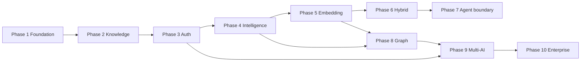

# 09 — Roadmap

**Status:** Permanent project standard (living roadmap).  
**Audience:** AI assistants and human maintainers.  
**Authority:** Subordinate to [00-CONSTITUTION.md](../../core/constitution/00-CONSTITUTION.md). Operational detail: [10-PHASE-STATUS.md](../../core/architecture/10-PHASE-STATUS.md).  
**Last updated:** Phase 10 gate PASS (2026-07-03)

---

# Purpose

Define the phased evolution of the AI Brain memory foundation from Phase 1 through Phase 10.

Record what is completed, what is in progress, what is planned, dependencies between phases, risks, success criteria, and architecture evolution at each stage.

---

# Scope

## Covered

- Phases 1–10 capability roadmap
- Current status, milestones, dependencies, risks, success criteria
- Architecture evolution per phase

## Not Covered

- Active implementation tasks → [../../../TASK_PROMPT.md](../../../TASK_PROMPT.md)
- Post–Phase 10 phases 11–14 → [10-POST-ROADMAP.md](10-POST-ROADMAP.md)
- Structural ADR content → [adr/](../../../docs/adr/)
- Immutable engineering law → [00-CONSTITUTION.md](../../core/constitution/00-CONSTITUTION.md) – [08-REVIEW.md](../../core/standards/08-REVIEW.md)
- Historical phase design detail → [archive/](../../docs/archive/)

---

# Summary

| Status | Phases |
|--------|--------|
| **Completed** | 1, 2 (2.5 + 2.6), 3, 4, 5, 6, 7, 8, 9, 9.5, 10 |
| **In progress** | — |
| **Completed (sub)** | 9.5 — Platform Architecture |
| **Next** | Phase 11 — Production Operations ([10-POST-ROADMAP.md](10-POST-ROADMAP.md)) |
| **Future** | Phases 12–14 (event pipeline, content scale, search/graph prod) |

**Capability stack:**

```
Memory → Knowledge → Embedding → Vector → Graph → Agent Runtime → Multi-AI → Enterprise → Production Ops
  ✅        ✅           ✅       ✅        ✅         ✅            ✅          ✅              🔲
```

**Metrics (current):** 405 tests · 19 MCP tools · REST on Vercel · D1 default · platform adapters opt-in

**Post–Phase 10 plan:** [10-POST-ROADMAP.md](10-POST-ROADMAP.md)

---

# Dependencies



| Phase | Hard dependencies | ADR gates |
|-------|-------------------|-----------|
| 6 | 4 `IRetrievalCandidateSource`, 5 `IEmbeddingStore` | ADR-001 Approved |
| 7 | 4 context/MCP contracts stable | External runtime ADR |
| 8 | 4 relations, 2.6 knowledge | `IGraphProvider` ADR |
| 9 | 3 auth, ADR-002 scope types | Workspace schema ADR |
| 10 | 9 multi-actor model | ADR-002 implementation |

---

# Architecture evolution

| Phase | Structural addition | Ports / adapters |
|-------|---------------------|------------------|
| 1 | Layer stack, MCP + REST | `MemoryRepository`, `MemoryService` |
| 2 | Knowledge metadata, ranking config | `KnowledgeService`, pure generators |
| 3 | Identity chain, permissions | `IdentityProvider` implementations |
| 4 | Retrieval pipeline | `IRetrievalCandidateSource`, `Retriever` |
| 5 | Async embedding | `IEmbeddingProvider`, `IEmbeddingStore` |
| 6 | Hybrid candidates | `VectorRetrievalCandidateSource`, `CompositeRetrievalCandidateSource` |
| 7 | Protocol boundary only | No agent logic in repo |
| 8 | Graph traversal | `IGraphProvider` |
| 9 | Workspace + agent scope | `IScopeResolver`, `IAgentIdentity` |
| 10 | Organization RBAC | Workspace membership, audit expansion |

**Invariant across all phases:** inward dependencies, composition root wiring, REST/MCP share services, no `*V2` classes.

---

# Risks (cross-phase)

| Risk | Phases affected | Mitigation |
|------|-----------------|------------|
| D1-only shortcuts block Postgres/vector | 5–10 | Ports per 04-ARCHITECTURE |
| Vector SQL in metadata repository | 5–6 | `IEmbeddingStore` only |
| Retriever rewrite for each source | 6, 8 | `CompositeRetrievalCandidateSource` |
| Owner-only hardcoding blocks enterprise | 9–10 | ADR-002 scope contract now |
| MCP/REST contract drift | all | Additive changes only |
| MVP vector scale ceiling (~5–10k/owner) | 5–6 | Adapter swap to Vectorize/pgvector |
| God-class `MemoryRepository` | 5–8 | ADR-004 types; split at Postgres |
| Agent logic inside foundation | 7+ | Constitution boundary |

---

# Phase 1 — Foundation

**Status:** ✅ Completed

## Scope

CRUD memories, MCP stdio server, D1 persistence, REST API skeleton, basic project structure.

## Milestones

- [x] `MemoryService` + `MemoryRepository`
- [x] MCP tools for save/search/get
- [x] Cloudflare D1 client
- [x] Fastify REST server
- [x] Vitest test harness

## Success criteria

- [x] Memory CRUD via REST and MCP
- [x] Single owner pool (pre-scope hardening)
- [x] Deployable locally

## Architecture evolution

- Established `routes → controllers → services → repositories`
- MCP shares `MemoryService`

---

# Phase 2 — Knowledge Foundation

**Status:** ✅ Completed (includes 2.5 Stabilization + 2.6 Knowledge)

## Scope

**2.5:** API stabilization, rate limits, env validation, legacy route removal prep.  
**2.6:** Codename, slug, keywords, categories, memory types, relations, ranking engine.

## Milestones

- [x] Phase 2.5 stabilization checklist
- [x] `KnowledgeService` + pure generators
- [x] `memory_relations` table
- [x] `ranking.engine.ts` (pure)
- [x] `SearchService` + candidate cap
- [x] UNIQUE `(owner_id, codename)`, `(owner_id, slug)`

## Success criteria

- [x] Enriched metadata on create/update
- [x] REST search with relevance ranking
- [x] Relation CRUD
- [x] 2.5 quality gate complete

## Dependencies

- Phase 1

## Architecture evolution

- `knowledge/` domain module
- `search/` separate from future LLM retrieval
- Ranking weights in `ranking.config.ts`

---

# Phase 3 — Authorization

**Status:** ✅ Completed

## Scope

JWT, OAuth, API keys, bootstrap, clients, permissions (`memory.read` / `memory.write`), audit bus, `/api/v1` canonical routes.

## Milestones

- [x] `IdentityProvider` chain
- [x] Auth middleware + permission middleware
- [x] Bootstrap once semantics
- [x] Owner isolation (404 cross-owner)
- [x] Auth E2E tests

## Success criteria

- [x] Authenticated REST for all memory endpoints
- [x] API key and JWT flows
- [x] Legacy `/memory` routes removed

## Dependencies

- Phase 2

## Architecture evolution

- `auth/` layer
- `ownerId` from `request.user`
- MCP remains env-scoped (separate auth model)

---

# Phase 4 — Memory Intelligence

**Status:** ✅ Completed

## Scope

Retriever, Ranker, ContextBuilder, PromptBuilder, ContextService, consolidator, semantic hash, `IRetrievalCandidateSource`, access tracking.

## Milestones

- [x] `SqlRetrievalCandidateSource`
- [x] `Retriever` → `Ranker` → context budget
- [x] `POST /api/v1/context`
- [x] `recordAccess` without touching `updated_at`
- [x] Consolidation script (dry-run default)
- [x] Reserved columns: `embedding_id`, `object_key`

## Success criteria

- [x] Bounded LLM context from task query
- [x] Separate from paginated REST search
- [x] MCP `get_context`, `build_prompt`
- [x] Milestones A–G complete

## Dependencies

- Phase 3

## Architecture evolution

- `memory/` intelligence pipeline
- Port-ready retrieval (`IRetrievalCandidateSource`)
- Intelligence fields on `memories`

---

# Phase 5 — Embedding

**Status:** ✅ Completed (2026-07-01)

## Scope

Async embedding backfill, `IEmbeddingProvider`, `IEmbeddingStore`, `memory_embeddings`, OpenAI optional, orphan cleanup on delete.

## Milestones

- [x] ADR-003, ADR-004 Implemented
- [x] `NoopEmbeddingProvider`, `OpenAIEmbeddingProvider`
- [x] `D1EmbeddingStore` + `searchSimilar` MVP
- [x] `EmbeddingJobRunner` + `db:backfill-embeddings`
- [x] `applyEmbeddingBackfill` / `findWithoutEmbedding`
- [x] Vector cleanup in `MemoryService`
- [x] 152+ tests

## Success criteria

- [x] No sync embed on CRUD
- [x] No vector SQL in `MemoryRepository`
- [x] Idempotent backfill with `content_hash` skip
- [x] REST/MCP contracts unchanged

## Dependencies

- Phase 4 (`embedding_id` column, retrieval port)

## Risks mitigated

- D1 MVP scale documented (~5–10k vectors/owner)
- Ports enable Vectorize/pgvector swap

## Architecture evolution

- `embedding/` module
- Composition root: `create-memory-service.ts`

---

# Phase 6 — Hybrid Retrieval

**Status:** ✅ Completed (2026-07-03)

## Scope

Vector-augmented retrieval: `VectorRetrievalCandidateSource`, `CompositeRetrievalCandidateSource`, rank fusion, env-gated hybrid mode.

## Milestones

- [x] ADR-001 Approved & Implemented
- [x] `CompositeRetrievalCandidateSource` + tests (13 unit tests)
- [x] `VectorRetrievalCandidateSource` via `IEmbeddingStore.searchSimilar`
- [x] Wire composite at composition root (`HYBRID_RETRIEVAL` flag)
- [x] Fusion weights in ranking config
- [x] TASK_PROMPT Phase 6 from template
- [x] No Retriever / ContextService rewrite

## Success criteria

- [x] Semantic recall improves via RRF fusion
- [x] `Retriever` and MCP tools unchanged
- [x] Dedupe by `memoryId`, cap after merge
- [x] Owner-scoped vector candidates
- [x] Quality gate green; 192 tests pass

## Dependencies

- Phase 5 `IEmbeddingStore.searchSimilar`
- Phase 4 `IRetrievalCandidateSource`

## Risks

| Risk | Mitigation |
|------|------------|
| Latency from parallel sources | Per-source caps |
| Merge policy ambiguity | Document in ADR-001 |
| Ranking engine coupling | Fusion in pure engine |

## Architecture evolution

- New retrieval adapters only
- `RankingEngine` may gain fusion weights — still pure

---

# Phase 7 — Agent Runtime

**Status:** ✅ **Completed** (2026-07-03)

## Scope

**Outside this repository.** Agent loops, planning, and execution consume MCP/REST. Foundation may add scope hooks per ADR-002 — no agent orchestration inside `src/`.

## Milestones

- [x] Agent runtime ADR (external system) — boundary in [07-agent-runtime/DESIGN.md](../07-agent-runtime/DESIGN.md)
- [x] MCP tool contracts stable for agent consumers — 14 tools verified
- [x] Optional: `agentId` in `MemoryScope` types — deferred to Phase 9 per ADR-002
- [x] Documentation for agent integration boundary — DESIGN.md + COMPLETION.md

## Success criteria

- [x] External agent can complete save → context → act loop via MCP
- [x] No agent planner code in `src/services/` or `src/memory/`
- [x] Constitution boundary preserved

## Dependencies

- Phase 4 context API
- Phase 6 hybrid retrieval ✅

## Architecture evolution

- Protocol-stable boundary only
- Prepares `IScopeResolver` contract (types) for Phase 9

---

# Phase 8 — Knowledge Graph

**Status:** ✅ **Complete** (gate PASS 2026-07-03)

## Scope

`IGraphProvider` for traversal; graph-augmented retrieval source; flat `memory_relations` CRUD unchanged.

**ADR:** [docs/adr/006-igraph-provider.md](../../docs/adr/006-igraph-provider.md) — **Approved** · **Implemented**

## Milestones

- [x] `IGraphProvider` ADR Approved — [ADR-006](../../docs/adr/006-igraph-provider.md) (2026-07-03)
- [x] `IGraphProvider` port + `D1GraphAdapter` (bidirectional BFS)
- [x] `GraphRetrievalCandidateSource` + tests
- [x] Composite retrieval includes graph source (role-based RRF caps)
- [x] `createContextService()` wiring matrix + `GRAPH_*` env flags
- [x] MCP `get_graph_capabilities`, `traverse_relations`; REST `/api/v1/graph/*`
- [x] Phase 8 gate docs (CHECKLIST / REVIEW / COMPLETION)

## Success criteria

- [x] Neighborhood expansion in retrieval within cap
- [x] `MemoryRelationService` API unchanged
- [x] No `MemoryRelationRepositoryV2`

## Dependencies

- Phase 4 retrieval port
- Phase 6 composite pattern
- Phase 2.6 relations data

## Risks

| Risk | Mitigation |
|------|------------|
| Graph SQL in metadata repo | `IGraphProvider` only |
| Relation repo replacement | Extend, not replace |

## Architecture evolution

- `IGraphProvider` adapter family
- Third leg of `CompositeRetrievalCandidateSource`

---

# Phase 9 — Multi-AI

**Status:** ✅ **Complete** (2026-07-03)

## Scope

Shared workspace memory across agents and clients; `IScopeResolver`, `IAgentIdentity`, `ISyncManager`; workspace schema; multi-client coherence.

**ADR:** [docs/adr/007-multi-ai-workspace-scope.md](../../docs/adr/007-multi-ai-workspace-scope.md) — **Implemented**  
**Contract:** [ADR-002](../../docs/adr/002-workspace-identity-model.md) — Approved

## Milestones

- [x] ADR-007 **Approved**
- [x] Workspace + agent schema migration
- [x] `IScopeResolver` implementation
- [x] `IAgentIdentity` port
- [x] `AcceptSyncManager` for cross-client consistency (MVP)
- [x] MCP/REST scope expansion (additive fields)
- [x] Cross-workspace isolation E2E
- [x] Workspace/agent REST + MCP tools

## Success criteria

- [x] Multiple AI clients share workspace-scoped memory
- [x] `MemoryService` core not rewritten
- [x] Owner isolation preserved; workspace isolation enforced
- [x] Agent attribution on writes — `MemoryService` + `AcceptSyncManager` wired

## Gate

[.ai/phases/09-multi-ai/COMPLETION.md](../09-multi-ai/COMPLETION.md)

---

# Phase 9.5 — Platform Architecture

**Status:** ✅ **Complete** (2026-07-03)

## Scope

Storage-agnostic **port registry** (`src/ports/`). Prepare enterprise infrastructure swap without changing domain or application services. No new user-facing features; no provider implementations.

**ADR:** [docs/adr/008-platform-architecture.md](../../docs/adr/008-platform-architecture.md) — **Approved**

## Milestones

- [x] ADR-008 Approved
- [x] `ISqlDatabase`, `IMemoryRepository`, `IRelationRepository`, `IEmbeddingProvider`
- [x] `IVectorStore`, `IGraphStore`, `IObjectStorage`, `ICache`, `IEventBus`, `IAnalyticsStore`
- [x] Contract tests
- [x] Gate PASS

## Success criteria

- [x] All ports in `src/ports/index.ts`
- [x] Zero behavior change to REST/MCP
- [x] D1 remains default adapter
- [x] Quality gate green (310 tests)

## Gate

[.ai/phases/09.5-platform-architecture/README.md](../09.5-platform-architecture/README.md)

---

# Phase 10 — Enterprise

**Status:** ✅ **Complete** (gate PASS 2026-07-03)

## Scope

Organization tenant, workspace membership RBAC, platform infrastructure adapters (Postgres, R2/S3, pgvector, Redis, Meilisearch, Neo4j, DuckDB, Redis Streams, OpenTelemetry), external provider backfill scripts, and opt-in memory access audit.

## Milestones

- [x] `organizations` schema
- [x] Workspace membership + RBAC port
- [x] JWT claims for org/workspace
- [x] Postgres adapter (ADR-009)
- [x] Platform adapters T0–T8 + events (ADR-005, 011–016)
- [x] Backfill scripts (pgvector, Meilisearch, Neo4j)
- [x] Audit expansion (memory access — ADR-017)
- [x] Formal phase gate (REVIEW, RETROSPECTIVE)

## Success criteria

- [x] Multi-tenant org isolation (E2E)
- [x] Role-based memory access within workspace (`ENTERPRISE_RBAC` opt-in)
- [x] Audit trail for compliance queries (`MEMORY_ACCESS_AUDIT` opt-in)
- [x] Scale path documented and tested (402 tests at default env)

## Dependencies

- Phase 9 multi-AI scope model ✅
- ADR-002 Phase 10 migration ✅
- ADR-005 content object store ✅

## Risks

| Risk | Mitigation |
|------|------------|
| RBAC complexity in services | Membership port |
| D1 scale limits | Postgres port per ADR-004 |
| Data residency | Adapter + deployment ADR |

## Architecture evolution

- `organizationId` in scope
- `IMemoryRepository` Postgres adapter
- Optional `IContentStore` for blobs

---

# Current action items

| Priority | Action | Owner |
|----------|--------|-------|
| 1 | Phase 8 — Knowledge Graph (ADR-006) | ✅ Done (gate PASS 2026-07-03) |
| 2 | Phase 9 / 9.5 — Multi-AI + platform ports | ✅ Done (2026-07-03) |
| 3 | Phase 10 — Enterprise gate | ✅ Done (2026-07-03) |
| 4 | Post–Phase 10 roadmap definition | ✅ Done ([10-POST-ROADMAP.md](10-POST-ROADMAP.md) 2026-07-03) |
| 5 | Phase 11 Readiness Review + ADR-018 draft | Next |

---

# Required

1. Treat this roadmap as the phase authority; update when phases complete.
2. Do not start a phase without dependency phases complete and ADR gates satisfied.
3. Update this document and [10-PHASE-STATUS.md](../../core/architecture/10-PHASE-STATUS.md) on phase completion.
4. Mark phases ✅ only when success criteria are met.
5. Keep agent/reasoning logic outside repo from Phase 7 onward.

---

# Forbidden

1. Skipping phases without ADR and owner approval.
2. Marking future phases complete before success criteria met.
3. Implementing Proposed ADRs without approval.
4. Collapsing capability stack layers into monolith modules.
5. Rewriting `MemoryService` / `Retriever` per phase instead of port extension.

---

# Decision Rules

| Question | Rule |
|----------|------|
| Ready to start Phase N? | Phase N−1 success criteria met + ADR gates Approved |
| Scope fits which phase? | Match capability stack row |
| Structural change? | ADR before code |
| Agent feature request? | Phase 7+ external or Phase 9 scope — not Phase 6 |
| Enterprise RBAC? | Phase 10 only |

---

# Checklist — phase completion

**Last verified:** 2026-07-03 (Phase 10 gate PASS)

- [x] All phase milestones checked — Phases 1–10; evidence in `.ai/phases/NN-*/CHECKLIST.md`
- [x] Success criteria verified with tests — **402 passed** (89 files); `npm test` green
- [x] 10-PHASE-STATUS.md phase row updated — [10-PHASE-STATUS.md](../../core/architecture/10-PHASE-STATUS.md)
- [x] 09-ROADMAP.md status updated — Summary + Phase 10 **Complete**
- [x] ADRs marked Implemented / Approved — [docs/adr/README.md](../../../docs/adr/README.md) (ADR-001–017)
- [x] TASK_PROMPT completion report archived — [TASK_PROMPT.md](../../TASK_PROMPT.md) → post–Phase 10
- [x] PANDUAN updated if user-visible — §8 platform, §9 migrasi, `MEMORY_ACCESS_AUDIT`
- [x] No constitutional violations per 08-REVIEW — Phase 10 REVIEW PASS; layer boundaries preserved

---

*Inherits from [00-CONSTITUTION.md](../../core/constitution/00-CONSTITUTION.md). Amend phase definitions with project owner approval.*
