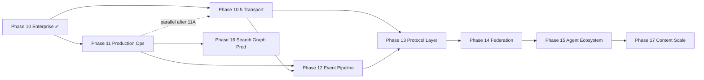

# Post–Phase 10 Roadmap

**Status:** Approved definition (2026-07-03)  
**Audience:** Project owner, maintainers, AI assistants  
**Authority:** Subordinate to [00-CONSTITUTION.md](../../core/constitution/00-CONSTITUTION.md). Extends [09-ROADMAP.md](09-ROADMAP.md) after Phase 10 gate PASS.

**Baseline:** 405 tests · default deploy D1-only unchanged · platform adapters opt-in (ADR-008–017)

---

## Purpose

Phase 10 delivered **adapter swap path** and **enterprise tenancy** without changing default behavior. Post–Phase 10 work moves from *capability build* to **production cutover**, **operational maturity**, and **targeted hardening** — still constitution-compliant (no agent logic in repo).

---

## Strategic themes

| Theme | Outcome |
|-------|---------|
| **Production metadata** | Validated Postgres cutover with rollback |
| **Operational pipeline** | Event bus consumers for audit/analytics |
| **Scale paths** | pgvector, R2 content offload, Neo4j/Meilisearch in staging |
| **Maintainability** | Repository decomposition when Postgres is primary |

**Non-goals (unchanged):** Agent runtime, planner, executor, workflow engine inside this repo.

---

## Recommended phase sequence

| Phase | Name | Priority | Hard dependency |
|-------|------|----------|-----------------|
| **11** | Production Operations | **P0 — start here** | Phase 10 ✅ |
| **10.5** | Transport & Connectivity Layer | **P1 extension** | Phase 10 ✅ · ADR-025 ✅ · ADR-027 Approved |
| **12** | Event Pipeline & Observability | P1 | Phase 11 staging Postgres (or parallel if event-only) |
| **13** | Protocol Layer (REST/gRPC/WS/SSE/benchmark) | P1 | Phase 10.5 ✅ · ADR-028 Approved |
| **14** | **Federation** (cross workspace/region/org/cloud) | P1 | Phase 9–10 ✅ · Phase 13 ✅ · ADR-029 Approved |
| **15** | **Autonomous Agent Ecosystem** (multi-client Memory Cloud) | P1 | Phase 7/9 ✅ · ADR-025 ✅ · ADR-030 Approved |
| **16** | Search & Graph Production *(renumbered)* | P2 | Phase 11 + backfill scripts proven |
| **17** | Content & Vector Scale *(renumbered from Phase 15)* | P1 | Phase 11 metadata · Phase 13 recommended |

Phases 10.5, 12–17 may overlap **after** Phase 11 Readiness PASS. **Phase 15 requires no agent runtime in repo** (Constitution §3).

---

# Phase 10.5 — Transport & Connectivity Layer

**Status:** 🔲 Reserved — Design draft (2026-07-04); **awaiting owner approval**  
**Folder:** [.ai/phases/10.5-transport-connectivity/](../10.5-transport-connectivity/README.md)

## Scope

Formalize **Transport & Connectivity** as canonical outer layer. REST and MCP stdio remain default public/AI protocols. Optional gRPC for internal/enterprise workloads (batch ingest, context streaming). **Zero change** to application services, repositories, or storage ports.

| Track | Deliverable |
|-------|-------------|
| 10.5A | `TransportContext` + unified scope resolution |
| 10.5B | Shared `IApplicationHandler` (anti-drift) |
| 10.5C | REST → `src/transport/rest/` (strangler re-exports) |
| 10.5D | MCP → `src/transport/mcp/` |
| 10.5E | gRPC v1 behind `GRPC_ENABLED=false` |
| 10.5F | Manifest `transport` section + docs |

## ADR gates

| ADR | Title | Purpose |
|-----|-------|---------|
| [ADR-027](../../adr/027-transport-connectivity-layer.md) | Transport & Connectivity Layer | **Proposed** — owner must Approve before code |
| ADR-025 amend | Add `transport` block to manifest | Additive only |

## Success criteria

- [ ] ADR-027 **Approved**
- [ ] `src/transport/` canonical; 04-ARCHITECTURE updated
- [ ] No `MemoryService` / `SearchService` / `KnowledgeService` logic change
- [ ] REST v1 + MCP tool schemas unchanged
- [ ] Handler parity ≥10 use cases
- [ ] `GRPC_ENABLED=false` default; 457+ tests at default env
- [ ] Manifest reports active transports

## Non-goals

- GraphQL (deferred)
- `@ai-brain/client` SDK in repo
- Agent runtime
- Repository / storage / schema changes
- gRPC on Vercel serverless default path

## Risks

| Risk | Mitigation |
|------|------------|
| REST/MCP/gRPC drift | Shared handlers + parity tests |
| Phase 11 delay | Parallel after 11A; owner authorization |
| Over-abstraction | `ITransportServer` lifecycle only — no god interface |

---

# Phase 11 — Production Operations

**Status:** 🔄 In Progress — Design Approved (2026-07-03); implementation complete; SC-11-01 + SC-11-05 pending owner action

## Scope

Move from *adapters exist* to *adapters proven in staging/production* for metadata SQL.

| Track | Deliverable |
|-------|-------------|
| 11A | **Postgres cutover runbook** — dual-read validation, migration checklist, rollback |
| 11B | **Staging harness** — `SQL_PROVIDER=postgres` CI/staging job; contract + E2E on Postgres |
| 11C | **Repository hardening** — split `MemoryRepository` when Postgres is primary (optional milestone) |
| 11D | **Ops docs** — update PANDUAN §8 with production env matrix |

## ADR gates (draft — owner must Approve before code)

| ADR | Title | Purpose |
|-----|-------|---------|
| ADR-018 | Production Postgres cutover | ✅ Approved (2026-07-03) |
| (optional) ADR-019 | Repository module split | Boundaries if 11C proceeds |

## Success criteria

- [x] Staging deploy runs full test suite on `SQL_PROVIDER=postgres` *(CI harness ready; SC-11-01 pending live Postgres)*
- [x] Documented cutover + rollback; owner sign-off *(MIGRATION.md authored; SC-11-05 pending owner sign-off)*
- [x] Default D1 deploy unchanged; Postgres opt-in only *(420 tests green at default env)*
- [x] No `MemoryService` / `Retriever` rewrite *(verified — no pg imports outside infrastructure)*

## Risks

| Risk | Mitigation |
|------|------------|
| Schema drift D1 ↔ Postgres | Shared migrations; contract tests |
| Cutover downtime | Read fallback or blue/green per ADR-018 |

---

# Phase 12 — Event Pipeline & Observability

**Status:** 🔲 Planned  
**Folder (when open):** `.ai/phases/12-event-pipeline/`

## Scope

Activate async paths declared in Phase 10 but not on hot path.

| Track | Deliverable |
|-------|-------------|
| 12A | **Domain event consumers** — subscribe via `IEventBus` (Redis Streams reference) |
| 12B | **Audit fan-out** — optional `memory.accessed` → analytics store / external sink |
| 12C | **Request context on audit** — identity/IP on `ContextService` when `MEMORY_ACCESS_AUDIT=true` |
| 12D | **OTel runbook** — production tracing checklist (OTEL already wired) |

## ADR gates

| ADR | Title |
|-----|-------|
| ADR-020 | Event consumer architecture (audit + analytics fan-out) |

## Success criteria

- [ ] Consumer(s) idempotent; at-least-once documented
- [ ] Default `EVENT_BUS_PROVIDER=none` unchanged
- [ ] Compliance query path documented (audit_logs and/or analytics export)

## Deferred from Phase 10

- DuckDB `memory_access_events` hot-path wiring → 12B
- ADR-017 identity/IP at context.build → 12C

---

# Phase 13 — Protocol Layer

**Status:** 🔲 Reserved — Design draft (2026-07-04); **awaiting owner approval**  
**Folder:** [.ai/phases/13-protocol-layer/](../13-protocol-layer/README.md)

## Scope

Multi-protocol access with **streaming** and **benchmark** — all protocols delegate to the **same** `MemoryService` via shared use-case handlers. Protocol adapters only; no business logic, repository, or storage change.

| Track | Deliverable |
|-------|-------------|
| 13A | `IStreamPublisher`, `IContextStreamSource`, chunk types |
| 13B | SSE — `GET /api/v1/context/stream` (`SSE_ENABLED=false`) |
| 13C | WebSocket — `WS /api/v1/ws` (`WEBSOCKET_ENABLED=false`) |
| 13D | gRPC context server-stream (extends 10.5) |
| 13E | `npm run benchmark:protocols` |
| 13F | Manifest `protocols` section + docs |

## Layer law

| Layer | Rule |
|-------|------|
| Protocol adapter | Wire only — no SQL, no repository |
| Handler | Services only — no storage SDK |
| Service | No Fastify/gRPC/ws/SSE imports |
| Repository | No protocol awareness |

## ADR gates

| ADR | Title |
|-----|-------|
| [ADR-028](../../adr/028-protocol-layer.md) | Protocol Layer — **Proposed** |
| ADR-027 | Transport foundation (prerequisite) |

## Success criteria

- [ ] ADR-028 **Approved**
- [ ] REST unary + MCP unchanged
- [ ] Context stream on SSE + gRPC + WebSocket
- [ ] Protocol benchmark report
- [ ] Handler parity (unary + stream)
- [ ] Default env 457+ tests green

## Non-goals

- GraphQL; MCP HTTP; agent runtime; repository changes

---

# Phase 15 — Autonomous Agent Ecosystem

**Status:** 🔲 Reserved — Design draft (2026-07-04); **awaiting owner approval**  
**Folder:** [.ai/phases/15-autonomous-agent-ecosystem/](../15-autonomous-agent-ecosystem/README.md)

## Scope

Enable **Cursor, Claude, OpenAI, Gemini, Codex, Continue, Qwen** to share the **same Memory Cloud** via REST/MCP/gRPC. **Agent runtime outside repo** — catalog + manifest + compatibility only.

| Track | Deliverable |
|-------|-------------|
| 15A | `AgentClientType` SSOT + client profile registry |
| 15B | `IAgentClientCatalog` port |
| 15C | Ecosystem manifest (extends ADR-025) |
| 15D | `GET /api/v1/ecosystem/clients` |
| 15E | Compatibility matrix + contract tests |
| 15F | PANDUAN § Agent Ecosystem |

## ADR gates

| ADR | Title |
|-----|-------|
| [ADR-030](../../adr/030-autonomous-agent-ecosystem.md) | Autonomous Agent Ecosystem — **Proposed** |

## Success criteria

- [ ] ADR-030 **Approved**
- [ ] Zero agent runtime code in `src/`
- [ ] MemoryService unchanged
- [ ] 8+ client profiles; manifest + REST accurate
- [ ] All clients use workspace-scoped shared memory path

## Non-goals

- Agent planner, executor, loops, in-repo SDK

---

# Phase 17 — Content & Vector Scale

**Status:** 🔲 Planned *(renumbered from former Phase 15)*  
**Folder (when open):** `.ai/phases/17-content-scale/`

## Scope

Production-scale content and vector storage beyond inline/D1.

| Track | Deliverable |
|-------|-------------|
| 17A | **R2/S3 content offload** — large body migration; `object_key` backfill |
| 17B | **pgvector production** — execute backfill; hybrid retrieval on pgvector in staging |
| 17C | **Embedding job hardening** — batch/retry metrics; gRPC client-stream ingest |

## ADR gates

| ADR | Title |
|-----|-------|
| ADR-021 | Content blob lifecycle |

## Success criteria

- [ ] Backfill scripts executed in staging with evidence
- [ ] Retrieval correctness E2E with external vector store
- [ ] Default env unchanged

---

# Phase 15 (legacy note)

*Former "Content & Vector Scale" renumbered to **Phase 17** (2026-07-04). Phase 15 is now **Autonomous Agent Ecosystem**.*

---

# Phase 14 (legacy note)

*Former "Phase 13 — Content & Vector Scale" renumbered to **Phase 15** (2026-07-04). Phase 13 is now **Protocol Layer**.*

---

# Phase 14 — Federation

**Status:** 🔲 Reserved — Design draft (2026-07-04); **awaiting owner approval**  
**Folder:** [.ai/phases/14-federation/](../14-federation/README.md)

## Scope

Multiple AI Brain nodes exchange knowledge across **workspace, region, organization, and cloud** — all via **federation ports**. `MemoryService` **unchanged**; local apply through existing APIs only.

| Track | Deliverable |
|-------|-------------|
| 14A | Federation port registry (8 ports) |
| 14B | `IKnowledgeExchangeService` → MemoryService delegation |
| 14C | Registry + trust adapters (env-driven) |
| 14D | Transport adapters (in-process, gRPC, REST, event-bus) |
| 14E | Policy + scope mapper + conflict resolver |
| 14F | REST `/api/v1/federation/*` + manifest |

## ADR gates

| ADR | Title |
|-----|-------|
| [ADR-029](../../adr/029-federation-layer.md) | Federation Layer — **Proposed** |

## Success criteria

- [ ] ADR-029 **Approved**
- [ ] Zero MemoryService logic change
- [ ] No cloud/region hardcode in services
- [ ] Cross-workspace + cross-node exchange proven
- [ ] Cross-org denied without trust link
- [ ] `FEDERATION_ENABLED=false` default

---

# Phase 16 — Search & Graph Production

**Status:** 🔲 Planned *(renumbered from former Phase 14)*  
**Folder (when open):** `.ai/phases/16-search-graph-prod/`

## Scope

External search index and graph engine for scale (optional per deployment).

| Track | Deliverable |
|-------|-------------|
| 16A | **Meilisearch** — incremental sync / reindex strategy |
| 16B | **Neo4j** — replace D1 in-process BFS in production graph path |
| 16C | **Graph vector seeds** (optional) — vector-derived graph seeds post-MVP |

## ADR gates

| ADR | Title |
|-----|-------|
| ADR-022 | External search/graph cutover |

## Success criteria

- [ ] `SEARCH_PROVIDER=meilisearch` and `GRAPH_PROVIDER=neo4j` validated in staging
- [ ] D1 graph adapter remains default

---

# Phase 14 — Search & Graph Production (superseded)

*Renumbered to **Phase 16** (2026-07-04). Phase 14 is now **Federation**.*

---

## Cross-phase debt register

| ID | Item | Target phase | Status |
|----|------|--------------|--------|
| T-01 | `MemoryRepository` ~622 lines | 11C | Open |
| T-05 | D1 in-process graph BFS | 16B | Open |
| T-06 | Audit identity at context.build | 12C | Open |
| T-07 | `GET /memory/:id` audit | 12C or ADR-017 amend | Open |
| ~~T-02~~ | ~~SELECT * queries~~ | — | ✅ Resolved |
| ~~T-03~~ | ~~N× recordAccess~~ | — | ✅ Resolved |

---

## Owner decision required

Before Phase 11 opens (Readiness Review):

1. **Confirm P0** — Phase 11 Production Ops vs parallel Phase 12 event work
2. ~~**Approve ADR-018**~~ ✅ Approved 2026-07-03
3. **Name staging target** — managed Postgres provider / connection policy

---

## Process

1. Open phase folder per [PHASE-DOCUMENT-SCHEMA.md](../PHASE-DOCUMENT-SCHEMA.md)
2. Readiness Review → DESIGN + RISKS → ADR Approved → implement
3. Update [09-ROADMAP.md](09-ROADMAP.md) row when phase opens
4. Rotate [TASK_PROMPT.md](../../TASK_PROMPT.md) to active phase

---

*Defined 2026-07-03 after Phase 10 gate PASS. Amended only with owner approval.*
