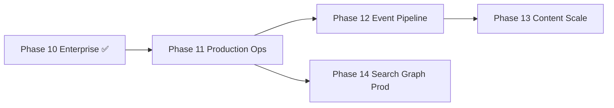

# Post–Phase 10 Roadmap

**Status:** Approved definition (2026-07-03)  
**Audience:** Project owner, maintainers, AI assistants  
**Authority:** Subordinate to [00-CONSTITUTION.md](../../core/constitution/00-CONSTITUTION.md). Extends [09-ROADMAP.md](09-ROADMAP.md) after Phase 10 gate PASS.

**Baseline:** 405 tests · default deploy D1-only unchanged · platform adapters opt-in (ADR-008–017)

---

## Purpose

Phase 10 delivered **adapter swap path** and **enterprise tenancy** without changing default behavior. Post–Phase 10 work moves from *capability build* to **production cutover**, **operational maturity**, and **targeted hardening** — still constitution-compliant (no agent logic in repo).

---

## Strategic themes

| Theme | Outcome |
|-------|---------|
| **Production metadata** | Validated Postgres cutover with rollback |
| **Operational pipeline** | Event bus consumers for audit/analytics |
| **Scale paths** | pgvector, R2 content offload, Neo4j/Meilisearch in staging |
| **Maintainability** | Repository decomposition when Postgres is primary |

**Non-goals (unchanged):** Agent runtime, planner, executor, workflow engine inside this repo.

---

## Recommended phase sequence

| Phase | Name | Priority | Hard dependency |
|-------|------|----------|-----------------|
| **11** | Production Operations | **P0 — start here** | Phase 10 ✅ |
| **12** | Event Pipeline & Observability | P1 | Phase 11 staging Postgres (or parallel if event-only) |
| **13** | Content & Vector Scale | P1 | Phase 11 metadata path stable |
| **14** | Search & Graph Production | P2 | Phase 11 + backfill scripts proven |

Phases 12–14 may overlap **after** Phase 11 Readiness PASS; do not start production env flips before Phase 11 cutover runbook exists.

---

# Phase 11 — Production Operations

**Status:** 🔲 Scaffolded — [11-production-ops/](../11-production-ops/README.md)

## Scope

Move from *adapters exist* to *adapters proven in staging/production* for metadata SQL.

| Track | Deliverable |
|-------|-------------|
| 11A | **Postgres cutover runbook** — dual-read validation, migration checklist, rollback |
| 11B | **Staging harness** — `SQL_PROVIDER=postgres` CI/staging job; contract + E2E on Postgres |
| 11C | **Repository hardening** — split `MemoryRepository` when Postgres is primary (optional milestone) |
| 11D | **Ops docs** — update PANDUAN §8 with production env matrix |

## ADR gates (draft — owner must Approve before code)

| ADR | Title | Purpose |
|-----|-------|---------|
| ADR-018 | Production Postgres cutover | ✅ Approved (2026-07-03) |
| (optional) ADR-019 | Repository module split | Boundaries if 11C proceeds |

## Success criteria

- [ ] Staging deploy runs full test suite on `SQL_PROVIDER=postgres`
- [ ] Documented cutover + rollback; owner sign-off
- [ ] Default D1 deploy unchanged; Postgres opt-in only
- [ ] No `MemoryService` / `Retriever` rewrite

## Risks

| Risk | Mitigation |
|------|------------|
| Schema drift D1 ↔ Postgres | Shared migrations; contract tests |
| Cutover downtime | Read fallback or blue/green per ADR-018 |

---

# Phase 12 — Event Pipeline & Observability

**Status:** 🔲 Planned  
**Folder (when open):** `.ai/phases/12-event-pipeline/`

## Scope

Activate async paths declared in Phase 10 but not on hot path.

| Track | Deliverable |
|-------|-------------|
| 12A | **Domain event consumers** — subscribe via `IEventBus` (Redis Streams reference) |
| 12B | **Audit fan-out** — optional `memory.accessed` → analytics store / external sink |
| 12C | **Request context on audit** — identity/IP on `ContextService` when `MEMORY_ACCESS_AUDIT=true` |
| 12D | **OTel runbook** — production tracing checklist (OTEL already wired) |

## ADR gates

| ADR | Title |
|-----|-------|
| ADR-020 | Event consumer architecture (audit + analytics fan-out) |

## Success criteria

- [ ] Consumer(s) idempotent; at-least-once documented
- [ ] Default `EVENT_BUS_PROVIDER=none` unchanged
- [ ] Compliance query path documented (audit_logs and/or analytics export)

## Deferred from Phase 10

- DuckDB `memory_access_events` hot-path wiring → 12B
- ADR-017 identity/IP at context.build → 12C

---

# Phase 13 — Content & Vector Scale

**Status:** 🔲 Planned  
**Folder (when open):** `.ai/phases/13-content-scale/`

## Scope

Production-scale content and vector storage beyond inline/D1.

| Track | Deliverable |
|-------|-------------|
| 13A | **R2/S3 content offload** — large body migration; `object_key` backfill |
| 13B | **pgvector production** — execute backfill; hybrid retrieval on pgvector in staging |
| 13C | **Embedding job hardening** — batch/retry metrics for production loads |

## ADR gates

| ADR | Title |
|-----|-------|
| ADR-021 | Content blob lifecycle (ADR-005 production implementation) |

## Success criteria

- [ ] Backfill scripts executed in staging with evidence
- [ ] Retrieval correctness E2E with external vector store
- [ ] Default env unchanged

---

# Phase 14 — Search & Graph Production

**Status:** 🔲 Planned  
**Folder (when open):** `.ai/phases/14-search-graph-prod/`

## Scope

External search index and graph engine for scale (optional per deployment).

| Track | Deliverable |
|-------|-------------|
| 14A | **Meilisearch** — incremental sync / reindex strategy |
| 14B | **Neo4j** — replace D1 in-process BFS in production graph path |
| 14C | **Graph vector seeds** (optional) — vector-derived graph seeds post-MVP (ADR-006 deferred) |

## ADR gates

| ADR | Title |
|-----|-------|
| ADR-022 | External search/graph cutover (if combined) or extend 014/015 |

## Success criteria

- [ ] `SEARCH_PROVIDER=meilisearch` and `GRAPH_PROVIDER=neo4j` validated in staging
- [ ] D1 graph adapter remains default

---

## Cross-phase debt register

| ID | Item | Target phase | Status |
|----|------|--------------|--------|
| T-01 | `MemoryRepository` ~622 lines | 11C | Open |
| T-05 | D1 in-process graph BFS | 14B | Open |
| T-06 | Audit identity at context.build | 12C | Open |
| T-07 | `GET /memory/:id` audit | 12C or ADR-017 amend | Open |
| ~~T-02~~ | ~~SELECT * queries~~ | — | ✅ Resolved |
| ~~T-03~~ | ~~N× recordAccess~~ | — | ✅ Resolved |

---

## Owner decision required

Before Phase 11 opens (Readiness Review):

1. **Confirm P0** — Phase 11 Production Ops vs parallel Phase 12 event work
2. ~~**Approve ADR-018**~~ ✅ Approved 2026-07-03
3. **Name staging target** — managed Postgres provider / connection policy

---

## Process

1. Open phase folder per [PHASE-DOCUMENT-SCHEMA.md](../PHASE-DOCUMENT-SCHEMA.md)
2. Readiness Review → DESIGN + RISKS → ADR Approved → implement
3. Update [09-ROADMAP.md](09-ROADMAP.md) row when phase opens
4. Rotate [TASK_PROMPT.md](../../TASK_PROMPT.md) to active phase

---

*Defined 2026-07-03 after Phase 10 gate PASS. Amended only with owner approval.*
