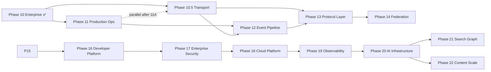

# Post–Phase 10 Roadmap

**Status:** Approved definition (2026-07-03)  
**Audience:** Project owner, maintainers, AI assistants  
**Authority:** Subordinate to [00-CONSTITUTION.md](../../core/constitution/00-CONSTITUTION.md). Extends [09-ROADMAP.md](09-ROADMAP.md) after Phase 10 gate PASS.

**Baseline:** 405 tests · default deploy D1-only unchanged · platform adapters opt-in (ADR-008–017)

---

## Purpose

Phase 10 delivered **adapter swap path** and **enterprise tenancy** without changing default behavior. Post–Phase 10 work moves from *capability build* to **production cutover**, **operational maturity**, and **targeted hardening** — still constitution-compliant (no agent logic in repo).

---

## Strategic themes

| Theme | Outcome |
|-------|---------|
| **Production metadata** | Validated Postgres cutover with rollback |
| **Operational pipeline** | Event bus consumers for audit/analytics |
| **Scale paths** | pgvector, R2 content offload, Neo4j/Meilisearch in staging |
| **Maintainability** | Repository decomposition when Postgres is primary |

**Non-goals (unchanged):** Agent runtime, planner, executor, workflow engine inside this repo.

---

## Recommended phase sequence

| Phase | Name | Priority | Hard dependency |
|-------|------|----------|-----------------|
| **11** | Production Operations | **P0** | Phase 10 ✅ |
| **10.5** | Transport & Connectivity | P1 extension | Phase 10 ✅ · ADR-027 |
| **12** | Event Pipeline | P1 | Phase 11 |
| **13** | Protocol Layer | P1 | Phase 10.5 · ADR-028 |
| **14** | Federation | P1 | Phase 9–10 · Phase 13 · ADR-029 |
| **15** | Autonomous Agent Ecosystem | P1 | Phase 7/9 · ADR-030 |
| **16** | **Developer Platform** (SDK, CLI, MCP) | P1 | Phase 13 · ADR-031 |
| **17** | **Enterprise Security** (SSO, OPA, ABAC) | P0 enterprise | Phase 10 · ADR-032 |
| **18** | **Cloud Platform** (control plane, metering) | P1 | Phase 14 · 17 · ADR-033 |
| **19** | **Observability Platform** (OTel, Grafana) | P1 | Phase 12 · 13 · ADR-034 |
| **20** | **AI Infrastructure Platform** (marketplace) | P1 capstone | Phase 16–19 · ADR-035 |
| **21** | Search & Graph Production *(renumbered)* | P2 | Phase 11 · ADR-022 |
| **22** | Content & Vector Scale *(renumbered)* | P1 | Phase 11 · ADR-021 |
| **23** | Enterprise Knowledge Fabric | P1 | Phase 11 · ADR-047 |
| **24** | Ratary Platform (umbrella) | P1 | Phases 16–23 · ADR-044 |

**Enterprise roadmap:** [11-ENTERPRISE-ROADMAP.md](11-ENTERPRISE-ROADMAP.md) · Phases 1–15 scopes **unchanged**.

---

# Phase 10.5 — Transport & Connectivity Layer

**Status:** ✅ Implemented — ADR-027 Implemented (2026-07-04); tracks 10.5A–10.5F ✅; gate REVIEW/COMPLETION pending  
**Folder:** [.ai/phases/10.5-transport-connectivity/](../10.5-transport-connectivity/README.md)

## Scope

Formalize **Transport & Connectivity** as canonical outer layer. REST and MCP stdio remain default public/AI protocols. Optional gRPC for internal/enterprise workloads (batch ingest, context streaming). **Zero change** to application services, repositories, or storage ports.

| Track | Deliverable | Status |
|-------|-------------|--------|
| 10.5A | `TransportContext` + unified scope resolution | ✅ |
| 10.5B | Shared `IApplicationHandler` (anti-drift) | ✅ |
| 10.5C | REST → `src/transport/rest/` (strangler re-exports) | ✅ |
| 10.5D | MCP → `src/transport/mcp/` | ✅ |
| 10.5E | gRPC v1 behind `GRPC_ENABLED=false` | ✅ |
| 10.5F | Manifest `transport` section + docs | ✅ |

## ADR gates

| ADR | Title | Purpose |
|-----|-------|---------|
| [ADR-027](../../adr/027-transport-connectivity-layer.md) | Transport & Connectivity Layer | **Implemented** (2026-07-04) |
| ADR-025 amend | Add `transport` block to manifest | Additive only |

## Success criteria

- [x] ADR-027 **Approved** → **Implemented**
- [x] `src/transport/` canonical; 04-ARCHITECTURE updated
- [x] No `MemoryService` / `SearchService` / `KnowledgeService` logic change
- [x] REST v1 + MCP tool schemas unchanged
- [x] Handler parity ≥10 use cases
- [x] `GRPC_ENABLED=false` default; 486 tests at default env
- [x] Manifest reports active transports

## Non-goals

- GraphQL (deferred)
- `@ratary/client` SDK in repo
- Agent runtime
- Repository / storage / schema changes
- gRPC on Vercel serverless default path

## Risks

| Risk | Mitigation |
|------|------------|
| REST/MCP/gRPC drift | Shared handlers + parity tests |
| Phase 11 delay | Parallel after 11A; owner authorization |
| Over-abstraction | `ITransportServer` lifecycle only — no god interface |

---

# Phase 11 — Production Operations

**Status:** ✅ Gate PASS (2026-07-04) — owner sign-off Lutfi Ramadhan

## Scope

Move from *adapters exist* to *adapters proven in staging/production* for metadata SQL.

| Track | Deliverable |
|-------|-------------|
| 11A | **Postgres cutover runbook** — dual-read validation, migration checklist, rollback |
| 11B | **Staging harness** — `SQL_PROVIDER=postgres` CI/staging job; contract + E2E on Postgres |
| 11C | **Repository hardening** — split `MemoryRepository` when Postgres is primary (optional milestone) |
| 11D | **Ops docs** — update PANDUAN §8 with production env matrix |

## ADR gates (draft — owner must Approve before code)

| ADR | Title | Purpose |
|-----|-------|---------|
| ADR-018 | Production Postgres cutover | ✅ Approved (2026-07-03) |
| (optional) ADR-019 | Repository module split | Boundaries if 11C proceeds |

## Success criteria

- [x] Staging harness green on live Postgres *(local 3/3 PASS 2026-07-04 — [TESTING.md](../11-production-ops/TESTING.md))*
- [x] Documented cutover + rollback; owner sign-off ✅ *(MIGRATION.md + REVIEW.md sign-off 2026-07-04)*
- [x] Default D1 deploy unchanged; Postgres opt-in only *(546 tests green at default env — 2026-07-04)*
- [x] No `MemoryService` / `Retriever` rewrite *(verified — no pg imports outside infrastructure)*

## Risks

| Risk | Mitigation |
|------|------------|
| Schema drift D1 ↔ Postgres | Shared migrations; contract tests |
| Cutover downtime | Read fallback or blue/green per ADR-018 |

---

# Phase 12 — Event Pipeline & Observability

**Status:** 🔲 Planned — design draft (2026-07-04)  
**Folder:** [.ai/phases/12-event-pipeline/](../12-event-pipeline/README.md)

## Scope

Activate async paths declared in Phase 10 but not on hot path.

| Track | Deliverable |
|-------|-------------|
| 12A | **Domain event consumers** — subscribe via `IEventBus` (Redis Streams reference) |
| 12B | **Audit fan-out** — optional `memory.accessed` → analytics store / external sink |
| 12C | **Request context on audit** — identity/IP on `ContextService` when `MEMORY_ACCESS_AUDIT=true` |
| 12D | **OTel runbook** — production tracing checklist (OTEL already wired) |

## ADR gates

| ADR | Title |
|-----|-------|
| ADR-020 | Event consumer architecture (audit + analytics fan-out) |

## Success criteria

- [ ] Consumer(s) idempotent; at-least-once documented
- [ ] Default `EVENT_BUS_PROVIDER=none` unchanged
- [ ] Compliance query path documented (audit_logs and/or analytics export)

## Deferred from Phase 10

- DuckDB `memory_access_events` hot-path wiring → 12B
- ADR-017 identity/IP at context.build → 12C

---

# Phase 13 — Protocol Layer

**Status:** 🔲 Reserved — Design draft (2026-07-04); **awaiting owner approval**  
**Folder:** [.ai/phases/13-protocol-layer/](../13-protocol-layer/README.md)

## Scope

Multi-protocol access with **streaming** and **benchmark** — all protocols delegate to the **same** `MemoryService` via shared use-case handlers. Protocol adapters only; no business logic, repository, or storage change.

| Track | Deliverable |
|-------|-------------|
| 13A | `IStreamPublisher`, `IContextStreamSource`, chunk types |
| 13B | SSE — `GET /api/v1/context/stream` (`SSE_ENABLED=false`) |
| 13C | WebSocket — `WS /api/v1/ws` (`WEBSOCKET_ENABLED=false`) |
| 13D | gRPC context server-stream (extends 10.5) |
| 13E | `npm run benchmark:protocols` |
| 13F | Manifest `protocols` section + docs |

## Layer law

| Layer | Rule |
|-------|------|
| Protocol adapter | Wire only — no SQL, no repository |
| Handler | Services only — no storage SDK |
| Service | No Fastify/gRPC/ws/SSE imports |
| Repository | No protocol awareness |

## ADR gates

| ADR | Title |
|-----|-------|
| [ADR-028](../../adr/028-protocol-layer.md) | Protocol Layer — **Proposed** |
| ADR-027 | Transport foundation (prerequisite) |

## Success criteria

- [ ] ADR-028 **Approved**
- [ ] REST unary + MCP unchanged
- [ ] Context stream on SSE + gRPC + WebSocket
- [ ] Protocol benchmark report
- [ ] Handler parity (unary + stream)
- [ ] Default env 457+ tests green

## Non-goals

- GraphQL; agent runtime; repository changes
- **Remote MCP HTTP** → [Phase 13.1 Remote MCP Clients](../13.1-remote-mcp-clients/README.md) (ChatGPT Server URL)

---

# Phase 13.1 — Remote MCP Clients (ChatGPT & Web)

**Status:** 🔲 Planned — design draft (2026-07-04)  
**Folder:** [.ai/phases/13.1-remote-mcp-clients/](../13.1-remote-mcp-clients/README.md)

## Scope

Enable **ChatGPT New App → Server URL** and other cloud MCP hosts via HTTPS MCP (Streamable HTTP / SSE). Same 20 tools as stdio; auth via `aic_...` API key.

| Track | Deliverable |
|-------|-------------|
| 13.1A | `McpRemoteTransportServer` — route `/mcp` (`REMOTE_MCP_ENABLED=false`) |
| 13.1B | API-key auth at MCP boundary |
| 13.1C | ChatGPT runbook; Custom GPT Actions remains interim fallback |
| 13.1D | MCP OAuth discovery + OIDC bearer bridge (Phase 17) | ✅ |

## ADR gates

| ADR | Title |
|-----|-------|
| [ADR-048](../../adr/048-remote-mcp-transport.md) | Remote MCP transport — **Proposed** |

## Success criteria

- [ ] ChatGPT Server URL connects to staging `/mcp`
- [ ] Tool parity with MCP stdio
- [ ] Default OFF; Vercel SSE limitation documented

## Interim (no code)

Custom GPT **Actions** + REST OpenAPI — see [PANDUAN.md](../../../docs/PANDUAN.md) § ChatGPT.

---

# Phase 15 — Autonomous Agent Ecosystem

**Status:** ✅ Implemented (2026-07-04)  
**Folder:** [.ai/phases/15-autonomous-agent-ecosystem/](../15-autonomous-agent-ecosystem/README.md) · [IMPLEMENTATION](../15-autonomous-agent-ecosystem/IMPLEMENTATION.md)

## Scope

Enable **Cursor, Claude, OpenAI, Gemini, Codex, Continue, Qwen** to share the **same Memory Cloud** via REST/MCP/gRPC. **Agent runtime outside repo** — catalog + manifest + compatibility only.

| Track | Deliverable |
|-------|-------------|
| 15A | `AgentClientType` SSOT + client profile registry |
| 15B | `IAgentClientCatalog` port |
| 15C | Ecosystem manifest (extends ADR-025) |
| 15D | `GET /api/v1/ecosystem/clients` |
| 15E | Compatibility matrix + contract tests |
| 15F | PANDUAN § Agent Ecosystem |

## ADR gates

| ADR | Title |
|-----|-------|
| [ADR-030](../../adr/030-autonomous-agent-ecosystem.md) | Autonomous Agent Ecosystem — **Proposed** |

## Success criteria

- [ ] ADR-030 **Approved**
- [ ] Zero agent runtime code in `src/`
- [ ] MemoryService unchanged
- [ ] 8+ client profiles; manifest + REST accurate
- [ ] All clients use workspace-scoped shared memory path

## Non-goals

- Agent planner, executor, loops, in-repo SDK

---

# Enterprise Evolution — Phases 16–20

**Full specification:** [11-ENTERPRISE-ROADMAP.md](11-ENTERPRISE-ROADMAP.md)

| Phase | Folder | ADR | Summary |
|-------|--------|-----|---------|
| **16** Developer Platform | [16-developer-platform/](../16-developer-platform/) | ADR-031 | SDK (7 langs), CLI, remote MCP, dashboard — **no business logic in clients** |
| **17** Enterprise Security | [17-enterprise-security/](../17-enterprise-security/) | ADR-032 | SSO, OPA, ABAC, hierarchy, quota, compliance |
| **18** Cloud Platform | [18-cloud-platform/](../18-cloud-platform/) | ADR-033 | Control plane, metering, multi-region, DR |
| **19** Observability Platform | [19-observability-platform/](../19-observability-platform/) | ADR-034 | OTel, Prometheus, Grafana, Loki, alerts |
| **20** AI Infrastructure | [20-ai-infrastructure/](../20-ai-infrastructure/) | ADR-035 | Plugin marketplace, provider registry capstone |

All enterprise phases: **additive**, **MemoryService unchanged**, agent runtime **external**.

---

# Phase 25 — Global AI Intelligence Platform (capstone)

**Status:** ✅ Implemented (2026-07-04)
**Folder:** [.ai/phases/25-global-ai-intelligence/](../25-global-ai-intelligence/README.md)

## Scope

Distributed-intelligence **composition capstone** above Phases 14/18/19/20/23/24: AI telemetry event model, usage analytics engine, cloud-connected ecosystem, and 5-tier federation sync (Workspace → Org → Cloud → Edge → Developer). Composes existing ports; **`MemoryService` unchanged**; no user-content collection by default.

| Track | Deliverable |
|-------|-------------|
| 25A | Telemetry event model (10 events) + OTLP mapping (ADR-037) |
| 25B | `IUsageAnalyticsService` + KPI catalog (ADR-038) |
| 25C | Cloud-connected ecosystem: offline journal, device sessions (ADR-043) |
| 25D | `IGlobalSyncOrchestrator` 5-tier sync over Phase 14 exchange (ADR-043) |

## ADR gates

| ADR | Title |
|-----|-------|
| ADR-036 | Global AI Intelligence Platform (umbrella) — **Implemented** |
| ADR-037 | AI Telemetry Event Model — **Implemented** |
| ADR-038 | Usage Analytics Engine — **Implemented** |
| ADR-043 | Cloud Federation Sync Topology — **Implemented** |

## Success criteria

- [x] ADR-036/037/038/043 **Implemented**
- [x] Zero `MemoryService` logic change; analytics never writes SSOT
- [x] No `switch(cloud)`/`switch(tier)` in services
- [x] No content collection by default; privacy redaction enforced
- [x] `GLOBAL_INTELLIGENCE_PLATFORM_ENABLED=false` default; full regression green (682 tests)

---

# Phase 21 — Search & Graph Production

**Status:** ✅ Implemented (2026-07-04)  
**Folder:** [.ai/phases/21-search-graph-prod/](../21-search-graph-prod/README.md)

## Scope

External search index and graph engine for scale (optional per deployment).

| Track | Deliverable |
|-------|-------------|
| 21A | **Meilisearch** — incremental sync / reindex strategy |
| 21B | **Neo4j** — replace D1 in-process BFS in production graph path |
| 21C | **Graph vector seeds** (optional) |

## ADR gates

ADR-022

## Success criteria

- [ ] `SEARCH_PROVIDER=meilisearch` and `GRAPH_PROVIDER=neo4j` validated in staging
- [ ] D1 graph adapter remains default

---

# Phase 22 — Content & Vector Scale

**Status:** ✅ Implemented (2026-07-04) *(renumbered from former Phase 17)*  
**Folder:** [.ai/phases/22-content-scale/](../22-content-scale/README.md)

## Scope

Production-scale content and vector storage beyond inline/D1.

| Track | Deliverable |
|-------|-------------|
| 22A | **R2/S3 content offload** |
| 22B | **pgvector production** |
| 22C | **Embedding job hardening** |

## ADR gates

[ADR-021 Implemented](../../adr/021-content-vector-scale-platform.md)

## Success criteria

- [x] Platform orchestration + admin REST (`CONTENT_SCALE_PLATFORM_ENABLED`)
- [x] CLI backfill scripts preserved
- [x] Default env unchanged
- [ ] Staging cutover evidence — deferred (manual)

---

# Phase 23 — Enterprise Knowledge Fabric

**Status:** ✅ Implemented (2026-07-04)  
**Folder:** [.ai/phases/23-enterprise-knowledge-fabric/](../23-enterprise-knowledge-fabric/README.md)

## Scope

External enterprise knowledge connectors with provenance into MemoryService SSOT.

| Track | Deliverable |
|-------|-------------|
| 23A | **Connector registry** (Slack, GitHub, Notion, …) |
| 23B | **Normalizer + policy** |
| 23C | **External ref store + incremental cursors** |

## ADR gates

[ADR-047 Implemented](../../adr/047-enterprise-knowledge-fabric.md)

## Success criteria

- [x] Platform orchestration + admin REST (`KNOWLEDGE_FABRIC_ENABLED`)
- [x] Catalog JSON ingest for dev/test
- [x] Default env unchanged
- [ ] Live vendor API smoke — deferred

---

# Phase 24 — Ratary Platform (umbrella)

**Status:** ✅ Implemented (2026-07-04)  
**Folder:** [.ai/phases/24-ai-brain-platform/](../24-ai-brain-platform/README.md)

## Scope

Umbrella platform manifest + outbound webhooks composing Phases 10.5–23.

| Track | Deliverable |
|-------|-------------|
| 24A | Umbrella manifest (planes + edition) |
| 24B | `IWebhookSubscriptionStore` |
| 24C | Webhook delivery via Phase 12 event bus |

## ADR gates

[ADR-044 Implemented](../../adr/044-ai-brain-platform-architecture.md)

## Success criteria

- [x] Platform manifest + admin REST (`RATARY_PLATFORM_ENABLED`)
- [x] Webhook CRUD + delivery consumer
- [x] Default env unchanged
- [ ] Live webhook receiver smoke — deferred

---

# Legacy renumbering notes

| Note | Detail |
|------|--------|
| Phase 15 | Was Content Scale → now Agent Ecosystem |
| Phase 13 | Was Content Scale → now Protocol Layer |
| Phase 16–17 (2026-07-04) | Were Search/Content → now **21/22**; **16–20** = Enterprise Evolution |
| Phase 14 | Was Search Graph → now Federation |

---

# Phase 14 — Federation

**Status:** 🔲 Reserved — Design draft (2026-07-04); **awaiting owner approval**  
**Folder:** [.ai/phases/14-federation/](../14-federation/README.md)

## Scope

Multiple Ratary nodes exchange knowledge across **workspace, region, organization, and cloud** — all via **federation ports**. `MemoryService` **unchanged**; local apply through existing APIs only.

| Track | Deliverable |
|-------|-------------|
| 14A | Federation port registry (8 ports) |
| 14B | `IKnowledgeExchangeService` → MemoryService delegation |
| 14C | Registry + trust adapters (env-driven) |
| 14D | Transport adapters (in-process, gRPC, REST, event-bus) |
| 14E | Policy + scope mapper + conflict resolver |
| 14F | REST `/api/v1/federation/*` + manifest |

## ADR gates

| ADR | Title |
|-----|-------|
| [ADR-029](../../adr/029-federation-layer.md) | Federation Layer — **Proposed** |

## Success criteria

- [ ] ADR-029 **Approved**
- [ ] Zero MemoryService logic change
- [ ] No cloud/region hardcode in services
- [ ] Cross-workspace + cross-node exchange proven
- [ ] Cross-org denied without trust link
- [ ] `FEDERATION_ENABLED=false` default

---

# Phase 16 — Search & Graph (superseded)

*Renumbered to **Phase 21**. Phase 16 is now **Developer Platform** — see [11-ENTERPRISE-ROADMAP.md](11-ENTERPRISE-ROADMAP.md).*

---

## Cross-phase debt register

| ID | Item | Target phase | Status |
|----|------|--------------|--------|
| T-01 | `MemoryRepository` ~622 lines | 11C | Open |
| T-05 | D1 in-process graph BFS | 21B | Open |
| T-06 | Audit identity at context.build | 12C | Open |
| T-07 | `GET /memory/:id` audit | 12C or ADR-017 amend | Open |
| ~~T-02~~ | ~~SELECT * queries~~ | — | ✅ Resolved |
| ~~T-03~~ | ~~N× recordAccess~~ | — | ✅ Resolved |

---

## Owner decision required

Before Phase 11 opens (Readiness Review):

1. **Confirm P0** — Phase 11 Production Ops vs parallel Phase 12 event work
2. ~~**Approve ADR-018**~~ ✅ Approved 2026-07-03
3. **Name staging target** — managed Postgres provider / connection policy

---

## Process

1. Open phase folder per [PHASE-DOCUMENT-SCHEMA.md](../PHASE-DOCUMENT-SCHEMA.md)
2. Readiness Review → DESIGN + RISKS → ADR Approved → implement
3. Update [09-ROADMAP.md](09-ROADMAP.md) row when phase opens
4. Rotate [TASK_PROMPT.md](../../TASK_PROMPT.md) to active phase

---

*Defined 2026-07-03 after Phase 10 gate PASS. Amended only with owner approval.*
