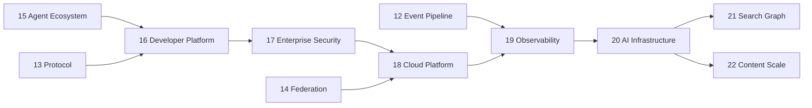

# Enterprise Evolution Roadmap — Phases 16–20

**Status:** Design draft (2026-07-04) — **awaiting owner approval**  
**Authority:** [00-CONSTITUTION.md](../core/constitution/00-CONSTITUTION.md) · [10-POST-ROADMAP.md](10-POST-ROADMAP.md)  
**Constraint:** Phases 1–10 ✅ and extension tracks 5.5–8.5 **unchanged**. Phases 10.5–15 **unchanged in scope**.

---

## Renumbering (additive only)

| Former planned | New number | Reason |
|----------------|------------|--------|
| Phase 16 Search & Graph Production | **Phase 21** | Free 16–20 for enterprise evolution |
| Phase 17 Content & Vector Scale | **Phase 22** | Same |

Phases **10.5, 11, 12, 13, 14, 15** — scope and folders **not modified**.

---

## Enterprise sequence

| Phase | Name | ADR | Priority |
|-------|------|-----|----------|
| **16** | Developer Platform | ADR-031 | P1 |
| **17** | Enterprise Security | ADR-032 | P0 enterprise |
| **18** | Cloud Platform | ADR-033 | P1 |
| **19** | Observability Platform | ADR-034 | P1 |
| **20** | AI Infrastructure Platform | ADR-035 | P1 capstone |
| 21 | Search & Graph Production *(renumbered)* | ADR-022 | P2 |
| 22 | Content & Vector Scale *(renumbered)* | ADR-021 | P1 |
| **25** | **Global AI Intelligence Platform** *(capstone above 16–20)* | ADR-036/037/038/043 | P2 vision |

**Capstone Phase 25** composes the enterprise platform (federation, cloud, observability, infrastructure) into a globally distributed telemetry + analytics + sync platform — see [10-POST-ROADMAP.md § Phase 25](10-POST-ROADMAP.md) and [.ai/phases/25-global-ai-intelligence/DESIGN.md](../25-global-ai-intelligence/DESIGN.md).

---

## Cross-cutting invariants

1. **Business logic** remains in AI Brain server `src/services/` — SDK/CLI/Dashboard are **consumers**.
2. **All providers** = adapters at composition root (ADR-008).
3. **All protocols** = adapters (Phase 13).
4. **Agent runtime** = external (Phase 7, 15).
5. **Default OFF** for every enterprise feature flag.
6. **No breaking** REST v1 / MCP tool schemas.

---

## Phase folders

| Phase | Path |
|-------|------|
| 16 | [.ai/phases/16-developer-platform/](../phases/16-developer-platform/README.md) |
| 17 | [.ai/phases/17-enterprise-security/](../phases/17-enterprise-security/README.md) |
| 18 | [.ai/phases/18-cloud-platform/](../phases/18-cloud-platform/README.md) |
| 19 | [.ai/phases/19-observability-platform/](../phases/19-observability-platform/README.md) |
| 20 | [.ai/phases/20-ai-infrastructure/](../phases/20-ai-infrastructure/README.md) |

---

## ADR gates

| ADR | Phase |
|-----|-------|
| [ADR-031](../adr/031-developer-platform.md) | 16 |
| [ADR-032](../adr/032-enterprise-security.md) | 17 |
| [ADR-033](../adr/033-cloud-platform.md) | 18 |
| [ADR-034](../adr/034-observability-platform.md) | 19 |
| [ADR-035](../adr/035-ai-infrastructure-platform.md) | 20 |
| [ADR-036/037/038/043](../../adr/036-global-ai-intelligence-platform.md) | 25 (capstone) |

Implementation blocked until respective ADR **Approved**.

---

*Subordinate to constitution. Amended only with owner approval.*
